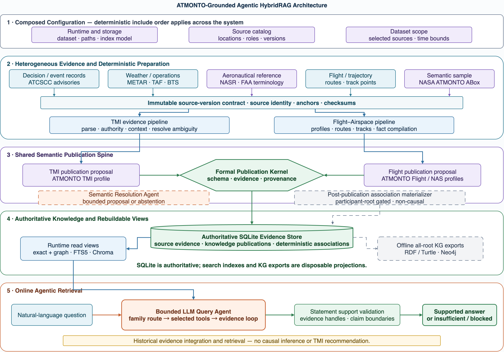

# Aviation Agentic AI

**ATMONTO-Grounded Agentic HybridRAG for Heterogeneous Aviation Knowledge
Integration**

Aviation Agentic AI integrates ATCSCC publication records, FAA authority data,
Weather reports, and BTS public observations into a shared semantic knowledge
layer. Deterministic ingestion preserves source roles and evidence anchors;
ATMONTO constrains formal publication; an LLM Query Agent dynamically combines
exact, graph, lexical, vector, and source retrieval to answer free-form
questions with verifiable support.

```text
Evidence Plane
  -> Deterministic Ingestion Orchestration
  -> Semantic and Trust Plane
  -> Knowledge and Retrieval Plane
  -> Agent Interaction Plane
```



The current GDP, Ground Stop, and ReRoute implementation is a reusable
end-to-end vertical slice, not the permanent topic boundary of the framework.
The admitted ATMONTO `atm:TrafficManagementInitiative` instance is its formal
root. ATMONTO supplies admitted schema terms; ATMGRAPH supplies
ABox-construction and cross-source-query principles.

The [architecture narrative](docs/architecture_narrative.md) explains the
research story and running example. The
[normative design](docs/multi_agent_kg_system_design.md) documents the complete
runtime and evidence contracts.

The [GDP 138 flagship walkthrough](docs/flagship_gdp138_walkthrough.md) follows
one natural-language question through persistent ingestion, real
`deepseek-v4-pro` tool selection, exact source verification, cross-source
context retrieval, and statement-level support validation. Its observed
[execution trace](docs/figures/flagship_gdp138_live_trace.png) is a passing
`live_smoke / system walkthrough`, not a benchmark.

## Quick Start

Install the active system:

```bash
uv sync --extra dev --extra agent-system --extra neo4j \
  --extra tmi-event-retrieval
uv run aviation-ai agent-system --help
```

Python 3.11 or newer is required. Obtain the pinned FAA NASR source described
in [REPRODUCIBILITY.md](REPRODUCIBILITY.md) before ingesting eligible events.

Ingest the five GDP, GS, and ReRoute development/regression records:

```bash
uv run aviation-ai agent-system ingest \
  --config configs/aviation_knowledge_v1.yaml \
  --store-dir data/stores/aviation/development-smoke-v1 \
  --advisory-id 2026-05-19:123 \
  --advisory-id 2026-05-19:138 \
  --advisory-id 2026-05-19:108 \
  --advisory-id 2026-05-20:020 \
  --advisory-id 2026-05-20:137 \
  --allow-model-download
```

Omit `--advisory-id` to process all configured advisories. A targeted run
registers only the named advisory records plus the shared authority and context
evidence needed by the construction path. The command skips terminal `ok` or
`insufficient` versions on later runs, retries blocked versions, and commits
each accepted publication independently. It does not need a completed batch
manifest before the data can be queried.

Complete source-supported records follow deterministic processing.
`--allow-live-model` only authorizes the bounded Semantic Resolution Agent when
genuine authority ambiguity remains; it is not proof that a provider was
called. Credentials stay in ignored local environment files.

## Persistent Knowledge And Retrieval

The configured store contains:

```text
<store-dir>/
  aviation_evidence.sqlite3
  chroma/
  exports/
```

SQLite is authoritative. It stores:

- immutable source assets, source versions, and exact text anchors;
- ingestion results and ingestion runs;
- active and historical TMI event publications;
- ATMONTO-aligned semantic facts and event membership;
- one-to-many evidence links and source-bound profile gaps;
- non-causal Weather associations;
- source-qualified BTS public observations;
- source chunks, FTS5 search data, vector-index state, and compact Agent usage
  telemetry.

The Formal Publication Kernel is the sole authority for accepted formal facts.
SQLite FTS5 is a lexical index over exact source chunks. Chroma contains two
rebuildable vector collections:

- source-record chunks for semantic source discovery;
- compact TMI event summaries for metadata-conditioned event retrieval.

The current source representation uses bounded full-record chunks with exact
source anchors. Search results are candidates: a final source-supported claim
must use `read_source` to retrieve the exact source version or anchor.

Ingestion attempts an incremental index update after semantic publication.
If the embedding model is unavailable, accepted evidence remains queryable
through exact and lexical paths. Rebuild both vector collections explicitly
with:

```bash
uv run --extra agent-system aviation-ai agent-system reindex \
  --config configs/aviation_knowledge_v1.yaml \
  --store-dir data/stores/aviation/development-smoke-v1 \
  --model-name sentence-transformers/all-MiniLM-L6-v2 \
  --allow-model-download
```

Chroma is current only when its recorded knowledge revision matches SQLite.
Neither FTS nor Chroma writes semantic facts back into the store.

## Ask Natural-Language Questions

```bash
uv run aviation-ai agent-system ask \
  --config configs/aviation_knowledge_v1.yaml \
  --store-dir data/stores/aviation/development-smoke-v1 \
  --question "For ATCSCC Advisory 138 on 19 May 2026, what was published, what reason did the source declare, and what weather context was retained?" \
  --allow-model-download
```

Every valid `ask` activates the configured Query Agent. There is no fixed
question registry, keyword router, or deterministic prose fallback. The model
selects among nine deterministic, read-only tools:

- `find_tmi_events`;
- `read_tmi_event_facts`;
- `read_tmi_operational_context`;
- `read_public_observations`;
- `read_tmi_event_graph`;
- `find_similar_tmi_events`;
- `search_source_text`;
- `semantic_search_sources`;
- `read_source`.

The default interaction requires only the natural-language question. Lexical
or semantic discovery returns any active TMI event IDs authoritatively bound to
the matched source version, so the Agent can continue to event facts, context,
observations, and graph tools without asking the user for an internal ID.
CLI answers render human-readable evidence labels, dates, authorities, and
source links; logical source IDs remain internal provenance metadata.

CLI event, family, metadata, paging, and candidate-scope filters form
an immutable upper bound around tool access. The Agent can narrow that scope
but cannot widen it. It may use exact SQLite reads, the store-backed semantic
graph view, SQLite FTS5, Chroma, and exact source reads in one bounded
action-observation loop.

Each final statement must cite returned support appropriate to its claim type.
Weather associations remain non-causal. BTS observations cannot be
reinterpreted as FAA demand, AAR, capacity, EDCT, decision rationale,
effectiveness, or caused outcomes. Metadata-conditioned event retrieval is not
operational-situation similarity and cannot support a TMI recommendation.

## Optional Exports

Export one active event and only its referenced evidence:

```bash
uv run aviation-ai agent-system export-event \
  --config configs/aviation_knowledge_v1.yaml \
  --store-dir data/stores/aviation/development-smoke-v1 \
  --event-id <event-id> \
  --output-dir data/stores/aviation/exports/selected-event
```

Load a rebuildable property-graph projection into Neo4j:

```bash
uv run aviation-ai agent-system neo4j-export \
  --config configs/aviation_knowledge_v1.yaml \
  --store-dir data/stores/aviation/development-smoke-v1
```

RDF/Turtle, JSONL, and Neo4j are optional products of the authoritative store.
They are not required by the Query Agent and do not become independent sources
of truth.

The public command surface is:

```text
ingest
reindex
ask
neo4j-export
export-event
```

At the repository root, `agent-system` is the supported runtime group.
`ontology`, `source`, `cqs`, and `report` remain research utilities. Retired
PHAK demos and the historical `cross-source` workflow are no longer registered
as public root commands. Their source, focused tests, and recorded artifacts are
retained only as historical evidence; the retired command surface is not kept
executable.

The cutover is intentionally breaking. There is no run-directory query path,
batch-snapshot query requirement, legacy reader, or command compatibility
alias.

## Regression Semantics

- GS `2026-05-19:123` retains a source-bound profile-gap reason.
- GDP `2026-05-19:138` retains formal `weather`.
- GDP cancellation `2026-05-20:020` retains an honestly missing reason.
- ReRoute `2026-05-19:108` and `2026-05-20:137` publish
  `atm:ReRouteTMI`; their unsupported ARTCC scope remains a profile gap.

These are development/regression fixtures, not special runtime routes,
evaluation samples, or a representative benchmark.

## Flight-Oriented Competency Supplement

Individual-flight and sector-trajectory evidence is not yet ingested into the
authoritative TMI-event store or exposed through the Query Agent. A separate
checksum-bound deterministic supplement covers four ATMONTO appendix query
shapes using the NASA 2014 sample plus a May 2026
BTS/NASR/METAR/aircraft-registry proxy:

```bash
uv run python -m aviation_agentic_ai.competency_query_supplement \
  --config configs/flight_competency_v1.yaml
```

The pinned result is F1-modern `616`, F3S-modern `81`, S4 `12` distinct
flights (`146` appendix track-point bindings), and S1S `3` pairs. F1/F3S are
modern proxies—not reproductions of the unavailable 2012 KATL dataset—and the
rain join is non-causal. See the
[sanitized report](reports/stages/atmonto_competency_query_supplement_v1.md)
and [REPRODUCIBILITY.md](REPRODUCIBILITY.md).

## Evaluation Boundary

Fake and scripted models verify software contracts only. Live smoke results
must use the configured real provider and report provider-call success
separately from task acceptance. Historical reports remain frozen under their
recorded architecture and are not evidence for the ingestion-first runtime.

The tracked persistent-store compatibility smoke used the persistent store and
6 real `deepseek-v4-pro` calls. All calls returned, but only 1/3 Query Agent
tasks passed the answer-contract and evidence checks. See the sanitized
[JSON report](reports/stages/agent_system_live_ingestion_hybridrag_smoke_v1.json)
or [Markdown report](reports/stages/agent_system_live_ingestion_hybridrag_smoke_v1.md).
The raw provider responses and parsed trial rows remain gitignored and are
identified by path and checksum in those reports.

The system does not provide live ATC support, causal explanation, operational
effectiveness scoring, TMI recommendation, complete aviation coverage, or a
formal model of decision inputs, alternatives, constraints, and rationale.

See [REPRODUCIBILITY.md](REPRODUCIBILITY.md) for source checks and commands,
[RESEARCH_AUDIT.md](RESEARCH_AUDIT.md) for current project truth, and
[docs/multi_agent_kg_system_design.md](docs/multi_agent_kg_system_design.md)
for the normative architecture.
