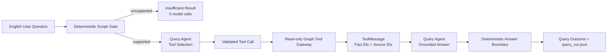

# Agent Tool Use Execution Plan

Status: accepted for implementation

Owner: Codex

Normative dependency: `docs/multi_agent_kg_system_design.md`

Current implementation dependency:
`docs/agent_system_formal_graph_kernel_execution_plan.md`

Accepted baseline:

- `8310ac6` — validated-fact RDF and Neo4j materialization;
- `4f410ec` — graph-grounded query boundaries and regression coverage.

## 1. Current Objective

Turn the existing role-separated workflow into a genuine tool-using
multi-Agent aviation event knowledge system without weakening the formal graph
boundary.

The first implementation target is the Query Agent. It must select and call
bounded graph tools, receive tool results, and generate an English
source-grounded answer. The model never receives a graph-write tool.

This stage tests one concrete system capability:

> Can a specialized Query Agent select authority-bounded graph operations and
> use their returned facts and provenance to answer a supported competency
> question, while unsupported questions and execution failures remain
> distinguishable?

## 2. Minimum Viable Tool-Use Experiment

### Minimum experiment

Use the accepted Ground Stop vertical-slice graph for advisory
`2026-05-19:123`.

Run two questions:

1. Supported:
   `What traffic management measure, controlled airport, and effective time are recorded in this advisory?`
2. Unsupported:
   `What is the runway surface at LAX?`

For the supported question, the Query Agent must:

1. receive only the question, controlled ontology labels, tool descriptions,
   and registered event IDs as graph-scope metadata;
2. select a graph tool through a real LangChain tool call;
3. request only allowed schema predicates;
4. receive a `ToolMessage` containing matching fact IDs and source IDs;
5. generate an English answer grounded only in those tool results;
6. cite `2026-05-19:123`.

For the unsupported question, the deterministic scope gate must return
`Insufficient graph evidence.` with zero provider calls and zero tool calls.

### Minimum components

- the existing fixed LangGraph system topology;
- one bounded Query Agent tool subgraph;
- LangChain typed read-only tools;
- one narrow tool-capable model adapter;
- the existing materialized `ValidatedFact` graph;
- the existing Query outcome and run-trace artifact;
- focused offline tests plus one bounded live capability check.

### Expected evidence

- an `AIMessage.tool_calls` record from the real model adapter;
- a matching `ToolMessage.tool_call_id`;
- a deterministic tool trace containing tool name, validated arguments, fact
  IDs, source IDs, and status;
- a final answer whose cited source IDs are a subset of the retrieved source
  IDs;
- exact model-call and tool-call counts;
- a replayable `query_run.json` without chain-of-thought or credentials.

### Success conditions

- supported question: `status=ok`;
- exactly one or more valid graph tool calls, within the registered budget;
- event type, KJFK, effective start, and effective end are retrieved;
- final answer is English and cites `2026-05-19:123`;
- unsupported question: `status=insufficient`, zero model calls, zero tool
  calls;
- provider, tool, argument-validation, or budget failure:
  `status=blocked`;
- no raw advisory text is exposed to the Query Agent;
- no tool can write RDF, Neo4j, registries, source snapshots, or prompts.

### Failure conditions

- the provider does not return a native tool call for the registered supported
  question;
- an unregistered tool or disallowed predicate is requested;
- the tool result contains an unregistered fact or source;
- the final answer cites a source outside the retrieved tool results;
- the model answers the supported question before receiving graph evidence;
- the tool or model budget is exceeded;
- a provider or tool failure is reported as insufficient evidence.

Any failure is reported as `BLOCKED`. Do not add a text-protocol fallback,
regex-repair loop, prompt retuning, or a second provider during the same run.

## 3. Why Query Agent Comes First

Query is the smallest stage in which model-controlled tool selection is both
useful and observable:

- the graph already exists;
- tools are read-only;
- tool arguments can be restricted to the active schema;
- the answer can be checked against retrieved facts and source IDs;
- a failure cannot corrupt the formal KG.

Facility and Terminology Agent tool use is valuable only for real
multiple-candidate cases. The fixed Ground Stop vertical slice resolves its
authority candidates deterministically, so tool-enabling those Agents first
would add machinery without producing evidence of useful behavior.

This stage is a capability probe, not a claim that the whole five-role system
has already become fully agentic. It proves one reusable internal pattern:

```text
observe bounded state
    -> choose one permitted action
    -> inspect the returned observation
    -> decide whether to act again, answer, or stop
```

After this pattern works for Query, it may be reused only where adaptive choice
changes behavior:

1. Terminology Agent for genuine multi-candidate authority lookup;
2. Knowledge Graph Construction Agent for choosing schema/evidence reads before
   producing a Graph Patch;
3. Facility Agent only for genuine ambiguity, while unique codes remain a
   deterministic fast path.

The parser, Formal Graph Kernel, RDF writer, and Neo4j loader remain
deterministic functions. Calling them Agents would add role names without
adding agency.

## 4. Architecture



The top-level multi-Agent topology remains fixed. The Query Agent owns a small
internal LangGraph loop:

```text
prepare
  -> model
  -> tool execution when tool_calls are present
  -> model with ToolMessage
  -> deterministic finalization
```

The loop has explicit counters and cannot continue indefinitely.

## 5. Framework Use

Use the framework capabilities already present in the project:

- LangChain `@tool` for typed tool definitions;
- `model.bind_tools(tools)` for model-visible tool schemas;
- `AIMessage.tool_calls` for selected tool name, arguments, and call ID;
- `ToolMessage` with the same `tool_call_id` for tool results;
- LangGraph conditional edges for model/tool/final routing;
- Pydantic for tool arguments, tool results, trace records, and final outcome.

Do not introduce another Agent framework or a custom ReAct parser.

Reference:

- <https://docs.langchain.com/oss/python/langgraph/quickstart>
- <https://docs.langchain.com/oss/python/langchain/messages>

## 6. Provider Capability Boundary

The existing text-only `ModelInvoker` cannot represent native tool calls. Add a
separate narrow interface rather than overloading raw text:

```text
ToolCallingModel.invoke(messages, tools) -> AIMessage + ModelCallRecord
```

The adapter must preserve:

- provider and model identity;
- prompt version;
- temperature;
- input/output token usage when available;
- latency;
- provider error;
- raw tool-call metadata needed for replay;
- no credentials.

Before the live tool-use smoke test, run one fictional capability probe:

1. bind one harmless read-only fictional tool;
2. ask the model to use it;
3. require a non-empty `AIMessage.tool_calls`;
4. validate tool name, arguments, and call ID;
5. stop as `BLOCKED` if native tool calling is unavailable.

The offline tests use a scripted `AIMessage` model double. Offline success is a
contract result, not evidence that the live provider supports tool calling.

## 7. Query Tool Contracts

Implement the minimum graph tool gateway over the current materialized graph.
The first version reads the run's validated `kg.jsonl`; it does not require a
live Neo4j connection. The interface may later receive a Neo4j backend without
changing Agent-visible contracts.

### `find_events`

Purpose: identify event IDs in the current run.

Arguments:

```text
source_id: optional registered source ID
event_class: optional allowed schema class
```

Returns:

```text
event_id
event_class
matching_fact_ids
source_ids
```

### `get_event_facts`

Purpose: retrieve selected facts for one event.

Arguments:

```text
event_id: registered event ID exposed in graph-scope metadata
predicates: non-empty list from the allowed predicate enum
```

Allowed predicates for the first vertical slice:

```text
rdf:type
atm:controlledNASelement
atm:effectiveStartTime
atm:effectiveEndTime
```

Returns:

```text
fact_id
subject
predicate
object
object_class
source_ids
```

### `get_neighbors`

Purpose: retrieve a bounded adjacent entity when a returned fact identifies an
entity.

Arguments:

```text
entity_id: registered event or facility ID
relation: allowed relation
```

This tool is available but is not required for the first competency question.

### `get_provenance`

Purpose: return source IDs for facts already retrieved in the current tool
session.

Arguments:

```text
fact_ids: non-empty subset of previously retrieved fact IDs
```

Returns:

```text
fact_id
source_id
```

### Tool restrictions

- read-only;
- run-directory scoped;
- no arbitrary filesystem path;
- no raw Cypher or SPARQL from the model;
- no arbitrary ontology IRI;
- no full-graph fallback;
- bounded result count;
- stable ordering;
- all arguments validated before execution;
- all returned fact and source IDs checked against the materialized run.

## 8. Query Agent State and Routing

Use one explicit state contract:

```text
question
run_dir
supported_intent
allowed_predicates
messages
model_calls
tool_calls
retrieved_fact_ids
retrieved_source_ids
status
answer
failure_reason
```

### Deterministic preparation

- load and validate the materialized graph;
- classify the question against registered competency intents;
- derive the maximum allowed predicate set;
- expose only registered event IDs as graph-scope metadata, never their facts;
- return `insufficient` without a model call for unsupported intent;
- never place raw advisory text in state.

### Model node

- bind only Query Agent tools;
- use the versioned Query Tool Agent prompt;
- increment the model-call counter before invocation;
- reject a provider error or empty response as `blocked`;
- accept either a tool call or a final answer only in its allowed phase.

### Tool node

- reject unknown tool names;
- validate Pydantic arguments;
- enforce the per-tool and total budgets;
- execute through the read-only gateway;
- return a `ToolMessage` whose ID matches the model tool call;
- append a sanitized tool trace;
- update the retrieved fact/source sets.

### Finalization

- require at least one successful tool call for supported questions;
- require non-empty retrieved evidence;
- parse the English answer and cited source IDs;
- require cited sources to be a subset of retrieved sources;
- record `ok`, `insufficient`, or `blocked`;
- write one `query_run.json`.

## 9. Budgets

For one Query Agent run:

```text
maximum model calls: 2
maximum total tool calls: 3
maximum calls per tool: 1
maximum facts returned per tool: 20
maximum answer length: 200 words
retries: 0
repairs: 0
```

For the existing repeated-ingest live vertical slice after tool use:

```text
two KG Construction Agent calls
two Query Agent model calls
zero calls for the unsupported question
expected total model calls: 4
hard stop: 5 attempted calls, including failures
```

This deliberately replaces the earlier three-call expectation. The additional
Query Agent call is the framework-standard step that consumes the
`ToolMessage` and produces the final answer.

## 10. Prompt Contract

Codex owns the prompt design and tests.

Create one versioned Query Tool Agent prompt. Its required behavior:

- English-only system and output;
- select only the bound tools;
- never answer a supported graph question before receiving tool evidence;
- use only allowed predicate values;
- never request raw advisory text;
- never invent an entity, fact, predicate, or source ID;
- after tool evidence, answer concisely and cite retrieved source IDs;
- do not expose hidden reasoning;
- do not emit JSON as the final user answer.

Tool arguments are structured internally by LangChain. The user-facing answer
remains natural-language English.

Prompt testing must verify:

- prompt version is recorded;
- no project evaluation example or real canonical ID leaks into examples;
- no Chinese interface text;
- tool descriptions clearly separate retrieval from graph persistence;
- final-answer instructions do not permit model-memory fallback.

## 11. Implementation Sequence

### Prerequisite: accept the current batch

Before Tool Use implementation:

1. ZCode returns its current `CHECKPOINT`.
2. Codex reviews the exact diff.
3. Codex reproduces the registered batch-two regressions.
4. Focused tests, full tests, ruff, and diff check pass.
5. The accepted batch-two changes are committed.
6. The worktree is clean.

Do not mix batch-two repair edits with Tool Use implementation.

### Create an isolated implementation branch

Create:

```text
codex/query-agent-tool-use
```

from the accepted batch-two commit.

### Add tool contracts and read-only gateway

Expected files:

```text
src/aviation_agentic_ai/agent_system/query_tools.py
tests/test_agent_system_query_tools.py
```

Deliver:

- typed arguments and results;
- allowed predicate enum;
- run-scoped graph reader;
- tool registry;
- sanitized tool trace;
- no model integration yet.

Checkpoint:

- tool unit tests pass;
- no active Agent code changes;
- no graph-write capability exists.

### Add the tool-capable model adapter

Expected files:

```text
src/aviation_agentic_ai/agent_system/tool_model.py
src/aviation_agentic_ai/agent_system/runtime.py
tests/test_agent_system_tool_model.py
```

Deliver:

- LangChain `bind_tools` adapter;
- `AIMessage` and `ToolMessage` preservation;
- provider/model/usage/latency recording;
- scripted offline adapter;
- capability failure is explicit.

Checkpoint:

- offline adapter tests pass;
- no live provider call yet.

### Add the Query Agent tool subgraph

Expected files:

```text
src/aviation_agentic_ai/agent_system/query_tool_graph.py
src/aviation_agentic_ai/agent_system/query.py
src/aviation_agentic_ai/agent_system/contracts.py
tests/test_agent_system_query_tool_graph.py
```

Deliver:

- preparation, model, tool, and finalization nodes;
- conditional routing;
- model/tool budgets;
- `ok`, `insufficient`, and `blocked` outcomes;
- no arbitrary loop.

Checkpoint:

- supported scripted run performs model -> tool -> model;
- unsupported run performs zero calls;
- failures remain distinguishable.

### Integrate CLI, prompt, and artifacts

Expected files:

```text
configs/prompts/agent_system_v1.yaml
src/aviation_agentic_ai/cli_agent_system.py
tests/test_agent_system_prompt_catalog.py
tests/test_cli_agent_system.py
```

Deliver:

- versioned Query Tool Agent prompt;
- `agent-system ask` uses the tool subgraph;
- `query_run.json` includes tool traces and budgets;
- existing non-tool query path is removed from the active command rather than
  maintained as a second active implementation.

Checkpoint:

- CLI contract tests pass;
- no prompt or output contains Chinese interface text.

### Run the offline vertical slice

Use the accepted fixed Ground Stop graph and a scripted tool-capable model.

Assertions:

- exact supported question calls `get_event_facts`;
- requested predicates are the four registered predicates;
- returned facts include event type, KJFK, start, and end;
- the second model message consumes the matching `ToolMessage`;
- answer cites only `2026-05-19:123`;
- unsupported LAX question makes zero calls;
- provider/tool/argument/budget failures are blocked.

### Run the bounded live capability stage

After offline acceptance:

1. run one fictional provider tool-call capability probe;
2. if successful, run the one supported fixed query;
3. enforce the two-model-call and three-tool-call Query budget;
4. do not retune the prompt after seeing the result;
5. report `FINAL` or `BLOCKED`.

No full-corpus run is part of this stage.

## 12. Acceptance Tests

Required focused tests:

```text
test_tool_registry_contains_only_read_only_query_tools
test_get_event_facts_rejects_disallowed_predicate
test_tool_cannot_escape_run_directory
test_tool_results_have_registered_fact_and_source_ids
test_supported_question_routes_to_tool_agent
test_supported_question_requires_tool_call
test_tool_message_matches_tool_call_id
test_supported_question_uses_exact_predicate_set
test_final_sources_are_subset_of_tool_sources
test_unsupported_question_uses_zero_model_and_tool_calls
test_provider_error_is_blocked
test_empty_provider_response_is_blocked
test_unknown_tool_is_blocked
test_invalid_arguments_are_blocked
test_tool_error_is_blocked
test_model_budget_exceeded_is_blocked
test_tool_budget_exceeded_is_blocked
test_query_run_records_sanitized_tool_trace
test_query_run_contains_no_chain_of_thought_or_credentials
test_query_prompt_is_English_and_versioned
```

Repository checks:

```bash
uv run pytest -q \
  tests/test_agent_system_query_tools.py \
  tests/test_agent_system_tool_model.py \
  tests/test_agent_system_query_tool_graph.py \
  tests/test_agent_system_prompt_catalog.py \
  tests/test_cli_agent_system.py

uv run ruff check .
uv run pytest -q
git diff --check
```

Active-language scan:

```bash
git grep -n -P '[\x{4e00}-\x{9fff}]' -- \
  src/aviation_agentic_ai/agent_system \
  src/aviation_agentic_ai/cli_agent_system.py \
  configs/prompts/agent_system_v1.yaml \
  tests/test_agent_system*.py \
  docs/multi_agent_kg_system_design.md \
  docs/agent_tool_use_execution_plan.md
```

The scan must return no active interface text. Explicitly identified external
source fixtures are exempt.

## 13. Commit Structure

Commit only after each checkpoint passes:

1. `feat: add read-only query tool gateway`
2. `feat: add tool-calling model adapter`
3. `feat: run Query Agent through bounded tools`
4. `test: cover tool-use vertical slice`
5. `docs: document Query Agent tool-use contract`

Do not push unless the user requests publication.

## 14. Deferred Work

Defer until the Query Agent tool-use vertical slice succeeds:

- Facility Agent native tool calling;
- Terminology Agent native tool calling;
- KG Construction Agent tool loop;
- constrained Graph Patch repair;
- Planner Agent;
- Critic Agent;
- Agent negotiation;
- long-term memory;
- generic RAG;
- vector retrieval;
- arbitrary Cypher or SPARQL generation;
- Neo4j write tools;
- weather and cross-source expansion;
- full-corpus Agent execution;
- multi-provider comparison;
- performance tuning.

## 15. Next Capability Stage

If Query Agent Tool Use succeeds, the next bounded stage is ambiguous
facility/term resolution:

- Facility Agent calls authority candidate search and candidate-detail tools;
- Terminology Agent calls glossary search, term-definition, and schema-class
  mapping tools;
- model selection remains restricted to returned candidate IDs;
- zero/one candidate paths remain deterministic and make no model call;
- unresolved cases abstain.

That later stage requires a separate accepted plan and must not be added during
the Query Agent implementation.
