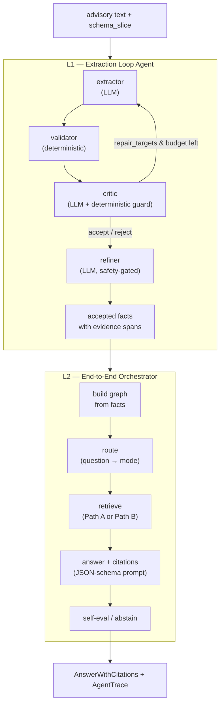

# End-to-End Agentic KG-RAG Architecture

> Status: design document. Specifies how to turn the current single-pass
> extraction pipeline into a two-layer autonomous Agent with a feedback loop
> (L1) and end-to-end orchestration (L2). No code is changed by this document;
> it is a blueprint for later implementation.

## 1. Goals and Non-Goals

### Goals

- Turn the current **single-pass linear pipeline** (extractor → validator →
  critic → refiner, each called at most once) into an Agent with a **feedback
  loop**: when the critic finds problems, it can drive a re-extraction with
  targeted repair guidance, bounded by an iteration budget.
- Add an **end-to-end orchestration layer** that connects extraction to the
  retrieval and answer stages, so one call takes an advisory and returns a
  cited answer.
- Reuse the existing, tested components (prompts, validators, retrieval,
  routing) rather than rewriting them.

### Non-Goals

- Do not alter the verified S0–S7 experimental results or the scored
  artifacts. The Agent is a new runtime path that *composes* those components;
  it does not re-score history.
- Do not claim the Agent is autonomous ontology construction or operational ATC
  decision support. It remains a diagnostic/repair framework under the same
  claim boundaries stated in `docs/thesis_positioning.md`.
- Do not introduce a heavyweight framework (LangGraph state graphs, etc.)
  unless a later decision calls for it. The first version is a small,
  dependency-light controller.

## 2. Current-State Gap Diagnosis

The codebase has a working, tested multi-agent *functional* pipeline, but it is
not an Agent in the feedback-loop sense.

### 2.1 The single-pass pipeline

`run_live_agentic_record` in
`src/aviation_agentic_ai/reporting/atmonto/agentic_loop/live_pilot_agents.py:41-168`
runs four agent roles in a fixed linear sequence:

```
extractor(invoker) -> validator(deterministic) -> critic(invoker) -> refiner(invoker) -> final_facts
```

Evidence that it is single-pass, not a loop:

- `agent_call_counts` (live_pilot_agents.py:162-167) is hard-capped at 1 call
  per role.
- The critic's output is consumed only to *drop* facts into quarantine
  (`_critic_allowed_facts`, live_pilot_agents.py:406-433); a critic finding
  "missing cause" never triggers a re-extraction.
- The refiner is a *safety gate*, not a repair step: `_final_facts`
  (live_pilot_agents.py:449-475) quarantines any fact the refiner added outside
  the S5 contract; the refiner is explicitly told "Do not add new predicates,
  values, classes, or evidence" (`_refiner_messages`,
  live_pilot_agents.py:303-309).

### 2.2 No end-to-end orchestration

`run_live_agentic_record` produces facts only. There is no runtime code that
chains facts → graph → retrieve → answer for the ATCSCC data. The closest thing
is `run_query` (`src/aviation_agentic_ai/retrieval/hybrid.py:421-458`), but it
operates on pre-built PHAK artifacts and exposes only 3 retrieval modes.

### 2.3 Two parallel retrieval stacks

| Stack | Location | Modes | Runtime? | Data |
| --- | --- | --- | --- | --- |
| `run_query` / `run_retrieval` | `retrieval/hybrid.py:333-458` | `graph` / `vector` / `hybrid` | Yes | PHAK (Chroma index + KGTriple JSONL) |
| S7 retrieval (14 modes) | `reporting/atmonto/s7/retrieval.py:47-62` | 14 incl. routed | No (report builder) | ATCSCC frozen contexts |

The S7 router (`ROUTED_TEMPLATE_MODES`,
`reporting/atmonto/core/answer_scoring.py:25-32`) and the live TF-IDF/dense
retrievers (`reporting/atmonto/core/live_retrieval.py:45-199`) are
self-contained and callable, but currently invoked only inside the offline S7
report builder.

## 3. Layered Architecture Overview



- **L1 (Extraction Loop Agent)** owns the feedback loop over extractor /
  validator / critic / refiner. It produces evidence-linked facts. It is the
  component with the clearest autonomy value (extraction-quality gains).
- **L2 (End-to-End Orchestrator)** calls L1 as a sub-step, then builds a graph,
  routes, retrieves, and answers with citations. It adds the routing and
  self-evaluation decisions.

L2 reuses L1; L1 is independently useful and testable on its own.

## 4. L1 Design: Extraction Loop Agent

### 4.1 Runtime and state

New subpackage `src/aviation_agentic_ai/agents/`. A small controller class holds
per-advisory state:

```python
class ExtractionAgent:
    def __init__(self, schema_slice, route_map, max_iterations=2):
        ...

    def run(self, record, invoker, progress=False) -> ExtractionResult:
        ...
```

- `invoker` follows the existing seam `AgentInvoker = Callable[[list[dict[str, str]]], str]`
  (`live_pilot_agents.py:38`). When `None`, the agent builds a default invoker
  via `build_default_llm_invoker` (same pattern as `live_pilot.py:80-81`).
- `max_iterations` is the repair budget. The MVP default is 2 (one initial
  extraction + one repair pass).

### 4.2 State machine

```
init → extract → validate → critique ──┬─ (repair_targets & iters<max) → extract
                                        ├─ (accept) → refine → done
                                        └─ (reject all) → done (empty)
```

Transitions are decided by the critic output (Section 4.3) and the budget.

### 4.3 The feedback contract (the core change)

The critic's output JSON today is `{drop_fact_ids, concerns, global_notes}`
(`_critic_messages`, live_pilot_agents.py:282-291). The Agent **extends** this
with an optional `repair_targets` field that drives re-extraction:

```json
{
  "drop_fact_ids": ["f3"],
  "concerns": [
    {"fact_id": "f7", "reason": "missing cause predicate for this ground stop"}
  ],
  "global_notes": [],
  "repair_targets": [
    {"scope": "cause_predicate", "hint": "re-extract impactingCondition from the MESSAGE block"}
  ]
}
```

Control logic:

- If `repair_targets` is non-empty AND `iteration < max_iterations` → loop back
  to `extract`, passing a **repair prompt** that appends the critic's
  concerns/repair_targets to `_extractor_messages`. The extractor sees prior
  rejected facts so it does not repeat them.
- Otherwise → proceed to `refine` with the accepted facts, or terminate if all
  facts were dropped.

The deterministic critic guard (`critic_reasons`,
`independent_run_agents.py:87-101`) still runs as a safety net for duplicate /
evidence-not-contained / text-artifact cases, exactly as in the live pilot.

### 4.4 Reused components (with locations)

| Component | Location | Role in L1 |
| --- | --- | --- |
| `AgentInvoker` type | `live_pilot_agents.py:38` | LLM seam |
| `_extractor_messages` | `live_pilot_agents.py:222-250` | extractor prompt template |
| `_critic_messages` | `live_pilot_agents.py:253-294` | critic prompt template (extended with `repair_targets`) |
| `_refiner_messages` | `live_pilot_agents.py:297-329` | refiner safety gate |
| `validate_prediction_record` | `ontology/atmonto_minimal_loop.py` | deterministic validation |
| `critic_reasons` | `agentic_loop/independent_run_agents.py:87-101` | deterministic critic guard |
| `canonical_fact_key` | `ontology/atmonto_experiment.py` | dedup key for seen facts |
| `_profile_normalize_live_record` | `live_pilot_agents.py:342-362` | ISO datetime / subject-class normalization |

### 4.5 New artifact: AgentTrace

Each `run` returns an `AgentTrace` recording every iteration, so the loop is
auditable:

```python
@dataclass
class AgentStep:
    iteration: int
    role: str            # "extractor" | "validator" | "critic" | "refiner"
    input_summary: dict  # what was passed in
    output_summary: dict # accepted/rejected counts, critic reasons
    raw_response_len: int

@dataclass
class AgentTrace:
    steps: list[AgentStep]
    iterations_used: int
    budget_exhausted: bool
```

The trace is written alongside results, following the metadata conventions in
Section 8.

## 5. L2 Design: End-to-End Orchestrator

```python
class EndToEndAgent:
    def __init__(self, schema_slice, route_map, retrieval_path="A",
                 max_iterations=2):
        self.extraction = ExtractionAgent(schema_slice, route_map, max_iterations)
        ...

    def process(self, advisory, invoker, question, progress=False)
        -> AnswerWithCitations:
        facts = self.extraction.run(advisory, invoker, progress).facts
        graph = self._build_graph(facts)
        mode = self._route(question)
        context = self._retrieve(question, graph, mode)
        answer = self._answer(question, context, invoker)
        return self._self_eval(question, answer, context)
```

### 5.1 Routing decision

Two designs, one per retrieval path (Section 6):

- **Path A**: a new `question → {graph, vector, hybrid}` classifier. No
  existing runtime router; either a keyword heuristic on top of
  `detect_risk_category` (`retrieval/sufficiency.py`) or a small LLM call.
- **Path B**: reuse `ROUTED_TEMPLATE_MODES` (`answer_scoring.py:25-32`) and
  `routed_underlying_mode` (`answer_scoring.py:349`). Requires a
  `question → template_id` classifier (keyword match against the ATCSCC query
  templates in `data/evaluation/nasa_atmonto/atcscc_cq_query_templates.json`).

### 5.2 Self-evaluation / abstention

- Pre-retrieval gate: reuse `evaluate_evidence_sufficiency`
  (`retrieval/sufficiency.py:160-222`) to short-circuit out-of-scope questions
  (same pattern as `web/app.py:242-257`).
- Post-answer self-eval: the JSON-schema answer prompt (Section 6, Path B)
  already emits `abstain` and `rationale`; L2 honors `abstain=true` by
  returning a "no grounded answer" result instead of forcing an answer.

## 6. Two Retrieval Paths

Both paths are designed; implementation picks one (or both) per phase.

### Path A — Existing `run_query` stack

Reuses `build_kg_graph` (`retrieval/graph_traversal.py:150`) +
`run_retrieval` (`retrieval/hybrid.py:333`, 3 modes) +
`generate_grounded_answer` (`retrieval/hybrid.py:265`).

| Aspect | Detail |
| --- | --- |
| Reuse | `build_kg_graph` + `run_retrieval` + `generate_grounded_answer` |
| Build cost | Adapter: ATCSCC fact → `KGTriple` (kg/extraction.py:49-67); build a Chroma index once |
| Router | None exists runtime; must write a `question → mode` classifier |
| Answer prompt | Free-text (`generate_grounded_answer`); weaker than S7's JSON-schema |
| Dependencies | Requires Chroma index + langchain-openai |

### Path B — Lift S7 live retrievers to runtime

Reuses `build_live_tfidf_source_index` / `query_live_tfidf_source_index` /
dense variants (`reporting/atmonto/core/live_retrieval.py:45-199`, pure Python,
no Chroma) + `ROUTED_TEMPLATE_MODES` router + S7 JSON-schema answer prompt
(`reporting/atmonto/s7/llm_answer_generation.py:250-294`).

| Aspect | Detail |
| --- | --- |
| Reuse | live TF-IDF/dense retrievers + `ROUTED_TEMPLATE_MODES` + S7 answer prompt |
| Build cost | Adapter: lift retrievers out of the report builder into a runtime module; wrap as callable |
| Router | `ROUTED_TEMPLATE_MODES` + `question → template_id` classifier |
| Answer prompt | JSON-schema (`abstain`, `answer_values`, `citations`, `rationale`); better for an Agent |
| Dependencies | None beyond existing LLM provider |

### Trade-off matrix

| Criterion | Path A | Path B |
| --- | --- | --- |
| Time to working | Faster (functions exist, just wire ATCSCC data) | Medium (lift + adapter layer) |
| Routing quality | Weak (must build classifier) | Strong (proven `ROUTED_TEMPLATE_MODES`) |
| Alignment with thesis evidence | Low (PHAK-style path) | High (matches S7 RQ3 results) |
| External deps | Chroma + langchain-openai | None extra |
| Answer contract | Free-text | Structured JSON with abstain |

**Recommendation**: implement Path B as the primary path (it aligns with the
RQ3 evidence and needs no Chroma), with Path A as a fallback if the lift proves
costly. The two paths share the L1 extraction layer and the L2 orchestrator
skeleton; only the `_retrieve` / `_route` / `_answer` methods differ.

## 7. Interface Contracts

### 7.1 Types

```python
# Reuse existing
AgentInvoker = Callable[[list[dict[str, str]]], str]   # live_pilot_agents.py:38

# New (agents/types.py)
class AgentState(TypedDict, total=False):
    iteration: int
    candidate_facts: list[dict]
    validator_results: list[dict]
    critic_payload: dict          # drop_fact_ids, concerns, repair_targets
    accepted_facts: list[dict]
    quarantined: list[dict]

@dataclass
class ExtractionResult:
    facts: list[dict]
    trace: AgentTrace
    schema_valid: bool
    metadata: dict                # follows *_run_metadata.json contract

@dataclass
class AnswerWithCitations:
    answer: str
    answer_values: list[str]
    abstain: bool
    citations: list[dict]
    rationale: str
    trace: AgentTrace             # spans L1 + L2
```

### 7.2 Per-role JSON schemas

| Role | Input | Output (JSON) |
| --- | --- | --- |
| extractor | advisory + schema menu + (iteration>1: prior rejections + repair_targets) | `{source_id, source_family, facts[]}` |
| validator | facts + source text + schema slice | `[{accepted, errors, warnings, validated_fact}]` (deterministic) |
| critic | S5 facts + CQ routes + validator rejections | `{drop_fact_ids, concerns[], global_notes[], repair_targets[]}` (repair_targets is the new field) |
| refiner | critic-allowed facts | `{facts[]}` copied from allowed (safety gate) |

## 8. Artifact and Testing Conventions

### 8.1 Metadata artifact

Write `*_run_metadata.json` following the existing contract
(`data/experiments/nasa_atmonto/formal/s2_llm_schema_slice_run_metadata.json`):

- Required fields: `system_id`, `run_status`, `provider`, `model`,
  `started_at`, `completed_at`, `record_count`, `prediction_output`,
  `claim_boundary`.
- Populate via `safe_llm_metadata()` (`evaluation/protocol.py:22-28`),
  `utc_timestamp()`, and `project_relative_path()` (never raw `str(Path)`).
- Add Agent-specific fields: `iterations_used`, `budget_exhausted`,
  `repair_pass_count`, `retrieval_path`.

### 8.2 Testing

- **Invoker injection seam**: every LLM-dependent method takes
  `invoker: AgentInvoker | None = None`; tests pass a content-dispatch fake
  function (pattern: `tests/test_nasa_atmonto_s5_s6_live_agentic_pilot.py:140-197`).
- **Fake invoker dispatch**: branch on `messages[0]["content"]` to identify the
  role (e.g. `"Extractor agent" in system`), return canned JSON.
- **Fixtures**: write minimal JSONL/JSON into `tmp_path` and pass
  `repo_root=tmp_path` so tests never touch the real repo.
- **Assertion target**: the returned `ExtractionResult` / `AnswerWithCitations`
  dict, not stdout. Assert `metadata["live_llm_run"] is False` to prove no real
  LLM ran.

### 8.3 CLI registration

Add to `TOP_LEVEL_COMMANDS` (`cli.py:9-79`):

```python
{"module": "aviation_agentic_ai.cli_agent", "attribute": "agent",
 "name": "agent", "help": "Run the end-to-end Agent over an ATCSCC advisory."}
```

Create `src/aviation_agentic_ai/cli_agent.py` mirroring `cli_query.py`'s
structure (`@click.command`, `raise click.ClickException` on error).

### 8.4 Progress / logging

- Library code: `progress: bool` flag + `print(f"[agent] ...", flush=True)`
  (same as `live_pilot_agents.py:52`).
- CLI: `click.echo` for human output (same as `cli_demo.py`).
- Use `logging` only for swallowed/exception diagnostics.

### 8.5 Module placement

New subpackage `src/aviation_agentic_ai/agents/` (there is no existing
`agents/` dir). Files: `types.py`, `extraction_agent.py` (L1),
`end_to_end_agent.py` (L2), `runtime.py` (retrieval adapters for Path A/B),
`cli_agent.py`. Lazy-import optional LLM deps with a helpful `RuntimeError`
(idiom: `providers.py:79-85`).

## 9. Implementation Roadmap

| Phase | Scope | Est. effort |
| --- | --- | --- |
| 1 | L1 Extraction Loop Agent + `AgentRuntime` + state machine + tests (fake invoker, no LLM) | 1–2 days |
| 2 | L2 End-to-End Orchestrator skeleton + Path A retrieval + answer | 1 day |
| 3 | Path B retrieval (lift live retrievers) + `ROUTED_TEMPLATE_MODES` router + JSON-schema answer | 1 day |
| 4 | `aviation-ai agent` CLI subcommand + end-to-end test + doc sync | 1 day |

Each phase is independently testable and committable. Phase 1 delivers the
clearest autonomy value (the feedback loop) on its own.

## 10. Risks and Boundaries

- **LLM extraction quality**: measured S2/S3 F1 is weaker than deterministic S0
  (see `reports/stages/nasa_atmonto_formal_experiment_scoring.md`). The loop
  may not close the gap; this must be validated in Phase 1 tests rather than
  assumed.
- **Cost / latency**: each repair pass is an extra LLM round-trip. The budget
  (`max_iterations`) bounds this; default 2 keeps cost predictable.
- **Claim safety**: the Agent remains a diagnostic and repair framework under
  the boundaries in `docs/thesis_positioning.md`. It is not autonomous ontology
  construction, not operational ATC support, and not a universal GraphRAG
  claim. The Agent's trace must record every decision so outputs stay auditable.

## References (file:line)

- `reporting/atmonto/agentic_loop/live_pilot_agents.py:38,41-168,222-329`
- `reporting/atmonto/agentic_loop/independent_run_agents.py:87-101`
- `retrieval/hybrid.py:265,333,421`
- `retrieval/graph_traversal.py:150`
- `retrieval/sufficiency.py:160`
- `reporting/atmonto/core/answer_scoring.py:25,349`
- `reporting/atmonto/core/live_retrieval.py:45-199`
- `reporting/atmonto/s7/llm_answer_generation.py:250`
- `evaluation/protocol.py:22-78`
- `cli.py:9-79`
- `tests/test_nasa_atmonto_s5_s6_live_agentic_pilot.py:140-197`
