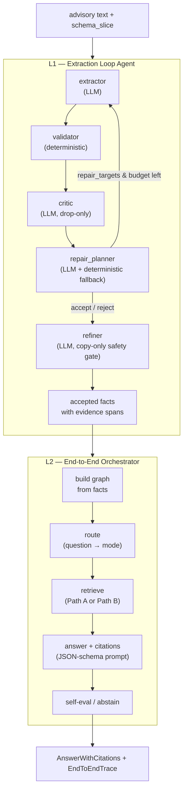

# End-to-End Agentic KG-RAG Architecture

> Status: design plus implementation tracker. L1 Extraction Loop Agent is now
> implemented as a small additive runtime path under
> `src/aviation_agentic_ai/agents/`; L2 end-to-end orchestration remains planned.
> The new runtime does not alter the scored S0-S7 artifacts.

## 1. Goals and Non-Goals

### Goals

- Turn the current **single-pass linear pipeline** (extractor → validator →
  critic → refiner, each called at most once) into an Agent with a **feedback
  loop**: when the critic drops facts or the repair_planner finds gaps, the
  repair_planner drives a re-extraction with targeted repair guidance, bounded
  by an iteration budget.
- Add an **end-to-end orchestration layer** that connects extraction to the
  retrieval and answer stages, so one call takes an advisory and returns a
  cited answer.
- Reuse the existing, tested components (prompts, validators, retrieval,
  routing) rather than rewriting them.

### Non-Goals

- Do not alter the verified S0–S7 experimental results or the scored
  artifacts. The Agent is a new runtime path that *composes* those components;
  it does not re-score history.
- Do not claim the Agent is autonomous ontology construction or operational ATC
  decision support. It remains a diagnostic/repair framework under the same
  claim boundaries stated in `RESEARCH_OVERVIEW.md`.
- Do not introduce a heavyweight framework (LangGraph state graphs, etc.)
  unless a later decision calls for it. The first version is a small,
  dependency-light controller.

## 2. Current-State Gap Diagnosis

The codebase has a working, tested multi-agent *functional* pipeline, but it is
not an Agent in the feedback-loop sense.

### 2.1 The single-pass pipeline

`run_live_agentic_record` in
`src/aviation_agentic_ai/reporting/atmonto/agentic_loop/live_pilot_agents.py:41-168`
runs four agent roles in a fixed linear sequence:

```
extractor(invoker) -> validator(deterministic) -> critic(invoker) -> refiner(invoker) -> final_facts
```

Evidence that it is single-pass, not a loop:

- `agent_call_counts` (live_pilot_agents.py:162-167) is hard-capped at 1 call
  per role.
- The critic's output is consumed only to *drop* facts into quarantine
  (`_critic_allowed_facts`, live_pilot_agents.py:406-433); a critic finding
  "missing cause" never triggers a re-extraction.
- The refiner is a *safety gate*, not a repair step: `_final_facts`
  (live_pilot_agents.py:449-475) quarantines any fact the refiner added outside
  the S5 contract; the refiner is explicitly told "Do not add new predicates,
  values, classes, or evidence" (`_refiner_messages`,
  live_pilot_agents.py:303-309).

### 2.2 No end-to-end orchestration

`run_live_agentic_record` produces facts only. There is no runtime code that
chains facts → graph → retrieve → answer for the ATCSCC data. The closest thing
is `run_query` (`src/aviation_agentic_ai/retrieval/hybrid.py:421-458`), but it
operates on pre-built PHAK artifacts and exposes only 3 retrieval modes.

### 2.3 Two parallel retrieval stacks

| Stack | Location | Modes | Runtime? | Data |
| --- | --- | --- | --- | --- |
| `run_query` / `run_retrieval` | `retrieval/hybrid.py:333-458` | `graph` / `vector` / `hybrid` | Yes | PHAK (Chroma index + KGTriple JSONL) |
| S7 retrieval (14 modes) | `reporting/atmonto/s7/retrieval.py:47-62` | 14 incl. routed | No (report builder) | ATCSCC frozen contexts |

The S7 router (`ROUTED_TEMPLATE_MODES`,
`reporting/atmonto/core/answer_scoring.py:25-32`) and the live TF-IDF/dense
retrievers (`reporting/atmonto/core/live_retrieval.py:45-199`) are
self-contained and callable, but currently invoked only inside the offline S7
report builder.

## 3. Layered Architecture Overview



- **L1 (Extraction Loop Agent)** owns the feedback loop over extractor /
  validator / critic / repair_planner / refiner. It produces evidence-linked
  facts. It is the component with the clearest autonomy value
  (extraction-quality gains).
- **L2 (End-to-End Orchestrator)** calls L1 as a sub-step, then builds a graph,
  routes, retrieves, and answers with citations. It adds the routing and
  self-evaluation decisions.

L2 reuses L1; L1 is independently useful and testable on its own.

## 4. L1 Design: Extraction Loop Agent

### 4.1 Runtime and state

Implemented subpackage `src/aviation_agentic_ai/agents/`. A small controller class holds
per-advisory state:

```python
class ExtractionAgent:
    def __init__(self, schema_slice, route_map, max_iterations=2):
        ...

    def run(self, record, invoker, progress=False) -> ExtractionResult:
        ...
```

- `invoker` follows the existing seam `AgentInvoker = Callable[[list[dict[str, str]]], str]`
  (`live_pilot_agents.py:38`). When `None`, the agent builds a default invoker
  via `build_default_llm_invoker` (same pattern as `live_pilot.py:80-81`).
- `max_iterations` is the repair budget. The MVP default is 2 (one initial
  extraction + one repair pass).

### 4.2 State machine

```
init → extract → validate → critic → repair_planner ──┬─ (repair_targets & iters<max) → extract
                                                       ├─ (accept) → refine → done
                                                       └─ (reject all) → done (empty)
```

Transitions are decided by the combined critic + repair_planner output
(Section 4.3) and the budget. Note the loop-back edge originates at
`repair_planner`, not `critic` — matching the Mermaid diagram in Section 3.

### 4.3 Roles: critic stays drop-only; a separate repair_planner drives the loop

The reviewer correctly flagged that overloading the critic with
`repair_targets` conflicts with its current contract. The reused critic prompt
is explicitly a drop-only reviewer (`_critic_messages`,
live_pilot_agents.py:268-273): *"Drop facts only when they are duplicate, not
actually supported... Do not propose new facts."* Asking it to also propose
missing fields would break that safety property.

**Resolution: keep the critic drop-only and add a separate `repair_planner`
role.** The critic and repair_planner run back-to-back on the same validated
facts; their outputs are independent:

| Role | Contract | Source |
| --- | --- | --- |
| critic | drop-only: `{drop_fact_ids, concerns, global_notes}` (unchanged) | `_critic_messages` (live_pilot_agents.py:253-294), reused verbatim |
| repair_planner (new) | `{repair_targets, blocked_keys}` — extraction *instructions*, never accepted facts | new prompt; deterministic fallback using `critic_reasons` (independent_run_agents.py:87-101) + CQ route map gaps |

The repair_planner inspects the critic's `concerns` and the CQ route map to
emit targeted extraction instructions, e.g. "re-extract
`impactingCondition` from the MESSAGE block." Its output is **advice to the
extractor**, not facts that enter the graph. This preserves the critic's safety
property and keeps a single, testable place where repair decisions are made.

Control logic:

- If `repair_targets` is non-empty AND `iteration < max_iterations` → loop back
  to `extract`, passing a **repair prompt** that appends the repair_planner's
  targets and the prior rejected fact keys (so the extractor does not repeat
  them). Merge of the new extraction follows Section 4.6.
- Otherwise → proceed to `refine` with the accepted facts, or terminate if all
  facts were dropped.

The deterministic critic guard (`critic_reasons`,
`independent_run_agents.py:87-101`) still runs as a safety net for duplicate /
evidence-not-contained / text-artifact cases, exactly as in the live pilot.

### 4.4 Reused components (with locations)

| Component | Location | Role in L1 |
| --- | --- | --- |
| `AgentInvoker` type | `live_pilot_agents.py:38` | LLM seam |
| `_extractor_messages` | `live_pilot_agents.py:222-250` | extractor prompt template |
| `_critic_messages` | `live_pilot_agents.py:253-294` | critic prompt template (reused unchanged) |
| `_refiner_messages` | `live_pilot_agents.py:297-329` | refiner safety gate |
| `validate_prediction_record` | `ontology/atmonto_minimal_loop.py` | deterministic validation |
| `critic_reasons` | `agentic_loop/independent_run_agents.py:87-101` | deterministic critic guard + repair_planner fallback |
| `evidence_tolerant_fact_key` | `ontology/atmonto_experiment.py:321-330` | fact identity for seen/blocked/accepted sets (§4.6); `canonical_fact_key` (which includes evidence) is only for strict dedup scoring |
| `_profile_normalize_live_record` | `live_pilot_agents.py:342-362` | ISO datetime / subject-class normalization |
| `repair_planner` prompt | `agents/repair_planner.py` | emits `repair_targets` + `blocked_keys`; reuses CQ route map |

### 4.5 New artifact: traces

Each `run` returns a trace recording every iteration, so the loop is auditable.
Per the reviewer, traces are split by layer so the role enum is unambiguous:

```python
# L1 roles only
EXTRACTION_ROLES = {"extractor", "validator", "critic", "repair_planner", "refiner"}

@dataclass
class ExtractionStep:
    iteration: int
    role: str            # one of EXTRACTION_ROLES
    input_summary: dict  # what was passed in
    output_summary: dict # accepted/rejected counts, critic reasons, repair_targets
    raw_response_len: int

@dataclass
class ExtractionTrace:
    steps: list[ExtractionStep]
    iterations_used: int
    budget_exhausted: bool

# L2 adds its own roles; EndToEndTrace wraps the L1 trace plus L2 steps
END_TO_END_ROLES = {"boundary_gate", "router", "retriever", "answerer", "self_eval"}

@dataclass
class EndToEndStep:
    role: str            # one of END_TO_END_ROLES
    input_summary: dict
    output_summary: dict # e.g. router: {template_id, mode, route_confidence}
    raw_response_len: int

@dataclass
class EndToEndTrace:
    extraction: ExtractionTrace   # the full L1 trace
    l2_steps: list[EndToEndStep]  # boundary_gate → router → retriever → answerer → self_eval
```

The trace is written alongside results, following the metadata conventions in
Section 8.

### 4.6 Merge invariants (between iterations)

The first review flagged that the loop never defines whether a repair extraction
is a full replacement, a patch, or a delta. This section fixes that, and also
corrects a key-identity bug caught in the second review.

**Key identity — use `evidence_tolerant_fact_key`, not `canonical_fact_key`.**
`canonical_fact_key` (`ontology/atmonto_experiment.py:308-318`) includes
`evidence_text` as its 7th element. Because the evidence span is *part of the
key*, "same canonical key but different evidence" is impossible — an earlier
draft of this invariant was self-contradictory. Fact identity across iterations
therefore uses `evidence_tolerant_fact_key` (`atmonto_experiment.py:321-330`),
which returns `canonical_fact_key(fact)[:6]` (everything except evidence). The
evidence span is tracked **separately** so re-grounding is observable:

- `identity(fact) = evidence_tolerant_fact_key(fact)` — 6-tuple (source, subject
  class, predicate, value, object class, datatype).
- `evidence_hash(fact) = sha256(compact_text(evidence_text).encode("utf-8")).hexdigest()` —
  the evidence span only, used to detect re-grounding. **Must be a stable
  digest, not Python's built-in `hash()`**, which is randomized per process and
  would make traces/metadata non-reproducible.

**Loop state (all keyed by identity):**

- `accepted_by_key: dict[identity, AcceptedFact]` where
  `AcceptedFact = {fact, evidence_hash, iteration}`.
- `blocked: dict[identity, BlockedReason]` where
  `BlockedReason = {reason, evidence_hash}`.
- `current_candidate_facts` — the latest extractor output (this iteration only).

**Invariants (must hold at every loop exit):**

1. **Accepted facts persist.** `accepted_by_key` is never cleared between
   iterations. A repair pass cannot drop a previously accepted fact.
2. **Rejected identities stay blocked unless re-grounded with new evidence.**
   An identity in `blocked` is only re-admitted if a later extraction produces
   the same identity with a *different* `evidence_hash` (i.e. the extractor
   actually re-grounded it, not just echoed it). Re-echoing a blocked fact with
   identical evidence is silently dropped and recorded in the trace. This is now
   well-defined because identity (6-tuple) and evidence (hash) are separate.
3. **Final facts = prior accepted + validated repairs.** At `done`, the result
   `facts` list is exactly `[a.fact for a in accepted_by_key.values()]`. A fact
   accepted in iteration 0 and untouched by repair is still present.
4. **No cross-iteration duplicates.** Identities are unique in
   `accepted_by_key`, so a repair cannot append a duplicate.
5. **Accepted and blocked sets are disjoint.** An identity is in at most one of
   `accepted_by_key` / `blocked` at any time. When a re-grounded blocked fact is
   admitted, the merge procedure removes it from `blocked` (see below); when an
   accepted identity is replaced, it stays only in `accepted_by_key`.

**Merge procedure on each extractor output (never overwrites an accepted fact
without re-validation):**

```
for fact in current_candidate_facts:
    ident = evidence_tolerant_fact_key(fact)
    ev    = evidence_hash(fact)
    # (a) blocked with unchanged evidence: stay blocked
    if ident in blocked and ev == blocked[ident].evidence_hash:
        trace(skip, "blocked_unchanged_evidence"); continue
    # (b) accepted with unchanged evidence: no-op (never overwrite w/o re-validation)
    if ident in accepted_by_key and ev == accepted_by_key[ident].evidence_hash:
        trace(skip, "accepted_unchanged_evidence"); continue
    # (c) otherwise: run the FULL validator+critic path on the new payload
    candidate = run_validator_and_critic(fact)
    if candidate.accepted:
        accepted_by_key[ident] = candidate          # add or replace
        blocked.pop(ident, None)                     # maintain disjointness (Invariant 5)
    else:
        blocked[ident] = BlockedReason(candidate.reason, ev)  # add or refresh reason
```

The old `if/elif` shape had a leak: a re-grounded blocked fact could "fall
through" to validation and be accepted without removing its `blocked[ident]`
entry, leaving the identity in both sets. The rewrite routes every
non-skip fact through one validation block, and **always** pops `blocked[ident]`
on acceptance and refreshes it on rejection, so the accepted/blocked sets stay
disjoint (Invariant 5).

Replacement of an already-accepted identity therefore happens **only** when the
new payload passes validator + critic *and* carries different evidence. A
matching identity with the same evidence is a no-op (skip). This closes the
"overwrite accepted without re-validation" hole.

**Required tests (Phase 1 acceptance, see Section 8.2):**

- `test_repair_adds_missing_field`: a record missing `impactingCondition` in
  iteration 0 is completed after one repair pass; the final facts include it.
- `test_repair_does_not_drop_prior_accepted`: a fact accepted in iteration 0
  survives a repair pass even if the repair extraction omits it.
- `test_rejected_fact_not_re_admitted`: a dropped identity re-emitted with
  identical evidence stays blocked; re-emitted with new evidence can be
  re-admitted (requires the evidence-tolerant identity + separate evidence hash).
- `test_accepted_not_silently_overwritten`: an accepted identity re-emitted with
  a malformed payload is not replaced unless the new payload passes validator +
  critic.
- `test_accepted_and_blocked_disjoint`: after a blocked identity is re-grounded
  and admitted, it is removed from `blocked` and present only in
  `accepted_by_key` (Invariant 5); the two sets never share a key.
- `test_evidence_hash_reproducible`: the recorded `evidence_hash` is identical
  across two process runs for the same evidence span (guards against using
  Python's randomized `hash()`).

### 4.7 The refiner's role (explicit)

Per the reviewer's open question: **repair happens before the refiner; the
refiner remains a copy-only safety gate.** The loop's repair work (extractor
re-runs driven by repair_planner) all occurs in the
extract→validate→critic→repair_planner loop. The refiner runs once, at the end,
over the final `accepted_by_key`, and
it is still forbidden from adding predicates/values/evidence (per
`_refiner_messages`, live_pilot_agents.py:303-309). Its sole job is to produce
the canonical output payload and to quarantine any fact that slipped through
outside the S5 contract (`_final_facts`, live_pilot_agents.py:449-475). This
keeps the "no new facts at the gate" safety property intact.

## 5. L2 Design: End-to-End Orchestrator

```python
class EndToEndAgent:
    def __init__(self, schema_slice, route_map, retrieval_path="B",
                 max_iterations=2):
        # retrieval_path defaults to "B" (the recommended, S7-aligned path).
        # Path A is opt-in only; see Section 6.
        self.extraction = ExtractionAgent(schema_slice, route_map, max_iterations)
        ...

    def process(self, advisory, invoker, question, progress=False)
        -> AnswerWithCitations:
        facts = self.extraction.run(advisory, invoker, progress).facts
        graph = self._build_graph(facts)
        mode = self._route(question)
        context = self._retrieve(question, graph, mode)
        answer = self._answer(question, context, invoker)
        return self._self_eval(question, answer, context)
```

### 5.1 Routing decision

Two designs, one per retrieval path (Section 6):

- **Path A**: a new `question → {graph, vector, hybrid}` classifier. No
  existing runtime router; either a keyword heuristic on top of
  `detect_risk_category` (`retrieval/sufficiency.py`) or a small LLM call.
- **Path B**: reuse `ROUTED_TEMPLATE_MODES` (`answer_scoring.py:25-32`) and
  `routed_underlying_mode` (`answer_scoring.py:349`). Requires a
  `question → template_id` classifier (keyword match against the ATCSCC query
  templates in `data/evaluation/nasa_atmonto/atcscc_cq_query_templates.json`).

**Path B unknown-template handling (required, not optional).** The reviewer
flagged that `routed_underlying_mode` silently defaults unknown template IDs to
`vector_rag`, so a classifier miss would *quietly avoid graph retrieval* on a
demo question that actually needs it. The Agent must not inherit that silent
default. The router returns one of three outcomes:

- a known `template_id` → its mapped mode (as today);
- `unknown_template` → the Agent treats this as **low-confidence**: it runs the
  hybrid path but records `route_confidence=low` in the trace, and the
  post-answer self-eval (§5.2) applies a stricter abstain threshold. It does
  *not* silently fall back to vector-only;
- `out_of_scope` → the ATCSCC boundary gate (§5.2) abstains before retrieval.

**Required Path B tests:** for each of the six ATCSCC templates, a paraphrased
question (not the canonical CQ wording) must still resolve to the correct
template; an unrelated question must classify as `unknown_template` (not a wrong
known template). These cover the classifier's precision and its failure mode.

### 5.2 Self-evaluation / abstention

- **Pre-retrieval ATCSCC boundary gate (new):** the reviewer flagged that the
  existing `evaluate_evidence_sufficiency` (`retrieval/sufficiency.py:160-222`)
  is built around generic aviation boundary triggers and `training_question`
  logic, not ATCSCC advisory CQ scope, so it can mis-abstain or give false
  confidence. L2 uses a new ATCSCC-specific boundary gate instead. It accepts a
  question only if all of:
  - the question concerns a **retrospective ATCSCC advisory** in the known
    source/advisory scope (the formal sample / reviewed gold families);
  - it does **not** request live operational instruction, current weather, or
    NOTAM freshness;
  - it does **not** exceed the known source scope (e.g. asking about facilities
    or routes outside the snapshot).
  Otherwise the gate abstains with a reason. The generic
  `evaluate_evidence_sufficiency` may be reused only as an outer fallback for
  aviation-domain out-of-scope detection, not as the ATCSCC scope decider.
- **Post-answer self-eval:** the JSON-schema answer prompt (Section 6, Path B)
  already emits `abstain` and `rationale`; L2 honors `abstain=true` by
  returning a "no grounded answer" result instead of forcing an answer.

### 5.3 L2 scope: demo/runtime, not a new scoring path

To resolve the reviewer's open question: **L2 is a thesis/demo runtime, not an
experiment that produces new scored artifacts.** It composes existing,
individually-scored components (L1 extraction, retrieval, answer generation)
into a live callable for demonstration and qualitative inspection. It does not
re-score the S0–S7 results, does not write into the formal experiment
directories, and its outputs are not cited as new experimental evidence. Any
quantitative claim about the Agent would require a separate, future scored
run with its own gold comparison; that is explicitly out of scope here.

## 6. Two Retrieval Paths

Both paths are designed; implementation picks one (or both) per phase.

### Path A — Existing `run_query` stack

Reuses `build_kg_graph` (`retrieval/graph_traversal.py:150`) +
`run_retrieval` (`retrieval/hybrid.py:333`, 3 modes) +
`generate_grounded_answer` (`retrieval/hybrid.py:265`).

| Aspect | Detail |
| --- | --- |
| Reuse | `build_kg_graph` + `run_retrieval` + `generate_grounded_answer` |
| Build cost | Adapter: ATCSCC fact → `KGTriple` (kg/extraction.py:49-67); build a Chroma index once |
| Router | None exists runtime; must write a `question → mode` classifier |
| Answer prompt | Free-text (`generate_grounded_answer`); weaker than S7's JSON-schema |
| Dependencies | Requires Chroma index + langchain-openai |

### Path B — Lift S7 live retrievers to runtime

Reuses `build_live_tfidf_source_index` / `query_live_tfidf_source_index` /
dense variants (`reporting/atmonto/core/live_retrieval.py:45-199`, pure Python,
no Chroma) + `ROUTED_TEMPLATE_MODES` router + S7 JSON-schema answer prompt
(`reporting/atmonto/s7/llm_answer_generation.py:250-294`).

| Aspect | Detail |
| --- | --- |
| Reuse | live TF-IDF/dense retrievers + `ROUTED_TEMPLATE_MODES` + S7 answer prompt |
| Build cost | Adapter: lift retrievers out of the report builder into a runtime module; wrap as callable |
| Router | `ROUTED_TEMPLATE_MODES` + `question → template_id` classifier |
| Answer prompt | JSON-schema (`abstain`, `answer_values`, `citations`, `rationale`); better for an Agent |
| Dependencies | None beyond existing LLM provider |

### Trade-off matrix

| Criterion | Path A | Path B |
| --- | --- | --- |
| Time to working | Faster (functions exist, just wire ATCSCC data) | Medium (lift + adapter layer) |
| Routing quality | Weak (must build classifier) | Strong after template classification; mode map reused, classifier tested (§5.1) |
| Alignment with thesis evidence | Low (PHAK-style path) | High (matches S7 RQ3 results) |
| External deps | Chroma + langchain-openai | None extra |
| Answer contract | Free-text | Structured JSON with abstain |

**Recommendation**: implement Path B as the primary path (it aligns with the
RQ3 evidence and needs no Chroma), with Path A as a fallback if the lift proves
costly. The two paths share the L1 extraction layer and the L2 orchestrator
skeleton; only the `_retrieve` / `_route` / `_answer` methods differ.

## 7. Interface Contracts

### 7.1 Types

```python
# Reuse existing
AgentInvoker = Callable[[list[dict[str, str]]], str]   # live_pilot_agents.py:38

# New (agents/types.py)
class AgentState(TypedDict, total=False):
    iteration: int
    candidate_facts: list[dict]              # this iteration's extractor output
    validator_results: list[dict]
    critic_payload: dict                     # drop_fact_ids, concerns, global_notes
    repair_targets: list[dict]               # repair_planner output (extraction advice)
    accepted_by_key: dict[tuple, dict]       # identity(evidence_tolerant_fact_key) -> AcceptedFact; persists (Invariant 1)
    blocked: dict[tuple, dict]               # identity -> BlockedReason(reason, evidence_hash); re-admit only on new evidence (Invariant 2)

@dataclass
class ExtractionResult:
    facts: list[dict]
    blocked: list[dict]
    trace: ExtractionTrace        # L1 trace (see §4.5)
    metadata: dict                # follows *_run_metadata.json contract

@dataclass
class AnswerWithCitations:
    answer: str
    answer_values: list[str]
    abstain: bool
    citations: list[dict]
    rationale: str
    trace: EndToEndTrace          # spans L1 + L2 (see §4.5)
```

### 7.2 Per-role JSON schemas

| Role | Input | Output (JSON) |
| --- | --- | --- |
| extractor | advisory + schema menu + (iteration>1: prior blocked keys + repair_targets) | `{source_id, source_family, facts[]}` |
| validator | facts + source text + schema slice | `[{accepted, errors, warnings, validated_fact}]` (deterministic) |
| critic | S5 facts + CQ routes + validator rejections | `{drop_fact_ids, concerns[], global_notes[]}` (unchanged, drop-only) |
| repair_planner | critic concerns + CQ route map gaps | `{repair_targets[], blocked_keys[]}` (extraction advice, never facts) |
| refiner | final accepted_by_key | `{facts[]}` copied from accepted (safety gate, no new facts) |

## 8. Artifact and Testing Conventions

### 8.0 Current L1 implementation status

The implemented L1 MVP is intentionally narrower than the full L2 roadmap:

- Runtime: `src/aviation_agentic_ai/agents/extraction_agent.py`
- Data contracts: `src/aviation_agentic_ai/agents/types.py`
- Repair-planner prompt and parsing: `src/aviation_agentic_ai/agents/repair_planner.py`
- Behavioral tests: `tests/test_agents_extraction_agent.py`

The current runnable verification path is:

```bash
uv run pytest -q tests/test_agents_extraction_agent.py
```

This test path uses a fake `AgentInvoker`; it proves loop behavior and merge
invariants without calling a live LLM. The existing project demo remains:

```bash
uv run aviation-ai demo
```

That demo shows the current ATCSCC source-to-KG-RAG trace, not the new L1 repair
loop as a scored result.

### 8.1 Metadata artifact

Write `*_run_metadata.json` following the existing contract
(`data/experiments/nasa_atmonto/formal/s2_llm_schema_slice_run_metadata.json`):

- Required fields: `system_id`, `run_status`, `provider`, `model`,
  `started_at`, `completed_at`, `record_count`, `prediction_output`,
  `claim_boundary`.
- Populate via `safe_llm_metadata()` (`evaluation/protocol.py:22-28`),
  `utc_timestamp()`, and `project_relative_path()` (never raw `str(Path)`).
- Add Agent-specific fields: `iterations_used`, `budget_exhausted`,
  `repair_pass_count`, `retrieval_path`.

### 8.2 Testing

Seam tests (necessary but, as the reviewer noted, insufficient on their own):

- **Invoker injection seam**: every LLM-dependent method takes
  `invoker: AgentInvoker | None = None`; tests pass a content-dispatch fake
  function (pattern: `tests/test_nasa_atmonto_s5_s6_live_agentic_pilot.py:140-197`).
- **Fake invoker dispatch**: branch on `messages[0]["content"]` to identify the
  role (e.g. `"Extractor agent" in system`, `"Critic agent"`,
  `"Repair planner"`, `"Refiner agent"`), return canned JSON.
- **Fixtures**: write minimal JSONL/JSON into `tmp_path` and pass
  `repo_root=tmp_path` so tests never touch the real repo.
- **Assertion target**: the returned `ExtractionResult` / `AnswerWithCitations`
  dict, not stdout. Assert `metadata["live_llm_run"] is False` to prove no real
  LLM ran.

**Behavioral acceptance tests (Phase 1 gate — verify the loop's research
claim, not just the seam):**

- `test_repair_adds_missing_field`: a record missing `impactingCondition` in
  iteration 0 is completed after one repair pass; the final facts include it
  (proves the loop fixes a known validator/critic failure).
- `test_repair_does_not_drop_prior_accepted`: a fact accepted in iteration 0
  survives a repair pass even if the repair extraction omits it (Invariant 1).
- `test_rejected_fact_not_re_admitted`: a dropped identity re-emitted with
  identical evidence stays blocked; re-emitted with new evidence can be
  re-admitted (requires `evidence_tolerant_fact_key` identity + separate
  evidence hash — see §4.6).
- `test_accepted_not_silently_overwritten`: an accepted identity re-emitted with
  a malformed payload is not replaced unless the new payload passes validator +
  critic (§4.6 merge rule).
- `test_accepted_and_blocked_disjoint`: a re-grounded blocked identity, once
  admitted, is removed from `blocked` and present only in `accepted_by_key`
  (Invariant 5).
- `test_evidence_hash_reproducible`: the recorded `evidence_hash` matches across
  two process runs (uses a stable digest, not Python's randomized `hash()`).
- `test_unsupported_stays_quarantined`: a fact failing the deterministic
  `critic_reasons` guard (duplicate / evidence-not-contained / text-artifact)
  is never accepted, regardless of repair iterations.
- `test_budget_exhausted_recorded`: when repair keeps failing, the loop stops at
  `max_iterations`, sets `budget_exhausted=True` in the trace, and returns the
  best accepted set rather than looping forever.

### 8.3 CLI registration

Add to `TOP_LEVEL_COMMANDS` (`cli.py:9-79`):

```python
{"module": "aviation_agentic_ai.cli_agent", "attribute": "agent",
 "name": "agent", "help": "Run the end-to-end Agent over an ATCSCC advisory."}
```

Create `src/aviation_agentic_ai/cli_agent.py` mirroring `cli_query.py`'s
structure (`@click.command`, `raise click.ClickException` on error).

### 8.4 Progress / logging

- Library code: `progress: bool` flag + `print(f"[agent] ...", flush=True)`
  (same as `live_pilot_agents.py:52`).
- CLI: `click.echo` for human output (same as `cli_demo.py`).
- Use `logging` only for swallowed/exception diagnostics.

### 8.5 Module placement

The reviewer flagged an inconsistency between the CLI module path and the
module-placement section. Resolved to match the existing repo pattern
(`cli_demo.py`, `cli_query.py` live at the package root; implementation lives
under a subpackage):

- **CLI command file**: `src/aviation_agentic_ai/cli_agent.py` (top-level, like
  `cli_query.py`). Registered in `TOP_LEVEL_COMMANDS` (Section 8.3).
- **Implementation subpackage**: `src/aviation_agentic_ai/agents/` (new; there
  is no existing `agents/` dir). Files: `types.py`, `extraction_agent.py` (L1),
  `end_to_end_agent.py` (L2), `repair_planner.py`, `runtime.py` (retrieval
  adapters for Path A/B), `boundary_gate.py` (ATCSCC scope gate).
- `cli_agent.py` is a thin wrapper that imports from `agents/`. Lazy-import
  optional LLM deps with a helpful `RuntimeError` (idiom: `providers.py:79-85`).

## 9. Implementation Roadmap

The roadmap now implements the **recommended Path B before Path A**, matching
the recommendation in Section 6. Path A is demoted to an optional fallback /
spike, so the first end-to-end implementation optimizes the path the document
calls most thesis-aligned.

| Phase | Scope | Est. effort |
| --- | --- | --- |
| 1 | L1 Extraction Loop Agent + state machine + merge invariants (§4.6) + behavioral tests (§8.2, fake invoker, no LLM) | implemented MVP |
| 2 | L2 End-to-End Orchestrator skeleton + **Path B** retrieval (lift live retrievers) + `ROUTED_TEMPLATE_MODES` router + JSON-schema answer + ATCSCC boundary gate | 1 day |
| 3 | `aviation-ai agent` CLI subcommand + end-to-end test + doc sync | 1 day |
| 4 (optional) | Path A runtime adapter (Chroma + `run_retrieval` + free-text answer) as a fallback/spike; only if Path B lift proves costly | 1 day |

Each phase is independently testable and committable. Phase 1 delivers the
clearest autonomy value (the feedback loop) on its own.

## 10. Risks and Boundaries

- **LLM extraction quality**: measured S2/S3 F1 is weaker than deterministic S0
  (see `reports/stages/nasa_atmonto_formal_experiment_scoring.md`). The loop
  may not close the gap; this must be validated in Phase 1 tests rather than
  assumed.
- **Cost / latency**: each repair pass is an extra LLM round-trip. The budget
  (`max_iterations`) bounds this; default 2 keeps cost predictable.
- **Claim safety**: the Agent remains a diagnostic and repair framework under
  the boundaries in `RESEARCH_OVERVIEW.md`. It is not autonomous ontology
  construction, not operational ATC support, and not a universal GraphRAG
  claim. The Agent's trace must record every decision so outputs stay auditable.

## References (file:line)

- `reporting/atmonto/agentic_loop/live_pilot_agents.py:38,41-168,222-329`
- `reporting/atmonto/agentic_loop/independent_run_agents.py:87-101`
- `retrieval/hybrid.py:265,333,421`
- `retrieval/graph_traversal.py:150`
- `retrieval/sufficiency.py:160`
- `reporting/atmonto/core/answer_scoring.py:25,349`
- `reporting/atmonto/core/live_retrieval.py:45-199`
- `reporting/atmonto/s7/llm_answer_generation.py:250`
- `evaluation/protocol.py:22-78`
- `cli.py:9-79`
- `tests/test_nasa_atmonto_s5_s6_live_agentic_pilot.py:140-197`
