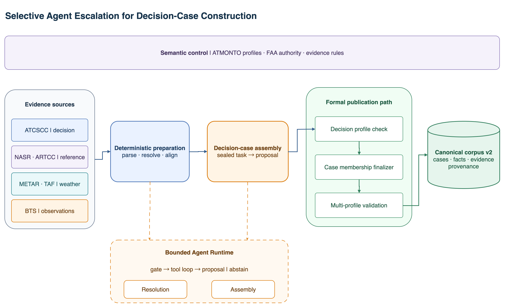
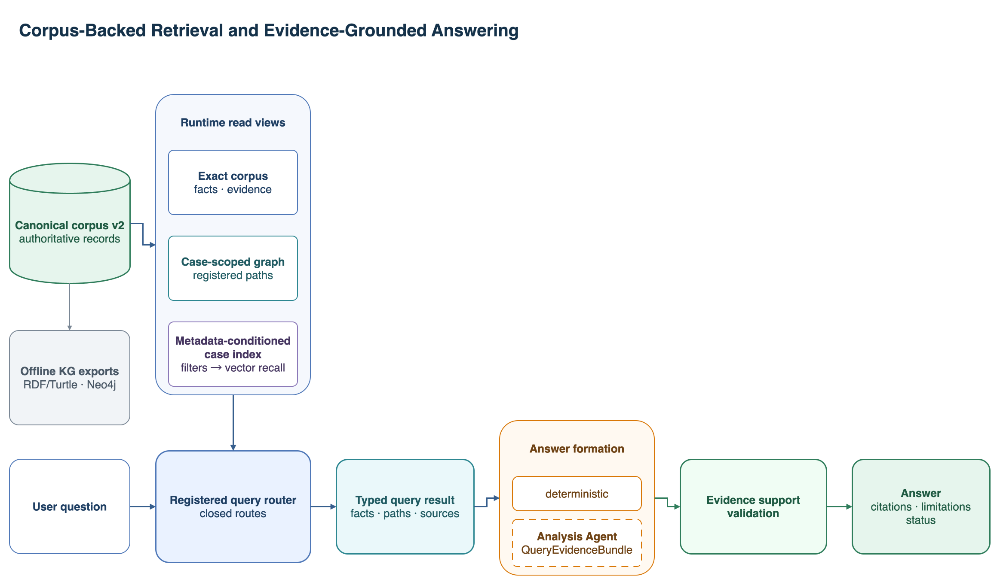

# Bounded-Agent Aviation Decision-Case Knowledge System

Status: normative current architecture with explicit final publication,
selective construction Agents, and an always-on bounded Hybrid Query Agent over
Corpus, case-graph, and metadata-conditioned vector tools

Date: 2026-07-30

## 1. Purpose and Scope

This document defines the runnable system for converting a selected corpus of
retrospective FAA ATCSCC advisories and bounded authority records into
evidence-bound decision cases, validated corpus artifacts, and bounded
graph-grounded answers. It is the normative description of the current
implementation.

The system is not live ATC decision support, a complete aviation ontology, a
causal explanation engine, or a TMI recommendation system. It does not claim
that a reported observation caused a measure or that a measure was optimal.

## 2. Current Architecture



Editable source:
[decision_case_construction_architecture.drawio](figures/decision_case_construction_architecture.drawio).



Editable source:
[decision_case_retrieval_architecture.drawio](figures/decision_case_retrieval_architecture.drawio).

```text
718 advisory rows + bounded FAA authority records
  -> cohort/all selection or explicit source-ID subset
  -> deterministic preflight
  -> zero-call insufficient result for unsupported/incomplete records
  -> deterministic AdvisoryParser
  -> deterministic facility and terminology authority services
     -> shared Semantic Resolution Agent only for genuine ambiguity
  -> deterministic Weather and BTS adapters
  -> sealed Decision Case Assembly task
     -> canonical zero-call compiler for the three approved cases
     -> bounded Decision Case Assembly Agent only for genuine evidence/schema choice
  -> task-bound event-patch admissibility validation
  -> source-independent DecisionCase membership finalization
  -> write-free multi-profile Formal Publication Kernel
  -> canonical corpus v2 normalization
  -> offline rebuildable RDF/Turtle and Neo4j exports
  -> always-on bounded Hybrid Query Agent
     -> exact Corpus, Weather, BTS, case-graph, and filtered-vector tools
     -> action / observation / continue-or-stop loop
     -> per-statement evidence-support validation
     -> answer / insufficient / blocked
```

The coordinator, parsers, authority services, adapters, validators, profiles,
writers, and materializers are deterministic components. They are not Agents.
The ontology profile constrains publication; it is not an Agent.

Only three components can make bounded model-mediated decisions:

1. the shared Semantic Resolution Agent;
2. the Decision Case Assembly Agent;
3. the Hybrid Query Agent for every valid natural-language query.

No separate Critic, long-term Memory, Weather, BTS, ASPM, or recommendation
Agent is active. Query planning and tool routing occur inside the bounded Query
Agent loop rather than a fixed question registry.

## 3. System Increment and Boundaries

| Item | Current decision |
| --- | --- |
| Capability | Build a source-bounded ATCSCC decision-case corpus and answer natural-language questions through model-selected, read-only HybridRAG tools. |
| Smallest end-to-end result | Build a selected source-ID subset into corpus v2, ask a paraphrased question, retrieve the needed evidence, and return supported statements or an honest terminal state. |
| Minimum components | AdvisoryParser, authority services, optional semantic/assembly Agents, Weather/BTS adapters, DecisionCase core, Formal Publication Kernel, corpus store, case-graph view, Chroma sidecar, bounded query tools, Query Agent, and statement-support validator. |
| Evidence | Source IDs, exact evidence text, snapshot checksums, sealed construction contracts, fact traces, tool observations, statement-level support IDs, and deterministic software tests. |
| Success | Accepted facts materialize consistently; every valid question enters the LLM query loop; supported statements cite admitted evidence; missing evidence returns `insufficient`. |
| Failure | A component invents a candidate, source, fact, cause, ontology term, recommendation, or graph write; the Query Agent answers before retrieval; a statement cites unavailable evidence; or a result bypasses the Kernel. |
| Deferred | Causal explanation, recommendation, lifecycle episode grouping, operational-situation or outcome-aware similarity, general aviation chat outside the bounded corpus, and current live-model performance claims. |

## 4. Source and Evidence Boundaries

The source families remain distinct:

- ATCSCC advisory records support source-declared event fields and declared
  reasons.
- FAA NASR and ARTCC records support facility authority resolution.
- FAA terminology records support operational-term authority resolution.
- METAR and TAF records supply time-bounded Weather context.
- BTS records supply source-qualified public operational observations.

Every accepted fact has source IDs, exact evidence text, a profile binding, and
an auditable fact trace. Authority records support resolution only; they do not
authorize event facts. Profile gaps are source-supported audit records and
never become formal RDF or Neo4j facts.

The runtime uses these terminal states:

| State | Meaning |
| --- | --- |
| `ok` | Validated evidence supports the requested result. |
| `insufficient` | The requested field, optional layer, or retrieved evidence is absent or unsupported. |
| `blocked` | A required contract, source, checksum, schema, or provider dependency failed. |
| `profile_gap` | The source supports a value that the active formal profile cannot publish. |

## 5. Deterministic Intake and Authority Services

`AdvisoryParser` deterministically extracts source-supported mentions and
structured fields from one advisory. It does not canonicalize a facility,
choose an ontology term, write a graph, or make a provider call.

The facility and terminology authority services each preserve their own source
family and candidate construction. They deterministically return a blocked,
insufficient, or unique accepted result when the authority evidence permits
one. They do not become Agents merely because their result is recorded in an
EvidenceCard.

For every authority result, the runtime preserves the source record bindings,
candidate audits, task and proposal identity, source-qualified evidence, and
the decision basis. A unique result must not construct a model factory.

## 6. Shared Semantic Resolution Agent

The Semantic Resolution Agent activates only when a facility or terminology
authority service has more than one eligible, source-bound candidate. It
receives a sealed `ResolutionTask` with a closed candidate set, authority
evidence, schema constraints, and remaining budget. It can accept an eligible
candidate or abstain; it cannot create a candidate, canonical ID, source,
definition, class, or property.

Its tools are read-only and candidate-bounded:

```text
get_resolution_candidates
get_authority_record
get_ontology_context
check_candidate_constraints
compare_candidate_evidence
```

The Agent may request one batch of at most three tools and has at most two
provider calls. A pre-activation blocked, insufficient, zero-candidate, or
unique-candidate path uses no provider. Malformed, out-of-scope, or
indistinguishable output returns a sealed abstained or blocked result, as the
contract requires.

## 7. Weather and BTS Context

Weather and BTS preparation is deterministic and precedes Decision Case
Assembly. The adapters select and validate source-bound records, then seal
their state into the Assembly task.

Weather rules:

- a TAF is issued no later than the advisory signature time and overlaps the
  operational period;
- the METAR context is the latest report in the allowed pre-issue window plus
  reports in the half-open operational period;
- Weather reports can enter the formal graph only through the curated Weather
  profile;
- event-to-Weather associations are audit-only and carry
  `causal_claim=false`.

BTS rules:

- baseline, active, and recovery windows are respectively `[-2h, start)`,
  `[start, end)`, and `[end, +6h)`;
- the formal public-observation profile owns BTS-reported observations,
  derivations, quantities, units, and traces;
- BTS observations are not FAA demand, AAR, capacity, EDCT, ASPM data, or
  proof that a TMI caused an outcome.

Weather and BTS context never supplies or changes a declared-reason state.

## 8. Decision Case Assembly

The runtime seals a `CaseAssemblyTask` after deterministic parsing, authority
resolution, Weather/BTS preparation, and profile checks. The task binds core
facts, source and evidence references, profile gaps, resolution proposals,
context associations, observations, component states, and source snapshots.

The three approved cases use `compile_case_assembly_proposal` and require no
Assembly provider construction or call. A non-canonical record may activate the
Decision Case Assembly Agent only when a dedicated factory is available and a
genuine evidence/schema choice remains. The Agent sees a compact task-bound
schema context and read-only task tools; it never receives graph-write
authority.

The active Agent contract uses two provider turns and one read-only tool call.
It first reads one compact sealed candidate bundle, then returns only an
`accepted` or `abstained` decision plus selected candidate IDs. It does not
regenerate predicates, values, evidence bindings, or a complete graph patch.
An accepted selection must equal the sealed candidate set; deterministic code
restores the full proposal and sends it through the existing preflight and
publication checks. An abstention becomes an honest `insufficient` result.
Any out-of-task candidate or malformed selection is blocked. This event-patch
check is an early admissibility gate; it does not write a projection.

## 9. Formal Publication Kernel and Profiles

After optional-layer selection and DecisionCase membership finalization, the
write-free Formal Publication Kernel validates the entire admitted case once.
It checks active profile membership, identity, source evidence, datatype,
domain/range, graph constraints, and layer-specific evidence traces. It
accepts only the formal layers owned by their profiles:

1. ATCSCC decision facts under the NASA ATMONTO decision profile;
2. METAR/TAF report facts under the curated Weather profile;
3. BTS-reported observations under the public-observation profile;
4. `DecisionCase`, `DecisionCaseReconstruction`,
   `prov:specializationOf`, and `prov:hadMember` facts under the DecisionCase
   core profile.

The DecisionCase core records source-independent system structure. Its
membership relations say that an admitted record belongs to one
reconstruction; they do not state that Weather caused the TMI or that the TMI
caused a BTS observation.

Every accepted fact carries the owning profile identifier and checksum. No
model writes directly to RDF, Turtle, Neo4j, or a final graph artifact. Normal
optional-layer `insufficient` or `blocked` outcomes are omitted before final
publication. A malformed layer that was admitted to the final set blocks the
whole case and produces no formal projection; the system does not silently
drop that layer and retry a smaller publication.

## 10. Corpus v2 Artifacts and Batch Recovery

`agent-system build-corpus` is the only persistent writer. It selects the
frozen cohort (or an explicit source-ID subset), preflights each advisory, and
runs eligible records sequentially through the existing workflow. It writes
one `CorpusBuildResult` for every selected source. The frozen intake is 718
discovered, 68 selected, 42 Agent-eligible, 23 unsupported-TMI, and 3
incomplete-core-field records. The 26 preflight outcomes are `insufficient`
with zero model calls.

The corpus manifest has version `decision-case-corpus-v2` and registers every
table and projection by path, count, and SHA-256:

```text
corpus_manifest.json
build_results.jsonl
artifacts.jsonl
source_objects/<sha256>.txt
source_bindings.jsonl
cases.jsonl
facts.jsonl
case_facts.jsonl
evidence_links.jsonl
profile_gaps.jsonl
context_associations.jsonl
observations.jsonl
kg.jsonl
kg.ttl
neo4j_nodes.jsonl
neo4j_relationships.jsonl
```

Source payloads are globally deduplicated by content checksum. `facts.jsonl`
uses semantic identity independent of provenance; `evidence_links.jsonl`
retains one-to-many support for facts, profile gaps, context associations, and
observations. Profile gaps preserve exact original evidence text outside the
formal graph. Weather associations retain `causal_claim=false`. Observations
retain phase, metric, null or numeric value, unit, admitted fact IDs, profile,
and source artifact.

Corpus v2 is the canonical persisted knowledge layer. Every `cases.jsonl`
record requires a conceptual `case_iri` and a `reconstruction_iri` extracted
from accepted DecisionCase core facts. Exact Corpus reads and the case-scoped
graph are runtime views; Chroma is a rebuildable metadata-conditioned retrieval
index. All three are accessed through deterministic, read-only Query Agent
tools. RDF/Turtle and Neo4j are offline rebuildable KG exports and do not
connect to the runtime query loop. Context associations are excluded from
formal RDF and Neo4j; already admitted BTS public-observation facts remain
formal.

The successful build also publishes a research-only usage sidecar:

```text
agent_usage/
  agent_usage.jsonl
  agent_usage_manifest.json
```

Each eligible workflow case contributes facility-resolution,
terminology-resolution, and decision-case-assembly rows. They distinguish
actual activation, deterministic bypass, and a role not reached, and aggregate
outcome, provider/tool calls, tokens, and recorded latency. Preflight
insufficiencies have no usage rows. The sidecar stores no prompt, raw model
response, tool payload, result payload, or reasoning text. Its manifest binds
the records to `corpus_id`, but the sidecar is excluded from the canonical
manifest and cannot change corpus identity. These rows are execution telemetry;
they do not measure whether model choices or outputs are semantically correct.

A blocked provider or workflow result does not stop the batch. It prevents
final-manifest publication and is the only state retried by
`build-corpus --resume`. Successful finalization deletes temporary case
bundles; those staging packages are never a public read backend.

## 11. Always-On Hybrid Query Agent

The public `ask` surface accepts a natural-language question; it has no exact
question registry, keyword classifier, or deterministic answer bypass. After
the corpus, immutable query scope, and provider are constructed successfully,
every request enters the bounded Query Agent. The first model response must
request retrieval and cannot answer from model memory.

The Agent follows a Pi-style action-observation loop:

```text
natural-language question + immutable query scope
  -> LLM selects one or more bounded tools
  -> deterministic tools return typed observations and evidence identities
  -> LLM continues retrieval or emits a typed answer
  -> per-statement support and claim-boundary validation
  -> answer / insufficient / blocked
```

The loop permits at most four provider turns, at most three tool calls in one
turn, and at most six tool calls in total. Tool errors and observations are
returned to the model through typed tool messages. Repeated retrieval is
allowed when a first observation reveals the event or evidence needed for a
later call; unbounded planning, external web access, graph writes, and
long-term Agent memory are not available.

Six deterministic, read-only tools form the HybridRAG surface:

| Tool capability | Runtime source | Boundary |
| --- | --- | --- |
| Find cases | Corpus case catalog | Exact filters and bounded paging. |
| Read case facts | Formal facts and profile gaps | Preserves formal, profile-gap, and missing reason states. |
| Read Weather context | Context associations plus admitted report facts | Always `causal_claim=false`. |
| Read public observations | BTS observation records and formal facts | Never FAA demand, capacity, AAR, EDCT, or decision rationale. |
| Read case graph | Case-scoped formal graph view | Entity, direction, predicate, and result limits; no SPARQL or Cypher. |
| Find similar cases | Corpus-bound Chroma sidecar | Exact filters before vector recall; no recommendation or optimality claim. |

The CLI event ID, exact filters, pagination window, and archive/prior candidate
scope form an immutable upper bound. A model may narrow that scope but cannot
widen it. The model never receives graph-write tools, raw storage paths, or an
external retriever.

Every typed answer consists of statements and limitations. Each statement
declares a semantic kind and cites the subset of retrieved case, fact,
profile-gap, context-association, observation, graph-path, and source IDs that
supports it. The validator rejects unknown IDs and applies kind-specific
requirements:

- a source fact needs a source plus a case, formal fact, or profile gap;
- a non-causal context statement needs a source and context association;
- a public-observation statement needs a source and observation;
- a similarity statement needs source and case support.

The validator also rejects causal language over Weather context, attempts to
reinterpret BTS observations as FAA demand/capacity or decision rationale, and
recommendation or optimality language over similarity results. No answer prose
is written back into corpus v2, RDF, Neo4j, or the construction
`agent_usage/` sidecar.

The metadata-conditioned case index still uses one compact document per
accepted case: TMI type, canonical facility, declared-reason state/value, UTC
time of day, and duration bucket. It does not encode Weather, BTS outcomes,
operational effectiveness, or recommended actions. The deterministic vector
tool is derived from and bound to `corpus_id`; changing the corpus requires
rebuilding it. The surrounding query always remains model-routed.

## 12. Canonical Acceptance Cases

The three cases are regression contracts, not a causal or semantic benchmark.

| Source ID | Facility and period | Declared-reason state | Active BTS-reported counts |
| --- | --- | --- | --- |
| `2026-05-19:123` | KJFK, `2026-05-19T21:00:00Z` to `2026-05-19T22:45:00Z` | Source-bound profile gap only; no formal `atm:impactingCondition`. | 20 scheduled, 18 completed, 2 cancellations, 0 diversions. |
| `2026-05-19:138` | KJFK, `2026-05-19T22:05:00Z` to `2026-05-20T02:59:00Z` | Formal `weather`; exact advisory evidence ends at `THUNDERSTORMS`. | 77 scheduled, 68 completed, 4 cancellations, 5 diversions. |
| `2026-05-20:020` | KEWR, preserved operational period | Declared reason missing; the Query Agent can retrieve that missing state but cannot fill it from Weather or BTS. | 50 scheduled, 49 completed, 1 cancellation, 0 diversions. |

All three take the canonical zero-call Assembly path. Weather context remains
non-causal and cannot widen, infer, replace, or otherwise change these reason
states.

## 13. Command Interface and Breaking Cutover

The current commands are:

```text
aviation-ai agent-system build-corpus --config <config> --output-dir <corpus-dir> [--selection cohort|all] [--source-id <id> ...] --allow-live-model [--resume]
aviation-ai agent-system index-cases --corpus-dir <corpus-dir> [--model-name <model>] [--allow-model-download]
aviation-ai agent-system ask --corpus-dir <corpus-dir> --question "<question>" [--event-id <event-id>] [exact filters and paging]
aviation-ai agent-system neo4j-export --corpus-dir <corpus-dir>
aviation-ai agent-system export-case --corpus-dir <corpus-dir> --event-id <event-id> --output-dir <export-dir>
```

This is a deliberate storage cutover. There is no public `ingest` command,
`ask-corpus` alias, `--runs-root` importer, `--run-dir` query/export path, or
v1 corpus migration layer. `build-corpus --source-id` is the bounded
single-case debug route. Corpus queries, projections, Neo4j loads, and case
exports all use the checksum-verified v2 tables.

`--allow-live-model` remains explicit authorization for eligible corpus builds.
The public `ask` command has no deterministic fallback or opt-in query flag: it
constructs the configured `query` model and returns `blocked` when that provider
is unavailable. Event type, facility, declared reason, pagination, and
`archive`/`prior` options bound the tool scope; they do not select a hard-coded
question route.

## 14. Verification Requirements

The active verification gate is:

```text
uv run ruff check .
uv run pytest -q
uv build
git diff --check
```

Focused three-case checks verify the exact source IDs, facilities, operational
periods, reason states, evidence wording, source provenance, non-causal
Weather boundary, active BTS-reported counts, and absence of unnecessary
provider use. A passing offline contract check does not claim external expert
certification or live semantic accuracy.

Scripted and fake providers remain appropriate for these software and data-flow
checks. Model-dependent claims require the explicit live-evaluation path,
which reuses the real corpus builder, Formal Publication Kernel, and corpus
query implementation and does not silently substitute a fake provider.

The frozen Batch F live smoke predates the Hybrid Query Agent. It used DeepSeek
`deepseek-v4-pro`, temperature `0.0`, thinking disabled, no automatic retries,
and one repetition for four Assembly tasks and the GDP `138` registered-analysis
task. Its runner completed, but model acceptance was `0/5`:

- Assembly `025`, `030`, and `072` exceeded the frozen output-token cap;
- Assembly `070` returned a malformed typed Assembly contract;
- the GDP `138` retired-analysis answer failed its typed evidence-support
  contract.

No prompt or token-cap adjustment was made during that frozen run. The later
versioned compatibility fix is described below. Temperature `0` reduces
sampling variance but does not make provider output deterministic, and this
one-shot smoke is neither a statistical benchmark nor evidence about the
current Query Agent.

The separate repeated-provider experiment used the same frozen five tasks for
12 full cycles. It recorded 108 attempted and 108 successful real-provider
calls, zero provider failures, 431,018 input tokens, and 89,148 output tokens.
Task acceptance remained `0/60`: 48 Assembly measurements exceeded the frozen
output-token cap and 12 retired-analysis measurements failed the typed
answer/support contract. DeepSeek reported 396,928 prompt-cache-hit tokens and 34,090
prompt-cache-miss tokens from its automatic input-prefix context cache. This
was not cached-response replay, and all 108 provider response IDs were unique.
These are repeated pre-refactor compatibility measurements, not 60 independent
tasks or current query performance. The
local `live-agent-experiment-v1-invalid-observer-phase/` and
`live-agent-experiment-v1-normalized-response-only/` diagnostics are excluded
from this result.

The pre-fix v2 experiment retained the same four Assembly tasks but replaced
the retired registered-analysis trial with the always-on Hybrid Query Agent.
Across 12 cycles, all 120 real DeepSeek calls returned successfully. The GDP
`138` query passed 12/12 measurements, while the Assembly tasks failed 48/48
measurements because the full graph-patch response was incompatible with the
frozen output contract.

The compact-selection fix was then accepted with the same five frozen tasks
over 12 cycles. All 120 real DeepSeek calls returned successfully and all
60 task measurements passed. The run used 261,238 input tokens and 30,561
output tokens; all observed Assembly and query outputs remained below the
then-active stricter limits. The raw and parsed artifact hashes
matched the experiment manifest, with no call-binding, cache, configuration,
invalid-tool-call, or assertion failure. These are repeated compatibility
measurements of five fixed tasks, not a broad natural-language benchmark.

The active system ceiling is now 10,000 output tokens for the Query Agent and
Decision Case Assembly Agent. Semantic Resolution remains capped at 256 tokens
because its final result is a compact candidate decision.

A subsequent one-repetition live smoke verified the 10,000-token configuration
with 10/10 successful real calls and all five frozen tasks accepted.

The Semantic Resolution Agent is
`not_evaluated_no_natural_ambiguity` because the frozen cohort has no natural
multi-candidate task. Synthetic ambiguity fixtures test offline orchestration
and contracts only; they are not reported as frozen-cohort model performance.

The tracked six-query retrieval smoke set over 38 accepted cases checks four
reviewed analogue pairs and two expected-insufficient filters. Its observed
Hit@1, Hit@3, and MRR are all `1.0`, with two of two expected-insufficient
queries passing. This is a bounded relevance smoke test, not expert Gold,
decision-quality evidence, or an operational recommendation benchmark.

## 15. Non-Capabilities

The current system does not provide general aviation chat, causal explanation,
operational optimization, TMI recommendation, lifecycle decision-episode
grouping, observed individual-flight impact, operational-situation or
outcome-aware similarity, learned reranking, automatic ontology expansion,
public deployment, or external expert certification.
