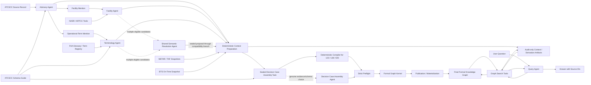

# Multi-Agent Aviation Event Knowledge System

Status: normative implementation design
Version: 1.4
Date: 2026-07-27

## 1. Purpose

This document is the single design source for the first runnable version of the
multi-Agent aviation event knowledge system.

The system reads one retrospective FAA ATCSCC advisory together with
authoritative facility and terminology sources, coordinates source-specialist
Agents, constructs an ontology-guided event knowledge graph, and answers a user
question from that graph with source references. The Decision Context Case v0
extension established the bounded Weather/BTS adapters. Decision Case Graph v1
adds source-qualified BTS-reported public operational observations without
adding Agent roles or causal claims. Batch B adds one shared Semantic
Resolution Agent behind the existing facility and terminology compatibility
branches. It activates only for genuine multi-candidate ambiguity. Batch C
replaces the legacy graph-construction runtime with a sealed Decision Case
Assembly task, a zero-call compiler for the three canonical cases, and a
bounded Assembly Agent for genuine non-canonical evidence/schema choice.

The project objective is to build a useful and extensible system. It is not
currently a Single-Agent versus Multi-Agent comparison experiment, a Gold-set
project, or an attempt to prove that role count alone improves quality.

The required vertical slice is:

```text
ATCSCC advisory
    -> Advisory Agent
    -> Facility Agent and Terminology Agent compatibility branches
       -> deterministic blocked / insufficient / unique outcomes
       -> shared Semantic Resolution Agent for multiple eligible candidates
    -> deterministic Weather/BTS context preparation and validation
    -> sealed Decision Case Assembly task
       -> deterministic compiler for Ground Stop 123, GDP 138, and GDP 020
       -> bounded Decision Case Assembly Agent only for genuine
          evidence/schema choice
    -> strict task-signature preflight
    -> Formal Graph Kernel
    -> profile-owned publication, materialization, and audit artifacts
    -> Query Agent
    -> graph-grounded answer with source IDs
```

## 2. Scope

### 2.1 Included

- One real ATCSCC advisory per ingest command.
- NASR and ARTCC authority data for facility resolution.
- FAA terminology and the existing operational-term registry.
- Deterministic METAR/TAF selection for decision-time and operational context.
- Deterministic BTS On-Time aggregation for source-qualified public operational
  observations.
- The existing NASA ATMONTO-derived ATCSCC schema profile.
- The curated NASA ATMONTO weather profile slice.
- The curated SOSA/PROV/TIME/QUDT public-observation profile.
- Existing interpretation, compatibility, and query role surfaces:
  - Advisory Agent
  - Facility Agent
  - Terminology Agent
  - Query Agent
- One shared Semantic Resolution Agent that is conditionally activated behind
  the facility and terminology branches.
- One Decision Case Assembly Agent conditionally activated behind a sealed
  Assembly task; the three canonical cases use its deterministic compiler.
- LangGraph for the fixed collaboration topology.
- LangChain for model invocation.
- Pydantic for internal Python contracts.
- A tolerant line-oriented Graph Patch model output.
- RDF, Neo4j projection, canonical-ID merging, and provenance.
- A separately authorized bounded live semantic smoke gate, which remains
  pending for Batch B.

### 2.2 Deferred

- Single-Agent versus Multi-Agent comparisons.
- Gold construction, benchmark scoring, and go/no-go research claims.
- Critic, Verifier, Self-Refine, debate, voting, and repair Agents.
- Weather Agents and broader weather-source expansion.
- Weather-based causal explanation.
- ASPM demand, AAR, capacity, EDCT, and runway configuration.
- Cross-advisory event coreference.
- Full-corpus model execution over all 718 advisories.
- Generic RAG, vector-memory expansion, and automatic prompt learning.
- Web UI and production hardening.
- Dynamic unbounded planning loops.
- Creation of a new aviation ontology.

## 3. Design Principles

1. **Use Agents only where bounded reasoning or tool choice is useful.**
   Deterministic parsing, schema validation, and graph writing are not Agents.
2. **Authority data outranks model knowledge.** A model cannot invent a
   facility, canonical term, ontology class, property, or source.
3. **Ontology is a shared contract, not another Agent.**
4. **Evidence moves between Agents, not hidden reasoning.**
5. **Model output stays simple.** Python state can be typed with Pydantic, but
   provider JSON Schema is not required.
6. **The knowledge graph is shared long-term system memory.**
7. **Unresolved information remains unresolved.** `abstain`, `profile_gap`, and
   `blocked` are normal outcomes.
8. **The first implementation remains bounded.** No Agent has an open-ended
   loop or unrestricted tool access.

## 4. System Architecture



The Workflow Coordinator is a deterministic LangGraph controller. It creates
tasks, performs fan-out and join, and records state transitions. It does not
call an LLM and is not counted as an Agent role.

### 4.1 Decision Case Graph v1 extension

After advisory and authority resolution, the `prepare_context` node invokes two
deterministic adapters in memory. Weather is validated against a transient
advisory-plus-Weather registry; BTS is validated against a separate BTS-only
registry. Their validated records and explicit missing/blocked states are
sealed into the Decision Case Assembly task. No context artifact is published
before Assembly preflight and the Formal Graph Kernel. The later
`decision_context` node publishes only context whose event identity still
matches the Kernel-accepted event:

```text
validated event + canonical airport + METAR/TAF snapshots
  -> source-derived report selection
  -> formal MeteorologicalReport facts
  -> audit-only non-causal context associations

validated event + canonical airport + normalized BTS snapshot
  -> baseline / active / recovery aggregation
  -> audit-only aggregation summaries
  -> profile-owned SOSA observations and QUDT results
  -> observation derivations and fact traces
```

TAF must be issued at or before the advisory signature time and overlap the
operational period. METAR selection is limited to the latest observation in the
two hours before issue plus observations in the half-open operational period.
BTS windows are half-open and fixed to baseline `[-2h, start)`, active
`[start, end)`, and recovery `[end, +6h)`.

Weather reports may enter the formal graph only through the curated weather
profile. Event-to-report associations remain outside RDF and Neo4j with
`causal_claim=false`. `outcome_summaries.jsonl` remains an audit intermediate,
not query authority. BTS-reported observations enter the formal graph only
through the dedicated public-observation profile and must not be mapped to FAA
demand, AAR, capacity, EDCT, or ASPM fields. `WeatherDelay` and `NASDelay`
retain their source meaning as carrier-reported attributions and are not causal
labels.

## 5. Ontology and Schema Guide

### 5.1 Existing artifacts

The system must reuse:

- `data/ontology/external/icarus_ontology/NASA/ATM.owl`
- `data/ontology/external/icarus_ontology/NASA/NAS.owl`
- `data/ontology/curated/nasa_atmonto_schema_catalog.json`
- `data/ontology/curated/nasa_atmonto_atcscc_schema_slice.json`
- `data/ontology/curated/nasa_atmonto_atcscc_extraction_schema.json`
- `data/ontology/curated/nasa_atmonto_decision_context_weather_slice.json`
- `data/ontology/curated/decision_case_public_observation_slice.json`
- `reports/stages/atcscc_ontology_profile_overview.md`

The full OWL files are the ontology source. The schema catalog is the
machine-readable inventory. The ATCSCC schema slice is the active application
profile. The extraction JSON schema is a machine-readable reference for the
existing extraction fields and constraints; it is not a requirement that the
LLM use JSON or provider-side JSON Schema. The Weather and public-observation
profiles independently own their admitted classes, properties, units,
datatypes, and checksums.

### 5.2 Profile-owned publication layers

The final graph is the union of three independently validated layers:

1. ATCSCC decision facts under the NASA ATMONTO decision profile;
2. METAR/TAF report facts under the curated Weather profile;
3. BTS-reported observations under the public-observation profile.

Every accepted fact records its owning profile ID and checksum. The
public-observation layer uses SOSA observations, TIME intervals, PROV
derivation activities, and QUDT values. Its observable-property labels are
explicitly BTS-reported, and its profile forbids mappings to FAA arrival
demand, AAR, causal relations, or semantic-equivalence properties.

### 5.3 Schema Guide service

`SchemaGuide` is a deterministic service. It exposes:

- schema-slice identifier and checksum;
- class IRI, prefixed name, label, comment, and parent classes;
- object-property domain and range;
- datatype-property domain and datatype;
- available cardinality and enumerated-value constraints;
- operational-term to event-class mapping;
- compact context selection for the current event class.

The active Decision Case Assembly Agent receives only compact task-bound schema
context, not the complete OWL ontology.

### 5.4 Initial ontology mappings

| Source meaning | Ontology representation |
| --- | --- |
| Ground Delay Program | `rdf:type -> atm:GroundDelayProgramTMI` |
| Ground Stop | `rdf:type -> atm:GroundStopTMI` |
| Controlled airport or NAS element | `atm:controlledNASelement` |
| Advisory number | `atm:advisoryNumber` |
| Effective start | `atm:effectiveStartTime` |
| Effective end | `atm:effectiveEndTime` |
| Impacting condition, when supported | `atm:impactingCondition` |
| Source provenance | `prov:wasDerivedFrom` |

The formal event graph must not replace these terms with parallel custom
properties such as `cs:eventType`, `cs:affectsFacility`,
`cs:usesMeasure`, `cs:effectiveStart`, or `cs:effectiveEnd`.

If a source-supported field has no valid representation in the active profile,
it is recorded as a `profile_gap`; it is not silently assigned a newly invented
property.

### 5.5 Canonical identity versus ontology type

Canonical identity and ontology typing solve different problems:

- the facility registry decides that `JFK` and `KJFK` denote the same facility;
- the canonical facility ID is the Neo4j/RDF entity identity;
- `nas:Airport` describes the entity type;
- `atm:controlledNASelement` describes the event-to-facility relationship;
- the terminology registry normalizes `GS` and `GROUND STOP`;
- the Schema Guide maps that normalized concept to `atm:GroundStopTMI`.

## 6. Shared Agent Contracts

The Python runtime uses small Pydantic contracts. These contracts do not imply
that LLMs must emit JSON.

### 6.1 AgentTask

```text
run_id
source_id
objective
context_refs
allowed_tools
schema_slice_id
```

### 6.2 EvidenceClaim

```text
field_name
value
ontology_target
evidence_text
source_id
canonical_ref
uncertainty
```

### 6.3 EvidenceCard

```text
agent_role
status: resolved | abstain | profile_gap | blocked
claims
canonical_refs
source_ids
uncertainties
tool_trace
decision_basis
```

### 6.4 AgentResult

```text
status
artifact_ref
evidence_card
failure_reason
```

`decision_basis` is a concise evidence summary. The runtime must not request or
store hidden chain-of-thought.

## 7. Common Agent Lifecycle

Every Agent follows the same bounded lifecycle:

```text
receive AgentTask
    -> inspect permitted context
    -> choose an allowed tool, when needed
    -> collect authority-backed evidence
    -> decide resolved / abstain / profile_gap / blocked
    -> emit an EvidenceCard, Graph Patch, or answer
```

Common rules:

- an Agent may call only the tools named in `allowed_tools`;
- every accepted claim must carry `source_id` and `evidence_text`;
- missing evidence produces `abstain`, not model completion from memory;
- tool traces record tool name, safe parameters, result references, and timing;
- credentials and hidden model reasoning are never stored;
- model and tool-call budgets are checked before invocation.

## 8. Advisory Agent

### 8.1 Goal

Convert one raw ATCSCC advisory into a source-bounded evidence card containing
event-type, facility, operational-term, time, and status mentions.

### 8.2 Input

- one `SourceRecord`;
- a compact list of relevant ATCSCC event classes;
- deterministic structured-field parse results.

### 8.3 Allowed tools

- `get_advisory`
- `parse_structured_fields`
- `get_schema_event_classes`

### 8.4 Internal process

1. Read the advisory and metadata.
2. Inspect deterministic field-parser output.
3. Identify the event-type mention.
4. Identify facility and operational-term mentions.
5. Identify effective start, effective end, and source status expressions.
6. Attach exact source spans to every claim.
7. Leave facility and terminology canonicalization to downstream Agents.
8. Emit `AdvisoryEvidenceCard`.

### 8.5 Limits

- at most three deterministic tool calls;
- at most one model call;
- no facility or terminology registry access;
- no graph construction.

### 8.6 Stop conditions

- missing source record: `blocked`;
- no event evidence: `abstain`;
- unsupported but real source field: retain the claim for later
  `profile_gap` handling.

## 9. Facility Agent

`Facility Agent` remains the compatibility role name during migration. Its
authority lookup and zero- or one-candidate decisions are deterministic. Only
a set of multiple eligible candidates is delegated to the shared Semantic
Resolution Agent.

### 9.1 Goal

Resolve a facility mention to an authoritative canonical facility entity and
its ontology type.

### 9.2 Input

- facility mention;
- structural slot;
- exact advisory evidence span;
- advisory source ID.

### 9.3 Allowed tools

- `lookup_nasr_facility`
- `lookup_artcc`
- `resolve_facility_alias`

### 9.4 Internal process

1. Use the structural slot to select an authority lookup.
2. Retrieve authority candidates.
3. Accept a unique authority candidate.
4. If multiple eligible candidates remain, seal a candidate-bounded
   `ResolutionTask` and invoke the shared Semantic Resolution Agent.
5. Translate its sealed accepted or abstained proposal back into the
   compatibility evidence card.
6. Emit canonical ID, authority source, and `nas:Airport`, `nas:ARTCC`, or the
   applicable existing profile type.

### 9.5 Limits

- at most three tool calls;
- no Semantic Resolution model factory for pre-activation blocked,
  insufficient, or unique authority outcomes;
- at most two provider calls through the shared Semantic Resolution Agent for
  a genuine multi-candidate case;
- no model-created facility IDs.

### 9.6 Stop conditions

- zero candidates: `abstain`;
- unresolved multiple candidates: `abstain`;
- authority-source failure: `blocked`.

## 10. Terminology Agent

`Terminology Agent` also remains a compatibility role name. Candidate
generation, authority lookup, schema compatibility, and zero- or
one-candidate decisions remain deterministic. Only a set of multiple eligible
candidates is delegated to the same Semantic Resolution Agent used by the
facility branch.

### 10.1 Goal

Expand and normalize an operational-term mention, resolve its canonical term,
and map the term to an existing ATCSCC ontology class when supported.

### 10.2 Input

- operational-term mention;
- exact advisory evidence span;
- advisory source ID.

### 10.3 Allowed tools

- `lookup_faa_glossary`
- `lookup_pcg_term`
- `resolve_term_registry`
- `resolve_schema_event_class`

### 10.4 Internal process

1. Expand the abbreviation when an authority definition exists.
2. Normalize surface variants to the canonical operational term.
3. Retrieve the authority definition and source reference.
4. Map the canonical term to an existing ATMONTO class.
5. Accept a unique authority mapping.
6. For multiple eligible mappings, seal a candidate-bounded `ResolutionTask`
   and use the shared Semantic Resolution Agent.
7. Emit `TerminologyEvidenceCard`.

### 10.5 Limits

- at most four tool calls;
- no Semantic Resolution model factory for pre-activation blocked,
  insufficient, or unique authority outcomes;
- at most two provider calls through the shared Semantic Resolution Agent for
  a genuine multi-candidate case;
- no new ontology class or property.

### 10.6 Stop conditions

- no authority candidate: `abstain`;
- canonical term exists but no schema mapping: `profile_gap`;
- authority-source failure: `blocked`.

## Shared Semantic Resolution Agent (Batch B)

The Batch B offline implementation uses one internal Agent runtime for both
facility and terminology ambiguity. Facility and terminology candidate
generation and authority sources remain separate. Compatibility wrappers keep
the existing workflow node names, fan-out, join, CLI commands, and downstream
evidence-card contracts unchanged.

The Agent receives an immutable `ResolutionTask` containing registered
candidates and their eligibility audits, source-bound authority evidence,
schema constraints, and the remaining budget. It may select only an eligible
candidate and may request one batch of one to three read-only tools:

```text
get_resolution_candidates
get_authority_record
get_ontology_context
check_candidate_constraints
compare_candidate_evidence
```

The first provider turn may request that single tool batch. The second and
final turn returns exactly the four provider-facing fields `decision`,
`selected_candidate_id`, `rejected_candidate_ids`, and `limitation`. The
runtime, not the model, constructs the full `ResolutionProposal`, stable IDs,
source bindings, and ordered tool traces.

The limits are:

- at most two provider calls and three read-only tool calls;
- a 4,096-token maximum rendered input and 256-token output cap;
- no parse-repair retry, second tool batch, graph write, new candidate, or
  source-family crossover;
- accepted output requires an eligible candidate and observed distinguishing
  authority content; ontology or constraint observations may inform the
  decision but do not replace source-bound authority support;
- indistinguishable evidence returns `abstained`;
- malformed output, contract corruption, provider setup failure, or provider
  invocation failure returns a sealed `blocked` proposal.

Pre-activation blocked, insufficient, zero-candidate, and unique-candidate
paths do not construct the Semantic Resolution model factory and therefore use
zero provider calls. A factory construction failure returns a sealed `blocked`
proposal with a limitation but no provider-attempt record. A provider invocation
failure adds a failed `ModelCallRecord`, consumes that provider-call budget, and
returns `blocked`. Automated Batch B acceptance uses scripted tool-model stubs
or replay only. The separate bounded live semantic smoke remains pending.
Decision Case Assembly is active in Batch C. Decision Case Analysis remains
inactive.

## 11. Decision Case Assembly and Legacy Construction Compatibility

The public workflow node retains the internal name `kg_construction` for
compatibility, but it no longer invokes the legacy Knowledge Graph Construction
Agent. It now seals and executes Decision Case Assembly as defined in
Section 14.2. The legacy design below records the predecessor contract and
should not be read as the active publication path.

### 11.0 Legacy Knowledge Graph Construction Agent

### 11.1 Goal

Plan a small event graph and generate an ontology-constrained Graph Patch from
the source record and the three evidence cards.

### 11.2 Input

- stable event URI and resolved event class;
- references to `AdvisoryEvidenceCard`, `FacilityEvidenceCard`, and
  `TerminologyEvidenceCard`;
- Schema Guide slice identifier;
- allowed source IDs and available canonical references.

The prompt does not receive the full evidence cards or Schema Guide context.
Those values remain behind the registered read-only tools so tool use changes
the Agent's observable state rather than decorating a preassembled prompt.
The active KG Construction Agent has no text-only model fallback: a resolved
event without a native tool-calling model adapter is blocked.

### 11.3 Allowed tools

- `get_schema_context`
- `resolve_canonical_ref`
- `get_source_evidence`

### 11.4 Internal process

1. Receive the stable event URI, resolved event class, and context references.
2. In one native tool-call turn, select the required read-only context tools.
3. Receive matching `ToolMessage` observations for the selected calls.
4. Plan only facts supported by the retrieved evidence cards.
5. Map each fact to an ontology property returned by `get_schema_context`.
6. Use only canonical entity IDs returned by `resolve_canonical_ref`.
7. Generate `GRAPH_PATCH` as text on the second model turn.
8. Place real but unmapped source facts under `PROFILE_GAPS`.
9. Omit unresolved or abstained entities from the formal patch.
10. Send the parsed patch to the existing deterministic Formal Graph Kernel.

### 11.5 Output format

```text
GRAPH_PATCH
subject | predicate | object | source_ids

PROFILE_GAPS
field | value | evidence | reason
```

The parser ignores blank lines, code fences, and lines beginning with `#`.

### 11.6 Limits

- at most three read-only tool calls;
- each tool may be called at most once;
- exactly one context-tool round;
- at most two model calls: tool selection, then Graph Patch generation;
- no retry, repair turn, self-refinement, or unbounded loop;
- no direct RDF, Turtle, Cypher, or provider JSON Schema output;
- no new ontology vocabulary;
- no writing to Neo4j.

### 11.7 Stop conditions

- missing resolved event type: `abstain`;
- missing required source evidence: `abstain`;
- missing Schema Guide: `blocked`;
- no native context-tool call or an out-of-scope tool call: `blocked`;
- a second-round tool request: `blocked`;
- output parse failure: `blocked`, with the raw response preserved.

## 12. Query Agent

### 12.1 Goal

Answer a user question using only the materialized knowledge graph and its
provenance.

### 12.2 Input

- user question;
- graph-store handle;
- registered event IDs as graph-scope metadata;
- ontology labels and property descriptions.

### 12.3 Allowed tools

- `find_events`
- `get_event_facts`
- `get_neighbors`
- `get_provenance`
- `get_profile_gaps`

Two typed high-level tools are available only to the deterministic query
router, not to the model-visible tool registry:

- `get_decision_context`
- `get_outcome_summary`

### 12.4 Internal process

1. Identify whether the question asks about events, facilities, time, event
   type, or provenance.
2. Select the smallest suitable graph query.
3. Inspect graph results.
4. Perform another graph query only when the first result reveals a necessary
   adjacent entity.
5. Retrieve provenance for every answer claim.
6. Generate a concise natural-language answer.
7. List the supporting source IDs.

Registered deterministic intents cover measure, facility, operational period,
declared reason, provenance, forecast known at decision time, observed weather
context, BTS-reported public operational observations, and one
reconstructed-case question. Unsupported, absent, or malformed optional
context is decided before model construction.

### 12.5 Limits

- at most three graph-tool calls;
- at most two model calls for one bounded model-tool-model cycle;
- no raw advisory reader;
- no external web or model-memory answer fallback.
- no Weather or BTS graph-write tool;
- no provider call for registered deterministic context intents.

### 12.6 Stop conditions

- no supporting graph evidence: answer `Insufficient graph evidence.`;
- missing provenance: omit the unsupported claim;
- graph-store failure: `blocked`.
- a valid missing optional layer: `insufficient`;
- checksum, schema, source binding, or layer-disjointness failure: `blocked`.

## 13. Deterministic Components

The following are infrastructure, not Agents:

- Workflow Coordinator;
- source loaders;
- multi-source snapshot registry;
- structured-field parser;
- Weather context adapter;
- BTS outcome adapter;
- BTS public-observation builder;
- validation-profile registry;
- context artifact validator;
- Schema Guide;
- Graph Patch parser;
- schema validator;
- canonical-ID resolver;
- RDF writer;
- Neo4j materializer;
- run-trace store.

The schema validator checks:

- class and property membership in the active schema slice;
- property domain and range;
- datatype and enumerated values;
- available cardinality constraints;
- canonical-reference existence;
- source-reference existence;
- graph endpoint existence.

Validation outcomes are:

- `accepted`: eligible for materialization;
- `schema_violation`: invalid under the active profile and not written;
- `profile_gap`: source-supported but not represented by the active profile;
- `parse_error`: malformed Graph Patch;
- `blocked`: required system dependency failed.

This validation does not use an LLM and is not a Verification Agent.

## 14. Collaboration Topology

The ingest graph is:

```text
START
  -> Advisory Agent
  -> parallel fan-out:
       Facility Agent compatibility branch
         -> deterministic blocked / insufficient / unique result
         -> shared Semantic Resolution Agent only for multiple eligible
            facility candidates
       Terminology Agent compatibility branch
         -> deterministic blocked / insufficient / unique result
         -> the same shared Semantic Resolution Agent only for multiple
            eligible terminology candidates
  -> evidence-card join
  -> deterministic Weather/BTS preparation and independent profile validation
  -> sealed Decision Case Assembly task
  -> deterministic compiler for 123 / 138 / 020
       or bounded Decision Case Assembly Agent for genuine choice
  -> strict task-signature preflight
  -> Formal Graph Kernel
  -> publication/materialization
  -> decision_context publication of the already validated optional context
  -> END
```

The Query Agent is a separate graph:

```text
START
  -> interpret question
  -> choose graph tool
  -> retrieve graph evidence
  -> optional bounded follow-up graph query
  -> retrieve provenance
  -> compose answer
  -> END
```

Decision Case Graph v1 is split between pre-Assembly preparation and
post-Kernel publication:

```text
resolved event + canonical facility
  -> Weather adapter
  -> BTS adapter
  -> Weather-profile validation
  -> public-observation construction and profile validation
  -> seal selected records and explicit layer states into Assembly task
  -> Assembly preflight and Formal Graph Kernel
  -> recheck accepted event identity
  -> append validated Weather/public-observation facts
  -> write audit-only associations, summaries, derivations, and traces
  -> bounded deterministic query tools
```

### 14.1 Batch B compatibility status

Batch A contracts and authority evidence remain in force. Batch B is
implemented offline behind the existing facility and terminology compatibility
entrypoints. Task-referenced authority records are retained as audit snapshots
after formal graph validation, but they do not authorize event facts or enter
the KG Construction Agent's evidence view.

The facility and terminology branches construct the same strict
`ResolutionTask`/`ResolutionProposal` contract family. Deterministic
pre-activation blocked, insufficient, zero-candidate, and unique-candidate
outcomes construct no provider. Only multiple eligible candidates activate the
shared Semantic Resolution Agent, and its result is translated back into the
existing `AgentResult`, resolution-domain outcome, authority-source registry,
and model-call ledger. The sealed task, proposal, and safe tool trace remain in
workflow state for replay and testing.

### 14.2 Decision Case Assembly Agent (Batch C)

In Batch C (`batch-c-decision-case-assembly-v1`), the compatibility
`kg_construction` node runs the Decision Case Assembly pipeline after
deterministic Weather/BTS preparation:

1. **CaseAssemblyTask:** The workflow constructs an immutable, sealed
   `CaseAssemblyTask` carrying core event facts, resolution proposal IDs,
   schema slice bindings, and multi-source evidence references.
2. **Deterministic Compiler:** Ground Stop 123, GDP 138, and GDP 020 always use
   `compile_case_assembly_proposal` with zero Assembly provider construction or
   calls. Other cases also remain deterministic unless a dedicated Assembly
   factory and a genuine evidence/schema choice are both present.
3. **Bounded Agent Loop:** Only an activated dedicated Assembly factory runs
   `run_case_assembly_agent`, in up to 3 turns:
   - Turn 1: Batch read-only tool selection (`get_case_requirements`,
     `get_schema_context`, `get_source_evidence`, `get_resolution_result`,
     `get_context_associations`, `get_public_observations` — max 6 tool calls across
     activation).
   - Turn 2: Proposal generation (`GRAPH_PATCH` and `PROFILE_GAPS`), evaluated
     against the exact sealed task signature.
   - Turn 3 (Revision): At most 1 validation-guided revision turn if a repairable
     lowercase-to-authorized-uppercase value defect occurs. Only the named
     fact's `object_value` may change to an explicitly allowed correction.
     Hard causal, out-of-task, out-of-schema, source-binding, profile, or
     evidence violations block.
4. **Contract Execution Binding:** Every task, proposal, and validation feedback is
   sealed with `ContractExecutionBinding` (`run_id`, `created_at`, `tool_version`).
5. **Strict Preflight:** Every `ok` or `partial` proposal must retain the exact
   task-owned fact IDs, profile gaps, evidence, resolution results, context
   associations, component artifacts, and source bindings. A declared reason
   must be supported only by ATCSCC advisory evidence and cannot use a
   Weather/BTS derivation.
6. **Kernel Authority:** The deterministic Formal Graph Kernel
   (`validate_graph_patch`) remains the sole final publication authority.

### 14.3 Batch C Decision Case Assembly status

Batch C activates Decision Case Assembly behind contract execution bindings and
preflight validation while preserving all existing ATCSCC, Weather, BTS,
provenance, and query contracts. Decision Case Analysis remains inactive.
Automated regression tests verify deterministic assembly (0 provider calls)
and replay stability across all three canonical decision cases. Optional
context preparation occurs before task sealing; publication occurs only after
the Assembly proposal passes strict preflight and the Formal Graph Kernel.

## 15. Memory Model

The system has three memory layers:

1. **Working state:** LangGraph state for the current ingest or query run.
2. **Knowledge memory:** canonical RDF/Neo4j graph shared across runs.
3. **Audit memory:** versioned run directory with source references, evidence
   cards, tool traces, model responses, Graph Patch, schema version, and graph
   artifacts. New runs also record a multi-source registry, Weather fact trace,
   non-causal context associations, BTS aggregation summaries, observation
   derivations, observation fact traces, and an immutable reconstruction trace.

There is no Memory Agent in this version. There is no vectorized conversation
history, autonomous experience replay, or automatic prompt modification.

## 16. Prompt Policy

The normative role prompts are stored in:

`configs/prompts/agent_system_v1.yaml`

This frozen catalog is authored and tested independently from executor
implementation. Runtime code loads the catalog; it must not rewrite, extend, or
silently replace the prompt text.

Runtime message assembly is fixed:

```text
SystemMessage(role.system)
HumanMessage(role.few_shot[0].user)
AIMessage(role.few_shot[0].assistant)
HumanMessage(role.few_shot[1].user)
AIMessage(role.few_shot[1].assistant)
HumanMessage(render(role.user_template, current_input))
```

The trace records the prompt-set ID, role prompt version, rendered current
input hash, model parameters, and raw response. ZCode may implement this loader
and trace, but it must not add a hidden system prefix or rewrite examples.

Each role prompt contains only:

- role goal;
- authority-source priority;
- permitted tools or supplied tool results;
- information boundary;
- abstain rule;
- output template;
- one minimal fictional positive example and one fictional boundary example for
  format and abstention stability.

### 16.1 Literature-grounded prompt design

The prompt design borrows narrow, reusable mechanisms from established work
without claiming to reproduce those systems:

- **Text2Event:** adopt a compact linearized structure that can be parsed back
  deterministically, and condition generation on an explicit event schema. In
  this project the linearized representation is Graph Patch. The project does
  not claim to implement Text2Event's trie-based constrained decoder.
- **VerifiNER:** present retrieved authority evidence and a closed candidate
  set, require the selected meaning to be supported by both knowledge and local
  context, and retain an explicit abstain outcome. The system never falls back
  to unsupported model memory and does not use multi-sample consistency voting.
- **EA-Agent:** expose only task-relevant evidence and invoke semantic facility
  or terminology resolution only when deterministic authority lookup leaves a
  real ambiguity. The current fixed topology does not implement learned path
  planning, policy optimization, or a Reflector.
- **Self-Refine:** use task-specific input-output examples to stabilize the
  expected representation. The examples are fictional and source-disjoint.
  Iterative self-feedback and revision are not part of this system version.
- **CRITIC:** treat external source evidence as more reliable than unsupported
  self-critique. No Critic Agent or correction loop is added in this version.

These adaptations produce five concrete prompt-engineering mechanisms:

1. explicit role and information boundaries;
2. delimited untrusted source, evidence, schema, and graph blocks;
3. closed candidate and vocabulary constraints with abstention;
4. character-for-character copying of identifiers and provenance;
5. two fictional, contrastive in-context input-output pairs per role.

The examples demonstrate representation and decision boundaries only. They do
not contain the real advisory, facility codes, operational terms, canonical
identifiers, or expected answer used by the live smoke input.

All model calls use the configured DeepSeek endpoint with:

- temperature `0`;
- thinking disabled;
- no automatic provider retry;
- bounded output tokens;
- recorded provider, model, usage, latency, and prompt version.

Temperature `0` reduces sampling variance but does not guarantee universal
determinism. Reproducibility comes from preserved prompts, inputs, outputs, and
versioned sources.

Prompt acceptance has two layers:

1. `tests/test_agent_system_prompt_catalog.py` checks roles, versions,
   placeholders, information boundaries, output contracts, ontology terms,
   refusal language, and model defaults without a provider call.
2. `scripts/smoke_agent_system_prompts.py` performs a bounded five-call
   DeepSeek smoke test, one call per role, using a fixed advisory and fixed
   authority/schema inputs. It validates format adherence, canonical reference
   preservation, ATMONTO predicate use, absence of parallel custom core
   predicates, and graph-source citations. It is implementation QA, not a
   semantic benchmark.

The legacy five-role smoke remains a compatibility check. Batch B adds the
frozen `semantic_resolution` prompt and deterministic scripted/replay
acceptance for its model-tool-model loop. Those offline checks do not replace
the separately authorized bounded live semantic smoke, which remains pending.

The prompt-engineering QA permits one fixed-input diagnostic pass and one
fixed-input confirmation pass after correcting observed prompt failures. This
is capped at ten provider calls in total. It is not best-of-N sampling, prompt
search, a model comparison, or evidence of semantic accuracy. If manual review
of the confirmation output reveals a newly specified contract failure, one
targeted call for the affected role is allowed after adding a deterministic
regression check; the other roles are not rerun.

## 17. Provenance and Trace

Every accepted graph fact must be traceable through:

```text
graph fact
  -> Graph Patch line
  -> EvidenceClaim
  -> source ID and evidence text
  -> versioned source snapshot
```

An EvidenceClaim is validated against its own `source_id` and checksum in
`source_snapshots.jsonl`; the kernel must not assume that every claim comes
from the advisory snapshot. Audit-only Weather associations and BTS aggregation
summaries carry their own source ID and checksum but are not graph facts.
Formal BTS-reported observations additionally bind their source snapshot,
owning profile, aggregation procedure, selected row IDs, derivation, fact
trace, and reconstruction membership.

The trace stores concise decisions and evidence. It must not store credentials,
hidden chain-of-thought, or unrelated environment values.

## 18. File Layout

The intended package is:

```text
src/aviation_agentic_ai/agent_system/
  __init__.py
  contracts.py
  decision_case_contracts.py
  case_assembly_tools.py
  case_assembly.py
  prompts.py
  resolution_tools.py
  semantic_resolution.py
  sources.py
  schema_guide.py
  agents.py
  graph_patch.py
  materialize.py
  weather_context.py
  weather_context_validation.py
  bts_outcomes.py
  public_observations.py
  validation_profiles.py
  context_artifacts.py
  query_context_store.py
  query_tools.py
  query_tool_graph.py
  workflow.py
  query.py
  runtime.py

src/aviation_agentic_ai/cli_agent_system.py
```

Existing loaders, registries, KG writers, graph projection code, and LLM
providers must be reused through narrow imports. They must not be copied into
the new package.

## 19. Command Interface

```text
aviation-ai agent-system ingest \
  --source-id <source-id> \
  --config configs/cross_source_v1.yaml \
  [--allow-live-model]

aviation-ai agent-system neo4j-export \
  --run-dir <run-directory>

aviation-ai agent-system ask \
  --run-dir <run-directory> \
  --question "<question>" \
  [--allow-live-model]
```

The ingest command writes a versioned run directory. The ask command must
retrieve from that run's materialized graph and must not answer directly from
the raw advisory.

## 20. Acceptance Requirements

### 20.1 Component tests

- Every Agent can call only its declared tools.
- The three canonical cases use the deterministic Assembly compiler and do not
  construct or call an Assembly provider.
- An activated Decision Case Assembly Agent receives only sealed record IDs,
  selects one batch of task-bounded read-only tools, and receives matching
  `ToolMessage` observations before emitting a proposal.
- The Assembly prompt does not preload full evidence records or raw source
  documents.
- The Assembly loop makes at most three model calls and six tool calls,
  including no more than one value-only revision.
- The Advisory Agent does not canonicalize facilities or terms.
- Unique authority facility and terminology paths make no model call.
- Pre-activation blocked, insufficient, zero-candidate, and unique-candidate
  resolution paths do not construct a provider. Factory construction failure
  yields a sealed blocked limitation; provider invocation failure records and
  consumes the failed attempt.
- Facility and terminology multiple-candidate paths use the same shared
  Semantic Resolution runtime while retaining separate authority sources.
- A resolvable ambiguity requires recorded distinguishing authority content;
  an indistinguishable ambiguity produces `abstained`.
- Semantic Resolution remains inside the sealed task candidate set, uses at
  most two provider calls and one batch of three read-only tools, and blocks on
  malformed or out-of-scope output without repair.
- Every EvidenceClaim carries source ID and evidence text.
- Facility and Terminology Agents fan out and join after the Advisory Agent.
- Unresolved canonical references cannot enter a formal Graph Patch.
- Graph Patch facts use the active Schema Guide vocabulary.
- Invalid domain/range facts produce `schema_violation`.
- Real unsupported fields produce `profile_gap`.
- Profile gaps never enter RDF or Neo4j.
- The run manifest records schema-slice ID and checksum.
- The formal graph contains no parallel custom core predicates replacing the
  ATMONTO profile terms.
- Reingesting the same source creates the same event ID.
- Reingesting produces no duplicate canonical nodes or relationships.
- No materialized relationship has a missing endpoint.
- The Query Agent sees graph-tool results, not raw source documents.
- Missing graph evidence produces `Insufficient graph evidence.`.
- No trace stores chain-of-thought or credentials.
- Every publishable Assembly proposal exactly matches its sealed task-owned
  formal facts, profile gaps, evidence, resolution, context, component, and
  source-binding sets before entering the Formal Graph Kernel.
- The run manifest records the sealed Assembly task/proposal and safe tool
  traces when the Agent path is activated.
- Every new run records `source_snapshots.jsonl`,
  `context_associations.jsonl`, `outcome_summaries.jsonl`, and
  `weather_fact_trace.jsonl`, plus `observation_derivations.jsonl`,
  `observation_fact_trace.jsonl`, and `reconstruction_trace.json`, with path,
  count, checksum, and `ok | insufficient | blocked` status.
- Decision-time TAF selection excludes forecasts issued after the advisory.
- Weather associations remain non-causal and absent from RDF/Neo4j.
- Aggregation summaries alone cannot authorize a query answer.
- Validated BTS-reported observations appear identically in JSONL, RDF, and
  Neo4j and retain profile, source, procedure, derivation, and row-selection
  bindings.
- The exact deterministic question `What BTS-reported public operational
  observations are recorded?` makes zero provider calls.
- The Ground Stop 123 reason remains a profile gap, GDP 138 retains the formal
  `weather` reason, and cancellation 020 remains missing-reason.
- Missing or unsupported deterministic context queries make zero provider
  calls.

### 20.2 Repository checks

```text
uv run ruff check .
uv run pytest -q
git diff --check
```

### 20.3 Real vertical-slice smoke

After all offline tests pass:

1. deterministically select one real advisory with one facility, a clear GDP
   or GS event, and complete effective times;
2. run live ingest;
3. ingest the same source again and check idempotency;
4. export with Neo4j `MERGE` semantics without clearing unrelated nodes;
5. ask one event/facility/time question;
6. confirm that the answer cites actual graph provenance.

Provider calls are capped at six, with a hard maximum of eight. There is no
calibration, A/B prompt test, resampling, or post-result prompt tuning.

## 21. Protected Areas

The implementation must not modify:

- `alignment_mve`;
- alignment Gold, Critic, or Self-Refine workflows;
- legacy cross-source and weather-linking code outside `agent_system`;
- `reports/final/figure_descriptions.md`;
- `.superpowers/`;
- `.zcode/`;
- NASA ATMONTO source OWL files;
- the content of the existing ATCSCC schema slice.

No push or merge is made before local Codex review.

## 22. Executor Protocol

ZCode implements this document; it does not redesign it.

ZCode must return `BLOCKED` when implementation requires:

- a new Agent role;
- a new ontology class or property;
- a change to the ATCSCC schema profile;
- a second Agent framework;
- an unbounded Agent loop;
- a new unapproved source family;
- a broader live-model run.

Completion evidence must report:

- implemented Agent contracts;
- tool boundaries;
- LangGraph fan-out and join;
- schema-slice ID and checksum;
- formal-graph custom core predicate count;
- tests;
- real source ID;
- provider calls;
- idempotency result;
- Neo4j result;
- graph-grounded answer and source IDs;
- remaining limitations.
