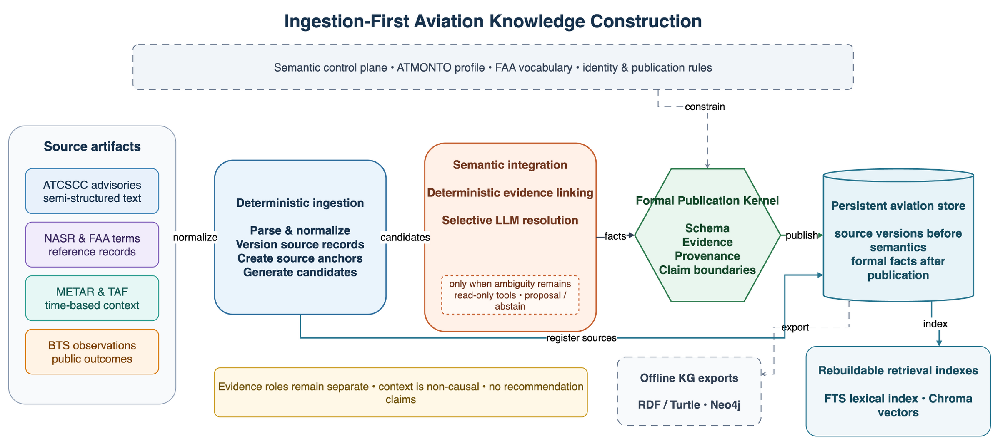
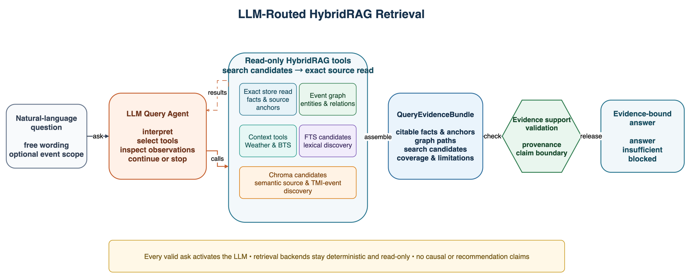

# ATMONTO-Centered Ingestion-First Aviation HybridRAG

Status: normative current architecture

Date: 2026-07-31

## 1. Purpose

This document defines the runnable system for ingesting retrospective FAA
ATCSCC records and bounded cross-source evidence into ATMONTO-aligned TMI event
knowledge, then answering free-form natural-language questions with explicit
source support.

The current vertical slice covers GDP, GS, and ReRoute. It validates a reusable
aviation knowledge-integration architecture; it is not a claim of complete ATM
coverage.

The system does not provide:

- live ATC decision support;
- a complete aviation ontology;
- an internal FAA decision-process model;
- causal explanation;
- operational effectiveness or optimality;
- TMI recommendation.

## 2. Architecture



Editable source:
[tmi_event_construction_architecture.drawio](figures/tmi_event_construction_architecture.drawio).



Editable source:
[tmi_event_retrieval_architecture.drawio](figures/tmi_event_retrieval_architecture.drawio).

Construction:

```text
ATCSCC + FAA authority + METAR/TAF + BTS source artifacts
  -> source-specific deterministic adapters
  -> immutable source assets, versions, and anchors
  -> ATMONTO-aligned TMI classification and preflight
  -> FAA facility and terminology authority services
     -> Semantic Resolution Agent only for genuine ambiguity
  -> Weather and BTS evidence preparation
  -> deterministic Event Evidence Integration
  -> task-bound admissibility validation
  -> write-free Formal Publication Kernel
  -> authoritative SQLite evidence and semantic store
  -> source chunks and SQLite FTS5
  -> rebuildable source and TMI-event Chroma collections
```

Retrieval:

```text
free-form question + immutable user scope
  -> bounded LLM Query Agent
  -> exact store | semantic graph | FTS | Chroma | exact source read
  -> structured evidence and support records
  -> LLM answer formation
  -> statement-support and claim-boundary validation
  -> answer / insufficient / blocked
```

RDF/Turtle, JSONL KG, and Neo4j are optional offline exports from SQLite, not
mandatory runtime databases.

The coordinator, adapters, parsers, authority services, profile loaders,
validators, materializers, SQLite queries, graph views, and index
implementations are deterministic. They are not Agents.

Only two roles make bounded model-mediated choices:

1. Semantic Resolution Agent;
2. Query Agent.

Event Evidence Integration is a deterministic construction service.

## 3. Relationship To The Six RAG Stages

The implementation preserves the standard separation between offline
ingestion and online inference:

```text
Offline/background
source record -> chunk -> embedding -> index

Online
question -> retrieval -> evidence augmentation -> LLM generation
         -> deterministic support validation
```

HybridRAG changes retrieval, not this separation. Exact SQLite reads,
store-backed graph traversal, SQLite FTS5, Chroma source retrieval, and Chroma
TMI-event retrieval are alternative bounded retrieval channels selected by the
Query Agent.

The authoritative store is not an experiment snapshot. It is the normalized
persistent knowledge layer from which retrieval indexes and exports can be
rebuilt. A frozen evaluation dataset may bind to a store revision, but it is
not a required runtime read backend.

## 4. Semantic Alignment

### 4.1 ATMONTO

ATMONTO is the schema/TBox target. The formal root is:

```text
atm:TrafficManagementInitiative
```

Active application-profile families are:

```text
atm:GroundDelayProgramTMI
atm:GroundStopTMI
atm:ReRouteTMI
```

One registry drives source-family detection, required-field preflight,
admitted predicates and values, publication-profile selection, and retrieval
labels. The versioned profile constrains publication; an LLM cannot extend it.

### 4.2 ATMGRAPH

ATMGRAPH is the ABox-construction and query reference. The implementation
adopts source-specific translation, stable cross-source identities, explicit
time, provenance-preserving links, and graph patterns for cross-source
queries.

No ATMGRAPH dataset is imported, and the project does not claim an exact
replica of the historical system.

## 5. Source And Evidence Roles

The source families remain distinct:

| Source family | Permitted role |
| --- | --- |
| ATCSCC advisories | Published TMI fields and source-declared reasons. |
| FAA NASR / ARTCC | Facility authority and canonical identity. |
| FAA terminology | Operational-term authority and schema alignment. |
| METAR / TAF | Time-bounded Weather report facts and non-causal context. |
| BTS On-Time | Source-qualified public operational observations. |

Authority evidence can resolve an identity but cannot authorize a TMI fact. A
Weather report can provide context but cannot fill a missing declared reason.
A BTS row cannot become an FAA demand or capacity record.

Every accepted fact carries an owning profile and checksum, semantic identity,
source-version binding, and evidence link or deterministic derivation trace.

## 6. Incremental Ingestion

`ingest` is the public write path. It registers immutable configured source
versions before processing selected advisories. One or more `--source-id`
values bound semantic event construction; omitting them processes all
configured advisory records.

One invocation loads schema, authority, Weather, and BTS resources once, then
processes advisories sequentially. For each source version:

1. a previous terminal `ok` or `insufficient` result is skipped;
2. unsupported or incomplete input becomes zero-call `insufficient`;
3. eligible input follows parsing, authority resolution, evidence integration,
   validation, and publication;
4. an accepted event publication is committed independently;
5. a blocked version is retained for a later retry.

There is no requirement to complete a batch or publish a batch manifest before
accepted knowledge becomes queryable.

## 7. Semantic Resolution Agent

The Semantic Resolution Agent receives a sealed task with a closed authority
candidate set, source-qualified evidence, ontology constraints, and fixed
tool/model budgets.

It may accept an eligible candidate or abstain. It cannot create a candidate,
canonical ID, source, class, predicate, or definition.

Its candidate-bounded tools are:

```text
get_resolution_candidates
get_authority_record
get_ontology_context
check_candidate_constraints
compare_candidate_evidence
```

A blocked, insufficient, zero-candidate, or unique-candidate path uses no
provider. The reviewed development inventory currently contains no natural
ambiguity suitable for a model-performance claim.

## 8. Weather And Public Observations

Weather and BTS preparation is deterministic and precedes evidence integration.

Weather rules:

- a TAF must be issued no later than the advisory signature time and overlap
  the operational period;
- METAR selection uses permitted pre-issue and half-open operational windows;
- Weather report facts enter formal knowledge only through the Weather profile;
- event-to-Weather associations remain non-formal and carry
  `causal_claim=false`.

BTS rules:

- baseline, active, and recovery windows are `[-2h, start)`, `[start, end)`,
  and `[end, +6h)`;
- the public-observation profile owns quantities, units, derivations, and
  source traces;
- numeric zero remains zero;
- a missing source value never becomes numeric zero;
- observations never become FAA demand, AAR, capacity, EDCT, decision
  rationale, effectiveness, or proof of a caused outcome.

Neither source family changes the ATCSCC-declared reason.

## 9. Event Evidence Integration And Publication

After deterministic parsing, authority resolution, and optional-layer
preparation, the runtime seals an `EventEvidenceIntegrationTask`. It binds the
TMI event identity, admitted core facts, source and evidence references,
profile gaps, authority resolutions, Weather associations and report facts,
public observations, and required/optional slots.

The deterministic compiler returns a source-supported proposal or honest
`insufficient`. Source identifiers never select special behavior. Malformed or
out-of-task evidence is `blocked`.

The Formal Publication Kernel is write-free and is the sole final publication
authority. It validates the complete admitted formal set before a transaction
writes accepted semantics.

It accepts:

1. ATCSCC TMI event facts under the ATMONTO profile;
2. admitted METAR/TAF Weather report facts;
3. admitted BTS public-observation facts.

It checks profile identity, source-version bindings, evidence and fact traces,
datatypes, domain/range, graph constraints, and layer-specific boundaries.
Normal optional insufficiency is omitted before publication. A malformed layer
already admitted to the final set blocks that event publication.

No model writes directly to SQLite, JSONL, RDF/Turtle, Neo4j, FTS, or Chroma.

## 10. Authoritative SQLite Store

The dataset-bound store uses schema version
`aviation-evidence-store-v1` and file:

```text
aviation_evidence.sqlite3
```

Its main logical groups are:

| Group | Stored records |
| --- | --- |
| Source | assets, logical sources, immutable versions, exact anchors |
| Ingestion | source-version results, ingestion runs, compact Agent usage |
| Event | TMI identities, active/historical publications, type/facility/source bindings |
| Semantics | facts, event membership, evidence links |
| Qualified evidence | profile gaps, Weather associations, public observations |
| Retrieval | source chunks, FTS5 table, vector-index state |

Semantic facts are deduplicated independently of provenance. Evidence links
preserve one-to-many support. Active-publication pointers allow a newer source
version to supersede an earlier publication without erasing history.

The store maintains a monotonically increasing knowledge revision. Vector
indexes and evaluation bindings must match that revision before use.

## 11. Chunking, FTS, And Chroma

The current source representation is
`aviation-source-chunk-v1`. It creates one bounded full-record chunk for each
admitted textual source version and binds the chunk to an exact source anchor.
This is a deliberately simple first chunking strategy, not a claim that one
strategy fits future PDF, table, or long-document sources.

SQLite FTS5 indexes source-chunk text and follows SQLite inserts, updates, and
deletes through triggers.

Chroma contains two rebuildable collections:

| Collection | Purpose |
| --- | --- |
| `aviation_source_chunks_v1` | Semantic discovery of source-record chunks. |
| `tmi_events_v1` | Metadata-conditioned retrieval of TMI event publications. |

Ingestion attempts an incremental update after semantic publication.
`reindex` recreates both collections from all current store rows. A failed or
missing vector index does not roll back accepted semantic publication.

The Query runtime attaches a Chroma collection only when dataset identity,
schema/representation version, embedding model, vector dimension, record
counts, and indexed knowledge revision are current.

## 12. Always-On Hybrid Query Agent

The public `ask` command accepts free natural language. There is no exact
question registry, keyword classifier, or deterministic answer bypass.

```text
question + immutable CLI scope
  -> LLM selects bounded read-only tool(s)
  -> typed tool observations
  -> continue retrieval or emit typed statements
  -> statement-support and claim-boundary validation
  -> answer / insufficient / blocked
```

The loop permits at most four provider turns, three tool calls in one turn, and
six tool calls in total.

The nine tools are:

| Tool | Capability |
| --- | --- |
| `find_tmi_events` | Exact event filters and bounded paging. |
| `read_tmi_event_facts` | Formal facts, profile gaps, and reason state. |
| `read_tmi_operational_context` | Non-causal Weather associations and report facts. |
| `read_public_observations` | Source-qualified BTS public observations. |
| `read_tmi_event_graph` | Bounded formal edges or reviewed non-causal paths. |
| `find_similar_tmi_events` | Metadata-conditioned TMI event candidates. |
| `search_source_text` | SQLite FTS lexical candidate discovery. |
| `semantic_search_sources` | Chroma source candidate discovery. |
| `read_source` | Exact bounded source-version and anchor read. |

CLI source IDs/families, event ID, exact filters, paging, and archive/prior
candidate scope form an immutable upper bound. The model may narrow but cannot
widen them. There is no arbitrary SPARQL, Cypher, graph write, external web
access, or long-term Agent memory.

## 13. Retrieval, Augmentation, And Support

Tool observations separate model-visible content from structured
`HybridQueryEvidence`, support records, graph paths, similarity matches, and
limitations. Together these contracts form the query evidence bundle used for
augmentation and final validation.

Lexical and semantic search tools return candidates with source-version,
anchor, and chunk identifiers, but no source-record support record. A source
statement becomes supportable only after `read_source` returns the exact
version and anchor.

Each model-generated statement declares one of:

```text
source_fact
source_record
non_causal_context
public_observation
similarity
```

The validator rejects unknown support IDs, unsupported factual statements,
causal language over Weather associations, reinterpretation of BTS
observations as FAA operational metrics or rationale, and recommendation,
optimality, or effectiveness claims over event retrieval.

Answer prose is never written back into the knowledge store or its indexes.

## 14. Optional Exports

`export-event` emits one active event, its accepted facts, evidence links,
profile gaps, Weather associations, public observations, exact referenced
source versions and anchors, and bounded KG projections.

The full store can be projected to:

```text
kg.jsonl
kg.ttl
neo4j_nodes.jsonl
neo4j_relationships.jsonl
```

`neo4j-export` builds that current projection and loads it into Neo4j. Export
manifests record dataset identity, store revision, counts, and checksums for
inspection and interchange. They are not query-runtime manifests and do not
become publication authorities.

## 15. Public Commands

```text
aviation-ai agent-system ingest \
  --config <config> \
  [--store-dir <store-dir>] \
  [--source-id <id> ...] \
  [--allow-live-model] \
  [--allow-model-download]

aviation-ai agent-system reindex \
  --config <config> \
  [--store-dir <store-dir>] \
  [--model-name <model>] \
  [--allow-model-download]

aviation-ai agent-system ask \
  --config <config> \
  [--store-dir <store-dir>] \
  --question "<question>" \
  [--event-id <event-id>] \
  [source, exact-filter, candidate-scope, and paging options]

aviation-ai agent-system neo4j-export \
  --config <config> \
  [--store-dir <store-dir>] \
  [Neo4j connection options]

aviation-ai agent-system export-event \
  --config <config> \
  [--store-dir <store-dir>] \
  --event-id <event-id> \
  --output-dir <export-dir>
```

The cutover is intentionally breaking. There is no legacy command alias,
run-directory persistence path, or mandatory snapshot reader.

## 16. Regression Contracts

| Source ID | Required semantic state |
| --- | --- |
| `2026-05-19:123` | Ground Stop reason is a source-bound profile gap. |
| `2026-05-19:138` | GDP reason is formal `weather`. |
| `2026-05-20:020` | GDP cancellation reason is honestly missing. |
| `2026-05-19:108` | Formal ReRoute with unsupported ARTCC scope retained as a profile gap. |
| `2026-05-20:137` | Formal ReRoute with unsupported ARTCC scope retained as a profile gap. |

They use the general processing path and are development/regression fixtures,
not evaluation samples, representative coverage, or special source-ID routes.

## 17. Evaluation Boundary

Offline fake/scripted providers validate software contracts only. They do not
establish extraction, reasoning, tool-selection, or Agent quality.

A live evaluation binds directly to an existing store revision, source
versions, active event publications, and current vector state. It does not copy
the knowledge base into a temporary query store.

Historical reports remain frozen under their named runtimes. They cannot
establish ingestion-first performance. Any new live claim must use the
configured real provider, record provider-call success separately from task
acceptance, and verify its raw/parsed artifacts and binding.

The first ingestion-first compatibility smoke satisfied those capture
requirements: 6/6 real `deepseek-v4-pro` calls returned, but only 1/3
development/regression tasks passed. The two failed answer-contract/evidence
checks are retained as observed behavior and are not converted into offline
successes.

## 18. Deferred Work

- Formal decision-state inputs, alternatives, constraints, rationale, and
  trade-offs.
- Decision lifecycle/episode identity.
- National Playbook PDF grounding.
- F1/F3S/S4/S1S flight and sector data.
- ASPM demand, capacity, AAR, EDCT, and runway configuration.
- Weather-based causal explanation.
- Operational effectiveness and outcome-aware similarity.
- TMI recommendation.
- General-purpose aviation QA.
- Automatic ontology expansion.
- Production deployment and production-only hardening.

## 19. Verification

The final repository gate is:

```bash
uv run ruff check .
uv run pytest -q
uv build
git diff --check
```

Software tests may use scripted providers. Model-dependent claims require the
separate live-evaluation path and may not substitute an offline result.

Each mainline implementation batch must add or simplify a user-visible
capability. A validator-only batch requires a reproduced failure through a
supported workflow or an explicit user request.
