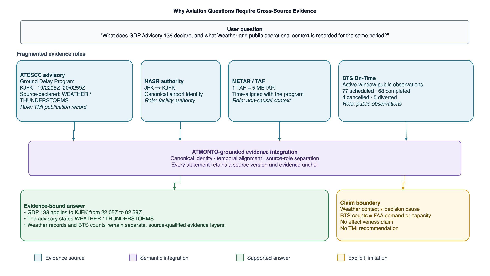
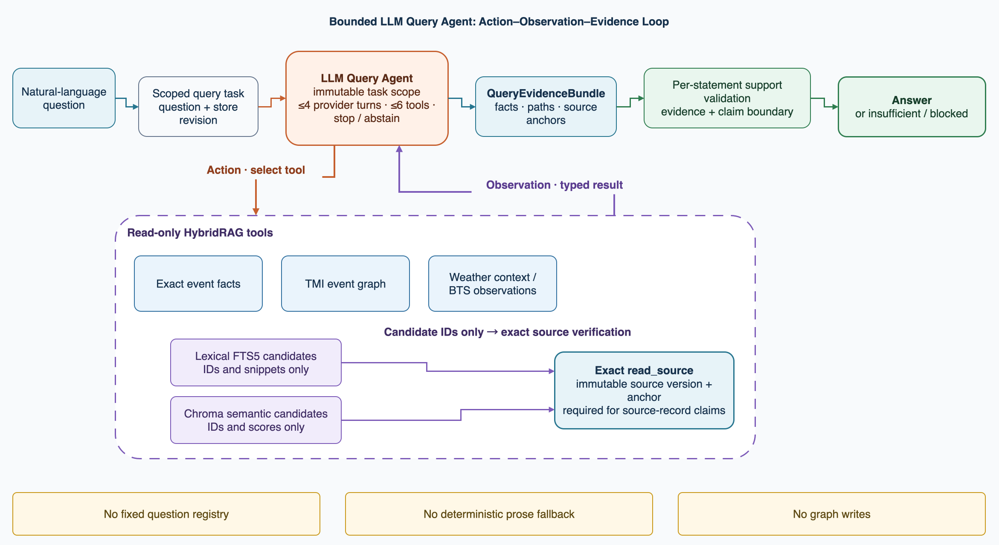
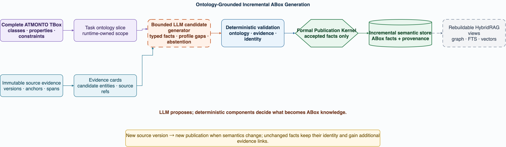

# ATMONTO-Grounded Agentic HybridRAG for Heterogeneous Aviation Knowledge Integration

Status: normative current architecture

Date: 2026-08-01

## 1. Purpose

This document defines a runnable architecture that integrates heterogeneous
aviation evidence into ATMONTO-aligned knowledge and lets an LLM Query Agent
answer free-form natural-language questions through exact, graph, lexical,
vector, context, and source retrieval. An optional Web Evidence sidecar can
provide allowlisted public-document acquisition and read-only query tools; it
is not required for the aviation store or the core Query Agent.

The method combines deterministic source-specific processing, one formal
publication boundary, an authoritative persistent knowledge layer, and
model-directed HybridRAG. Every released answer statement remains traceable to
retrieved evidence.

GDP, GS, and ReRoute remain the mature TMI vertical slice. Flight/Airspace,
reference, Weather, and reviewed cross-source association roots now use the
same publication and query architecture; none defines its permanent subject
boundary.

## 2. Research Narrative And Architecture

### 2.1 Motivated Example



**Figure 1.** Advisory 138 shows why a source-bound answer needs multiple
evidence roles: ATCSCC states the TMI and impacting condition, NASR resolves
KJFK, Weather adds time-aligned non-causal context, and BTS supplies separate
public observations. The figure does not turn those associations into a causal
or effectiveness claim. Editable source:
[cross_source_evidence_motivated_example.drawio](figures/cross_source_evidence_motivated_example.drawio).

### 2.2 System Overview


**Figure 2.** The five-plane architecture keeps deterministic integration,
formal semantic publication, authoritative knowledge, rebuildable retrieval,
and model-directed interaction distinct while connecting them end to end.
Editable source:
[aviation_hybridrag_system_architecture.drawio](figures/aviation_hybridrag_system_architecture.drawio).

### 2.3 Query Agent Workflow



**Figure 3.** The Query Agent makes bounded tool choices over multiple turns;
discovery results become answer support only after exact source verification
and statement-level validation. Editable source:
[bounded_query_agent_workflow.drawio](figures/bounded_query_agent_workflow.drawio).

The figures answer three separate questions: why cross-source integration is
needed, how the complete system is organized, and how the LLM Agent behaves at
query time. This separation prevents the architecture diagram from becoming a
dense workflow chart.



**Figure 4.** The opt-in construction path keeps the complete ATMONTO TBox,
task slice, bounded candidate generation, deterministic publication, and
incremental semantic fusion explicit. Editable source:
[ontology_grounded_incremental_kg_generation.drawio](figures/ontology_grounded_incremental_kg_generation.drawio).

The five planes are:

1. **Evidence Plane** — ATCSCC, FAA authority, Weather, BTS, NASA ATMONTO
   sample, aircraft-registry, and airspace records.
2. **Deterministic Ingestion Orchestration** — parsing, versioning,
   normalization, identity and time alignment, and evidence preparation.
3. **Semantic and Trust Plane** — ATMONTO profiles, selective semantic
   resolution when ambiguity remains, and the Formal Publication Kernel.
4. **Knowledge and Retrieval Plane** — authoritative generic knowledge roots
   in SQLite with rebuildable graph, lexical, vector, and offline export views.
5. **Agent Interaction Plane** — the model-directed Query Agent, evidence
   assembly, optional explicitly authorized Web Evidence tools,
   statement-level support validation, and user answer.

`Agentic` refers to the Query Agent's online action-observation loop and the
selective Semantic Resolution Agent. The coordinator, adapters, parsers,
authority services, profile loaders, validators, materializers, SQLite
queries, graph views, and index implementations remain deterministic services.

### 2.4 Ontology-Grounded ABox Generation (Opt-In Construction Path)

The system also exposes an explicit research path for using an LLM to propose
new ABox facts from source evidence. This path is deliberately separate from
the default deterministic ingestion compiler:

```text
complete ATMONTO TBox
  -> deterministic task-specific ontology slice
  -> sealed evidence cards, anchors, and candidate entities
  -> bounded LLM candidate-fact generator
  -> CandidateFactProposal | abstention | profile gap
  -> deterministic ontology and evidence validation
  -> Formal Publication Kernel
  -> generic knowledge-root publication
  -> incremental semantic-store fusion
```

The complete TBox supplies reusable classes, properties, hierarchy,
domain/range, datatypes, and cardinality constraints. A task receives only
the relevant slice and an immutable evidence binding; it does not receive an
unbounded ontology prompt. The model may select an allowed term and cite an
allowed anchor, but it cannot create ontology terms, identities, source
versions, profile rules, or storage writes. A source-supported statement that
has no active publication term remains a profile gap.

This is an opt-in construction API in the current release, not a claim that
the default `ingest` path already delegates all fact extraction to an LLM.
The separation makes it possible to measure candidate generation and
incremental fusion without weakening the deterministic runtime publication
boundary.

Construction:

```text
composed runtime + source + dataset/temporal-scope configuration
  -> source-specific deterministic adapters
  -> immutable source assets, versions, and anchors
  -> selected domain
     -> TMI classification, authority resolution, Weather/BTS preparation,
        and deterministic Event Evidence Integration
     -> Flight/Airspace normalization and profile-bound fact compilation
  -> semantic facts: write-free Formal Publication Kernel
     -> generic knowledge-root publication spine
  -> cross-source associations: deterministic derivation materializer
  -> authoritative SQLite evidence and semantic store
  -> source chunks and SQLite FTS5
  -> rebuildable source and TMI-event Chroma collections
```

Retrieval:

```text
free-form question + immutable user scope
  -> LLM selects source | tmi | flight_airspace tool families
  -> bounded Query Agent over the selected evidence tools
  -> exact store | semantic graph | FTS | Chroma | exact source read
  -> structured evidence and support records
  -> LLM answer formation
  -> statement-support and claim-boundary validation
  -> answer / insufficient / blocked
```

RDF/Turtle, JSONL KG, and Neo4j are optional all-root offline exports from
SQLite, not mandatory runtime databases.

The default runtime has two roles that make bounded model-mediated choices:

1. Semantic Resolution Agent;
2. Query Agent.

The opt-in ontology construction path adds a third bounded role:

3. Ontology Candidate Fact Generator.

It is activated only by an explicit construction call and is evaluated as a
candidate-proposal component, not as a direct knowledge-store writer.

Event Evidence Integration is a deterministic construction service.

## 3. Relationship To The Six RAG Stages

The implementation preserves the standard separation between offline
ingestion and online inference:

```text
Offline/background
source record -> chunk -> embedding -> index

Online
question -> retrieval -> evidence augmentation -> LLM generation
         -> deterministic support validation
```

HybridRAG changes retrieval, not this separation. Exact SQLite reads,
store-backed graph traversal, SQLite FTS5, Chroma source retrieval, and Chroma
TMI-event retrieval are alternative bounded retrieval channels selected by the
Query Agent.

The authoritative store is not an experiment snapshot. It is the normalized
persistent knowledge layer from which retrieval indexes and exports can be
rebuilt. A frozen evaluation dataset may bind to a store revision, but it is
not a required runtime read backend.

## 4. Semantic Alignment

### 4.1 ATMONTO

ATMONTO is the schema/TBox target. The TMI registry root is:

```text
atm:TrafficManagementInitiative
```

Active application-profile families are:

```text
atm:GroundDelayProgramTMI
atm:GroundStopTMI
atm:ReRouteTMI
```

One registry drives source-family detection, required-field preflight,
admitted predicates and values, publication-profile selection, and retrieval
labels. The versioned profile constrains publication; an LLM cannot extend it.

Additional validation profiles admit the configured Flight, Aircraft/Model,
Airport/ARTCC, Route, TrackPoint, Sector, Weather, and association terms. They
share the publication mechanism but retain typed root kinds and temporal-domain
boundaries.

The broader semantic control-plane inventory is maintained separately from
the closed runtime slices. It covers the six pinned NASA OWL/XML modules and
records class hierarchy, object/datatype property signatures, and cardinality
constraints across these eight domains:

```text
airspace structures / facilities
navigation / routes / fixes
traffic management initiatives
flight / carrier / aircraft
airport / surface operations
weather
sequences
temporal / spatial
```

The current coverage asset is
[`atmonto_semantic_coverage_v1.json`](../data/ontology/curated/atmonto_semantic_coverage_v1.json);
its interpretation and rebuild command are documented in
[`docs/ontology/atmonto_semantic_coverage.md`](ontology/atmonto_semantic_coverage.md).
This catalog is the semantic parity baseline, not a claim that every upstream
term is already populated by a source adapter. Active, planned, and
unsupported terms are explicit, so the runtime remains closed-world while the
research comparison remains honest.

### 4.2 ATMGRAPH

ATMGRAPH is the ABox-construction and query reference. The implementation
adopts source-specific translation, stable cross-source identities, explicit
time, provenance-preserving links, and graph patterns for cross-source
queries.

No ATMGRAPH dataset is imported, and the project does not claim an exact
replica of the historical system.

## 5. Source And Evidence Roles

The source families remain distinct:

| Source family | Permitted role |
| --- | --- |
| ATCSCC advisories | Published TMI fields and source-declared reasons. |
| FAA NASR / ARTCC | Facility authority and canonical identity. |
| FAA terminology | Operational-term authority and schema alignment. |
| METAR / TAF | Time-bounded Weather report facts and non-causal context. |
| BTS On-Time | Source-qualified public operational observations. |
| NASA ATMONTO public sample | Flight, route, track, sector, Weather, airport-operation, and TMI instance evidence for July 2014. |
| BTS flight operations | Bounded public flight-operation records for the configured May 2026 slice. |
| FAA aircraft registry | Later technical aircraft/model lookup; not historical state proof. |
| Optional Web Evidence | Allowlisted public-document text and exact spans acquired through the separately running Wigolo sidecar; not an aviation authority or decision source. |

Authority evidence can resolve an identity but cannot authorize a TMI fact. A
Weather report can provide context but cannot fill a missing declared reason.
A BTS row cannot become an FAA demand or capacity record.

Every accepted fact carries an owning profile and checksum, semantic identity,
source-version binding, and evidence link or deterministic derivation trace.

Web documents remain a separate source family (`web_document`). Their source
versions, anchors, and chunks can support a source-grounded statement when the
operator authorizes the sidecar, but web prose cannot create an ATCSCC reason,
Weather cause, FAA capacity value, or TMI recommendation.

### 5.1 Configuration Composition

`configs/aviation_knowledge_v1.yaml` composes:

```text
runtime/aviation_knowledge_v1.yaml
sources/aviation_knowledge_v1.yaml
datasets/aviation_knowledge_v1.yaml
```

The files separate runtime/storage settings, artifact locations and source
checksums, and dataset/role/temporal-scope metadata. In particular, the NASA
July 2014 and May 2026 operational slices carry distinct temporal-domain IDs;
the active configuration forbids cross-temporal joins.

The composed mapping has a canonical SHA-256 reported by `ingest` for run
provenance. It is deliberately not used as the authoritative knowledge
revision: source versions and accepted publications determine store state,
while configuration files govern a particular ingestion invocation.

The source configuration may also contain an optional `web_evidence` block.
It is disabled in the tracked configuration and requires both an explicit
seed/allowlist and the runtime `--allow-live-web` authorization. The sidecar
endpoint, token environment variable, adapter version, and content limits are
configuration inputs; the sidecar is not a project import or a core runtime
dependency. Operational installation and recovery are documented in
[`wigolo_web_evidence_operations.md`](wigolo_web_evidence_operations.md).

## 6. Incremental Ingestion

`ingest` is the public write path. `--domain all` is the default;
`--domain tmi` and `--domain flight-airspace` select one bounded domain. One or
more `--advisory-id` values select a targeted TMI construction/backfill and are
valid only with `--domain tmi`. A targeted run registers the selected advisory
records plus the shared authority and context evidence required by that path.

The TMI path loads schema, authority, Weather, and BTS resources once, then
processes advisories sequentially. For each source version:

1. a previous terminal `ok` or `insufficient` result is skipped;
2. unsupported or incomplete input becomes zero-call `insufficient`;
3. eligible input follows parsing, authority resolution, evidence integration,
   validation, and publication;
4. an accepted event publication is committed independently;
5. a blocked version is retained for a later retry.

There is no requirement to complete a batch or publish a batch manifest before
accepted knowledge becomes queryable.

The Flight/Airspace path uses deterministic source adapters, profile-bound
fact compilation, the same Formal Publication Kernel, and the generic
knowledge-root transaction. Its bounded sources publish Flights,
Aircraft/Models, Airports/ARTCCs, routes, track points, sectors, Weather and
airport-operation records. A separate deterministic materializer then emits
reviewed association roots over already accepted participant publications.

The optional Web domain is isolated from those semantic publication paths. It
fetches configured seeds through the Wigolo REST sidecar, validates the
response and citation spans, and registers immutable `web_document` source
versions, anchors, and source-record chunks. A blocked or insufficient web
seed preserves the previous accepted version and does not roll back TMI or
Flight/Airspace publications. Web ingestion does not invoke the Formal
Publication Kernel unless a later, explicitly reviewed source-binding workflow
uses the stored document as evidence for a formal fact.

## 7. Semantic Resolution Agent

The Semantic Resolution Agent receives a sealed task with a closed authority
candidate set, source-qualified evidence, ontology constraints, and fixed
tool/model budgets.

It may accept an eligible candidate or abstain. It cannot create a candidate,
canonical ID, source, class, predicate, or definition.

Its candidate-bounded tools are:

```text
get_resolution_candidates
get_authority_record
get_ontology_context
check_candidate_constraints
compare_candidate_evidence
```

A blocked, insufficient, zero-candidate, or unique-candidate path uses no
provider. The reviewed development inventory currently contains no natural
ambiguity suitable for a model-performance claim.

## 8. Weather And Public Observations

Weather and BTS preparation is deterministic and precedes evidence integration.

Weather rules:

- a TAF must be issued no later than the advisory signature time and overlap
  the operational period;
- METAR selection uses permitted pre-issue and half-open operational windows;
- Weather report facts enter formal knowledge only through the Weather profile;
- event-to-Weather associations remain non-formal and carry
  `causal_claim=false`.

BTS rules:

- baseline, active, and recovery windows are `[-2h, start)`, `[start, end)`,
  and `[end, +6h)`;
- the public-observation profile owns quantities, units, derivations, and
  source traces;
- numeric zero remains zero;
- a missing source value never becomes numeric zero;
- observations never become FAA demand, AAR, capacity, EDCT, decision
  rationale, effectiveness, or proof of a caused outcome.

Neither source family changes the ATCSCC-declared reason.

## 9. Evidence Integration And Publication

After deterministic parsing, authority resolution, and optional-layer
preparation, the runtime seals an `EventEvidenceIntegrationTask`. It binds the
TMI event identity, admitted core facts, source and evidence references,
profile gaps, authority resolutions, Weather associations and report facts,
public observations, and required/optional slots.

The deterministic compiler returns a source-supported proposal or honest
`insufficient`. Source identifiers never select special behavior. Malformed or
out-of-task evidence is `blocked`.

The Formal Publication Kernel is write-free and is the sole final publication
authority. It validates a complete admitted formal set before the generic
knowledge-root transaction writes accepted semantics.

For the TMI path it accepts:

1. ATCSCC TMI event facts under the ATMONTO profile;
2. admitted METAR/TAF Weather report facts;
3. admitted BTS public-observation facts.

The Flight/Airspace adapters compile their typed roots and source-supported
facts against the corresponding profiles, then use the same Kernel and
publication spine. After those participants are accepted, a deterministic
association materializer publishes Flight–Weather and TMI-applicability roots
with procedure identity, input publications, source closure, result checksum,
and an explicit non-causal or candidate relation type.

It checks profile identity, source-version bindings, evidence and fact traces,
datatypes, domain/range, graph constraints, and layer-specific boundaries.
Normal optional insufficiency is omitted before publication. A malformed layer
already admitted to the final set blocks that event publication.

No model writes directly to SQLite, JSONL, RDF/Turtle, Neo4j, FTS, or Chroma.

### 9.1 Ontology Candidate Fact Publication

The opt-in candidate generator uses the same final publication boundary as
the deterministic paths. Its sealed task includes a temporal-domain ID, the
task ontology slice, candidate entities, evidence cards, and immutable source
anchor bindings. Its strict output contains typed candidate facts, explicit
abstentions, and profile-gap proposals.

Before publication, deterministic code checks that every predicate belongs to
the slice and active profile, every object satisfies domain/range and datatype
constraints, every evidence reference resolves to the exact source span, and
the root and temporal domain are in scope. Semantic fact identity excludes
provenance so an incremental replay can retain one fact and attach multiple
evidence links. A malformed or unsupported candidate is blocked; uncertainty
is not converted into a guessed fact.

Weather and BTS evidence retain their existing boundaries: an association is
non-causal, and public observations are not FAA demand, capacity, rationale,
effectiveness, or recommendation facts. The generator therefore extends
coverage of source-supported ABox construction without changing those claim
boundaries.

## 10. Authoritative SQLite Store

This store replaced the former `Corpus v2` batch snapshot. Evaluation output
directories contain run evidence only and never participate in runtime reads.

The dataset-bound store uses schema version
`aviation-evidence-store-v2` and file:

```text
aviation_evidence.sqlite3
```

Its main logical groups are:

| Group | Stored records |
| --- | --- |
| Source | assets, logical sources, immutable versions, exact anchors |
| Ingestion | source-version results, ingestion runs, compact Agent usage |
| Knowledge roots | typed roots and active/historical generic publications |
| Semantics | facts, root membership, evidence links and deterministic derivations |
| Qualified evidence | profile gaps, Weather associations, public observations |
| Flight/Airspace | Flights, aircraft, airports/ARTCCs, routes, trajectories, sectors, Weather links, and TMI-applicability candidates |
| Retrieval | source chunks, FTS5 table, vector-index state |

Semantic facts are deduplicated independently of provenance. Evidence links
preserve one-to-many support. Active-publication pointers allow a newer source
version to supersede an earlier publication without erasing history.

The store maintains a monotonically increasing knowledge revision. Vector
indexes and evaluation bindings must match that revision before use.

## 11. Chunking, FTS, And Chroma

The current source representation is
`aviation-source-chunk-v1`. It creates one bounded full-record chunk for each
admitted textual source version and binds the chunk to an exact source anchor.
This is a deliberately simple first chunking strategy, not a claim that one
strategy fits future PDF, table, or long-document sources.

SQLite FTS5 indexes source-chunk text and follows SQLite inserts, updates, and
deletes through triggers.

The source-chunk builder includes the `web_document` family. A Web Evidence
fetch therefore participates in the same exact lexical and source-record
semantic retrieval path as other admitted textual sources after it is
persisted; no separate web vector database is introduced.

Chroma contains two rebuildable collections:

| Collection | Purpose |
| --- | --- |
| `aviation_source_chunks_v1` | Semantic discovery of source-record chunks. |
| `tmi_events_v1` | Metadata-conditioned retrieval of TMI event publications. |

Ingestion attempts an incremental update after semantic publication.
`reindex` recreates both collections from all current store rows. A failed or
missing vector index does not roll back accepted semantic publication.

The Query runtime attaches a Chroma collection only when dataset identity,
schema/representation version, embedding model, vector dimension, record
counts, and indexed knowledge revision are current.

### 11.1 Optional Web Evidence Boundary

The optional Web Evidence sidecar is a separate acquisition process at a
loopback or operator-controlled REST endpoint. The project owns the
allowlist, adapter contract, checksum identity, source anchors, and SQLite
registration; it does not vendor or import Wigolo. Ingestion accepts only the
non-synthesizing fetch/extract/diff surface, and query time exposes search,
fetch, and extract only as an explicitly authorized read-only `web` family.

Search results are candidates. A web statement requires an exact fetched span
and the ordinary support validator. A blocked or insufficient sidecar result
does not remove an older source version and does not roll back other ingestion
domains. Web pages are not automatically formal knowledge roots. RDF/Turtle,
JSONL, and Neo4j remain projections of accepted SQLite formal facts and their
evidence links. See
[`wigolo_web_evidence_operations.md`](wigolo_web_evidence_operations.md) for
installation, scheduling, and recovery procedures.

## 12. Model-Directed HybridRAG Query Agent

The public `ask` command accepts free natural language. There is no exact
question registry, keyword classifier, or deterministic answer bypass.

```text
question + immutable CLI scope
  -> LLM selects source | tmi | flight_airspace families
     (+ optional web only when explicitly authorized)
  -> bind only those bounded read-only evidence tools
  -> typed tool observations
  -> continue retrieval or emit typed statements
  -> statement-support and claim-boundary validation
  -> answer / insufficient / blocked
```

The evidence loop permits at most 6 provider turns, 6 tool calls in one turn,
and 10 evidence-tool calls in total. The separate routing call selects one or
more families from a shared registry:

| Family | Tools | Capability |
| --- | ---: | --- |
| `source` | 3 | SQLite FTS and Chroma candidate discovery followed by exact source-version/anchor reading. |
| `tmi` | 6 | TMI discovery, formal facts and gaps, Weather context, BTS observations, event graph, and metadata-conditioned candidates. |
| `flight_airspace` | 9 | Flights, airports, trajectories, sector passages/aggregation, Flight–Weather links, TMI-applicability candidates, and the general aviation graph. |
| `web` (optional) | 3 | Allowlisted public-document candidates and exact sidecar fetch/extract reads; search candidates alone are never evidence. |

The 18 core evidence tools are registered once and shared by the runtime and
live evaluation harness. When Web Evidence is explicitly authorized, the
three web tools are added as one optional family. The model does not see all
core or optional tools on every evidence turn; it sees only the families
selected during routing.

```text
source: search_source_text, semantic_search_sources, read_source
tmi: find_tmi_events, read_tmi_event_facts,
     read_tmi_operational_context, read_public_observations,
     read_tmi_event_graph, find_similar_tmi_events
flight_airspace: find_flights, read_flight, find_airports,
     read_flight_trajectory, find_sector_passages, analyze_sector_traffic,
     find_flight_weather_associations, find_tmi_applicability_candidates,
     read_aviation_graph
web (optional): web_search, web_fetch, web_extract
```

Lexical and semantic source candidates carry active TMI event IDs derived from
the store's publication bindings. `read_source` preserves that mapping, allowing
the Agent to resolve a user's date, advisory number, airport, or other source
wording before continuing through event-scoped tools. The user is not expected
to know an internal source or event ID.

CLI source families, event ID, exact filters, paging, and archive/prior
candidate scope form an immutable upper bound. The model may narrow but cannot
widen them. There is no arbitrary SPARQL, Cypher, graph write, or long-term
Agent memory. External web access is absent by default and becomes available
only when both the Web Evidence configuration and `--allow-live-web` are
explicitly set.

## 13. Retrieval, Augmentation, And Support

Tool observations separate model-visible content from structured
`HybridQueryEvidence`, support records, graph paths, similarity matches, and
limitations. Together these contracts form the query evidence bundle used for
augmentation and final validation.

Lexical and semantic search tools return candidates with source-version,
anchor, and chunk identifiers, but no source-record support record. A source
statement becomes supportable only after `read_source` returns the exact
version and anchor.

Each model-generated statement declares one of:

```text
source_fact
source_record
non_causal_context
public_observation
similarity
flight_fact
airport_fact
airspace_fact
trajectory_fact
graph_fact
aggregate_result
temporal_association
tmi_applicability
```

The validator rejects unknown support IDs, unsupported factual statements,
causal language over Weather associations, reinterpretation of BTS
observations as FAA operational metrics or rationale, and recommendation,
optimality, or effectiveness claims over event retrieval.

Answer prose is never written back into the knowledge store or its indexes.

## 14. Optional Exports

`export-event` emits one active event, its accepted facts, evidence links,
profile gaps, Weather associations, public observations, exact referenced
source versions and anchors, and bounded KG projections.

All active formal knowledge roots in the store can be projected to:

```text
kg.jsonl
kg.ttl
neo4j_nodes.jsonl
neo4j_relationships.jsonl
```

`neo4j-export` builds that current projection and loads it into Neo4j. Export
manifests record dataset identity, store revision, total roots, root-kind
counts, facts, publication/provenance bindings, and checksums for inspection
and interchange. They are not query-runtime manifests and do not become
publication authorities.

## 15. Public Commands

```text
aviation-ai agent-system ingest \
  --config <config> \
  [--store-dir <store-dir>] \
  [--domain all|tmi|flight-airspace] \
  [--source-root <source-root>] \
  [--advisory-id <id> ...] \
  [--allow-live-model] \
  [--allow-model-download]

aviation-ai agent-system reindex \
  --config <config> \
  [--store-dir <store-dir>] \
  [--model-name <model>] \
  [--allow-model-download]

aviation-ai agent-system ask \
  --config <config> \
  [--store-dir <store-dir>] \
  --question "<question>" \
  [--event-id <event-id>] \
  [--source-family <family> ...] \
  [exact-filter, candidate-scope, and paging options]

aviation-ai agent-system neo4j-export \
  --config <config> \
  [--store-dir <store-dir>] \
  [Neo4j connection options]

aviation-ai agent-system export-event \
  --config <config> \
  [--store-dir <store-dir>] \
  --event-id <event-id> \
  --output-dir <export-dir>
```

The cutover is intentionally breaking. There is no legacy command alias,
run-directory persistence path, or mandatory snapshot reader.

## 16. Regression Contracts

| Source ID | Required semantic state |
| --- | --- |
| `2026-05-19:123` | Ground Stop reason is a source-bound profile gap. |
| `2026-05-19:138` | GDP reason is formal `weather`. |
| `2026-05-20:020` | GDP cancellation reason is honestly missing. |
| `2026-05-19:108` | Formal ReRoute with unsupported ARTCC scope retained as a profile gap. |
| `2026-05-20:137` | Formal ReRoute with unsupported ARTCC scope retained as a profile gap. |

They use the general processing path and are development/regression fixtures,
not evaluation samples, representative coverage, or special source-ID routes.

## 17. Evaluation Boundary

Offline fake/scripted providers validate software contracts only. They do not
establish extraction, reasoning, tool-selection, or Agent quality.

A live evaluation binds directly to an existing store revision, source
versions, active event publications, and current vector state. It does not copy
the knowledge base into a temporary query store.

Historical reports remain frozen under their named runtimes. They cannot
establish ingestion-first performance. Any new live claim must use the
configured real provider, record provider-call success separately from task
acceptance, and verify its raw/parsed artifacts and binding.

The first ingestion-first compatibility smoke satisfied those capture
requirements: 6/6 real `deepseek-v4-pro` calls returned, but only 1/3
development/regression tasks passed. The two failed answer-contract/evidence
checks are retained as observed behavior and are not converted into offline
successes.

The tracked GDP 138 flagship walkthrough provides historical pre-family-router
TMI-slice evidence: 1/1 natural-language Query Agent task
passed, 3/3 real `deepseek-v4-pro` calls returned, and 5/5 bounded tool
executions were bound to the accepted trial. It verifies one versioned
ingestion-to-answer path with exact ATCSCC source support, non-causal Weather
context, and source-qualified BTS observations. It is not current-runtime
acceptance, a benchmark, or a claim of general model quality.

The broader cross-domain `live_smoke` binds six ordinary natural-language
tasks to one store revision and the shared runtime registry. With
`deepseek-v4-pro`, all 33/33 real calls returned; routing and retrieval passed
6/6, and grounding/answer acceptance passed 5/6. TMI, Flight, Weather, Sector,
and TMI-applicability tasks passed. The unsupported actual-control/causal task
kept retrieving until the 10-tool ceiling and returned `blocked` instead of
`insufficient`. This is an observed stop-policy failure, not a successful
abstention or a statistical benchmark.

Ontology candidate generation currently has deterministic structural
diagnostics only. The report includes proposal counts, ontology-term
compliance, evidence-anchor coverage, profile gaps, duplicate semantic facts,
and blocked publication counts under the `offline_software_test` label. These
metrics verify contracts and incremental fusion; they are not live-model
quality results. A future live construction benchmark must invoke the
configured provider for every sample and report provider success separately
from publication acceptance.

## 18. Deferred Work

- Formal decision-state inputs, alternatives, constraints, rationale, and
  trade-offs.
- Decision lifecycle/episode identity.
- National Playbook PDF grounding.
- ASPM demand, capacity, AAR, EDCT, and runway configuration.
- National-scale or operationally complete flight and sector coverage.
- Weather-based causal explanation.
- Operational effectiveness and outcome-aware similarity.
- TMI recommendation.
- General-purpose aviation QA.
- Automatic ontology expansion.
- Default-ingest activation of ontology candidate generation and a live
  candidate-fact benchmark.
- Production deployment and production-only hardening.

## 19. Verification

The final repository gate is:

```bash
uv run ruff check .
uv run pytest -q
uv build
git diff --check
```

Software tests may use scripted providers. Model-dependent claims require the
separate live-evaluation path and may not substitute an offline result.

Each mainline implementation batch must add or simplify a user-visible
capability. A validator-only batch requires a reproduced failure through a
supported workflow or an explicit user request.
