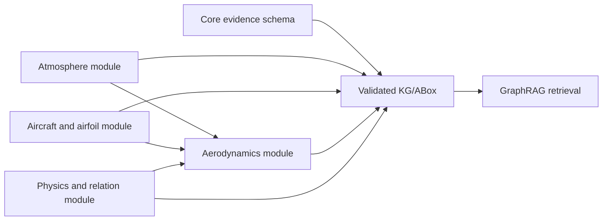

# Explainable Ontology Design

Last updated: 2026-05-19

## Purpose

The active ontology for this project is `data/ontology/curated/06_phak_ch4_0.curated.ttl`. It is a small, explainable TBox schema for PHAK Chapter 4. Its purpose is to constrain KG extraction and make GraphRAG evidence easier to inspect, not to encode every detail in the chapter.

The previous baseline ontology is kept as a historical reference. It is RDF-valid, but it is too large to explain clearly in a project defense: it contains hundreds of classes and object properties and was generated as an exploratory artifact. The curated ontology is the active design used for KG extraction.

Reference patterns used for this design:

- NASA ATM Ontology treats an aviation ontology as a conceptual model for information organization, querying, integration, and terminology standardization: https://ntrs.nasa.gov/citations/20170006095
- Aviation accident KG work uses a compact core-concept ontology diagram before information extraction: https://www.mdpi.com/2079-9292/13/19/3936
- ATC KG work frames KG construction as part of a narrow-domain hybrid AI system: https://www.sciencedirect.com/science/article/pii/S2352146522006524
- SWIM ontology work separates domain ontologies and reference-level semantic alignment: https://www.jstage.jst.go.jp/article/tjsai/36/1/36_36-1_WI2-F/_article/-char/en

## Design Questions

The ontology is designed around the questions a reviewer is likely to ask:

- What aviation concepts from PHAK Chapter 4 matter for a first GraphRAG prototype?
- Which concepts can become KG entity types?
- Which relations are safe enough to extract from text with source evidence?
- How does ontology design prevent arbitrary LLM-generated triples from entering the KG?
- What evidence should be preserved so answers can cite source pages, chunks, and triples?

## Conceptual Structure



The ontology is logically modular but stored as one Turtle file for v1. This avoids OWL import complexity while still making the design explainable.

## Modules

Core module:

- `Cl_Document`
- `Cl_SourceChunk`
- `Cl_Evidence`
- `Cl_KGTriple`

Atmosphere module:

- `Cl_Atmosphere`
- `Cl_Air`
- `Cl_Fluid`
- `Cl_Pressure`
- `Cl_Density`
- `Cl_Temperature`
- `Cl_Altitude`
- `Cl_Humidity`

Aircraft and airfoil module:

- `Cl_Aircraft`
- `Cl_Wing`
- `Cl_Airfoil`
- `Cl_AirfoilSurface`
- `Cl_LeadingEdge`
- `Cl_TrailingEdge`
- `Cl_ChordLine`

Aerodynamics module:

- `Cl_AerodynamicForce`
- `Cl_Lift`
- `Cl_Drag`
- `Cl_AngleOfAttack`
- `Cl_BoundaryLayer`
- `Cl_WingtipVortex`
- `Cl_Downwash`
- `Cl_PressureDistribution`
- `Cl_AircraftPerformance`

Physics and relation module:

- `Cl_NewtonLaw`
- `Cl_BernoulliPrinciple`
- `Cl_Force`
- `Cl_Flow`
- `Cl_Condition`
- `Cl_Outcome`

## Relations

The KG extraction profile only allows a small set of relations:

- `hasComponent`
- `partOf`
- `hasQuantity`
- `affects`
- `causes`
- `appliesTo`
- `hasCondition`
- `hasOutcome`
- `supportedByEvidence`

This keeps extraction focused. The LLM can extract aviation facts only when both the class names and relation names are already declared by the ontology and extraction profile.

## TBox vs ABox Boundary

The ontology is TBox-only. It defines reusable classes and relations.

The KG/ABox stores extracted facts, for example:

```text
angle of attack --affects--> pressure distribution
wing --hasComponent--> airfoil
pressure difference --causes--> wingtip vortex
```

Each KG triple must preserve provenance:

- source document
- page
- section or chunk context
- chunk id
- exact evidence text
- extraction model
- confidence
- extraction timestamp

## Storage

Ontology storage:

- Active ontology: `data/ontology/curated/06_phak_ch4_0.curated.ttl`
- Historical baseline: `data/ontology/baseline/06_phak_ch4_0.ttl`
- Generated candidates: `data/ontology/generated/`

KG storage:

- Runtime KG: `data/kg/06_phak_ch4_0.kg.jsonl`
- Optional TTL export: `data/kg/06_phak_ch4_0.kg.ttl`

Retrieval storage:

- Source chunks: `data/chunks/`
- Chroma vector index: `data/indexes/chroma`

## Why GraphRAG Needs This Ontology

Vector retrieval can find semantically similar text, but it does not provide an explicit schema for aviation entities and relationships. The curated ontology supplies that schema. The KG then gives GraphRAG structured evidence that can be searched, cited, and compared with vector evidence.

In this project, the ontology is therefore not the final answer. It is the design contract that controls which KG triples are allowed to exist.
