# ATCSCC Advisory Data Format and Processing Flow

## Purpose

This note documents the structure of the FAA ATCSCC advisory data used in the
NASA ATMONTO extraction experiment. It is intended to support thesis writing,
defense slides, and method descriptions where the data source and preprocessing
pipeline must be explained without relying on implementation details alone.

The key point is that ATCSCC advisories are neither clean tabular data nor fully
unstructured prose. They are public FAA web pages containing short,
semi-structured operational advisory messages. This makes them a suitable test
bed for ontology-constrained information extraction, evidence-grounded KG
construction, SHACL/profile validation, and GraphRAG-style question answering.

## Dataset Scope

The current experiment uses a retrospective ATCSCC snapshot:

| Layer | Record count | Artifact |
| --- | ---: | --- |
| Downloaded advisory pages | 867 | `data/raw/nasa_atmonto/2026-05-14/atcscc_advisories/` |
| Processed source records | 867 | `data/processed/nasa_atmonto/source/2026-05-14/atcscc_advisories.jsonl` |
| Temporally aligned records | 718 | `data/processed/nasa_atmonto/aligned/2026-05-14/atcscc_advisories.jsonl` |
| Formal experiment sample | 100 | `data/experiments/nasa_atmonto/formal/input_records.jsonl` |
| Reviewed gold records | 100 | `data/evaluation/nasa_atmonto/atcscc_gold_v1.reviewed.jsonl` |

The formal study sample spans FAA ATCSCC advisories from 2026-05-14 through
2026-05-20. The reviewed 100-record gold set covers the following candidate
classes:

| Candidate class | Records |
| --- | ---: |
| `GroundDelayProgramTMI` | 16 |
| `GroundStopTMI` | 21 |
| `ReRouteTMI` | 23 |
| `TrafficManagementInitiative` | 40 |

## Raw Source Format

Each raw advisory is stored as an HTML page. The main advisory payload appears
inside an HTML table:

- a header row, for example `ATCSCC ADVZY 007 DCA/ZDC 05/14/2026 CDM GROUND STOP`;
- a `MESSAGE:` row whose value is usually a `<PRE>` block;
- an `EFFECTIVE TIME:` row;
- a `SIGNATURE:` row.

Representative raw files:

- `data/raw/nasa_atmonto/2026-05-14/atcscc_advisories/advisory_2026-05-14_007.html`
- `data/raw/nasa_atmonto/2026-05-14/atcscc_advisories/advisory_2026-05-20_089.html`

### Example 1: Ground Stop

The raw page for advisory 007 contains a compact Ground Stop message:

```text
ATCSCC ADVZY 007 DCA/ZDC 05/14/2026 CDM GROUND STOP

MESSAGE:
CTL ELEMENT: DCA
ELEMENT TYPE: APT
ADL TIME: 0026Z
GROUND STOP PERIOD: 13/2307Z - 14/0130Z
DEP FACILITIES INCLUDED: (1stTier) ZTL ZDC ZNY ZJX ZOB ZBW ZID
PREVIOUS TOTAL, MAXIMUM, AVERAGE DELAYS: 0 / 0 / 0
NEW TOTAL, MAXIMUM, AVERAGE DELAYS: 580 / 62 / 36
PROBABILITY OF EXTENSION: MEDIUM
IMPACTING CONDITION: WEATHER / THUNDERSTORMS
COMMENTS: FIRST TIER.

EFFECTIVE TIME:
140030-140230

SIGNATURE:
26/05/14 00:31
```

This record exposes several fields relevant to ontology extraction:
`advisoryNumber`, `GroundStopTMI`, `controlledNASelement`, `effectiveStartTime`,
`effectiveEndTime`, `extensionProbability`, `impactingCondition`, and
`initiativeComments`.

### Example 2: Ground Delay Program

The raw page for advisory 089 contains a longer Ground Delay Program message:

```text
ATCSCC ADVZY 089 EWR/ZNY 05/20/2026 CDM GROUND DELAY PROGRAM

MESSAGE:
CTL ELEMENT: EWR
ELEMENT TYPE: APT
ADL TIME: 1709Z
DELAY ASSIGNMENT MODE: UDP
ARRIVALS ESTIMATED FOR: 20/2000Z - 21/0459Z
CUMULATIVE PROGRAM PERIOD: 20/2000Z - 21/0459Z
PROGRAM RATE: 28/28/20/20/20/28/36/36/36
FLT INCL: ALL CONTIGUOUS US DEP
DEP SCOPE: (ALL+CZY_AP) ZLA ZAU ZLC ZTL ZDC ZNY ZHU ZJX ZFW ZOB ZDV
CANADIAN DEP ARPTS INCLUDED: CYHZ CYOW CYUL CYYZ CYTZ CYQB
DELAY ASSIGNMENT TABLE APPLIES TO: ZNY
MAXIMUM DELAY: 171
AVERAGE DELAY: 97
IMPACTING CONDITION: WEATHER / THUNDERSTORMS
COMMENTS: TSTMS AND SWAP EXPECTED. TIME +45. LOW POPUP.

EFFECTIVE TIME:
201710-210559

SIGNATURE:
26/05/20 17:11
```

This illustrates why the source should be treated as semi-structured text:
many fields are label-value pairs, but the available labels and message content
vary by advisory type.

## Processing Flow

The project converts ATCSCC advisories into experiment-ready KG extraction
records through a layered pipeline:

```mermaid
flowchart LR
  A["FAA ATCSCC HTML advisory pages"] --> B["Raw HTML snapshots"]
  B --> C["Processed JSONL source records"]
  C --> D["Temporal alignment JSONL"]
  D --> E["Formal 100-record input sample"]
  E --> F["Candidate ontology facts"]
  F --> G["Validator output"]
  G --> H["Reviewed gold KG facts"]
  H --> I["CQ and GraphRAG evaluation"]
```



The collection script downloads advisory list pages and detail pages, then
extracts flattened text records. The alignment script parses explicit and
implicit time fields from advisory text. The extraction systems then generate
ontology candidate facts with evidence spans.

| Stage | Main artifact | Output shape |
| --- | --- | --- |
| Raw collection | `data/raw/nasa_atmonto/2026-05-14/atcscc_advisories/*.html` | FAA HTML pages |
| Source processing | `data/processed/nasa_atmonto/source/2026-05-14/atcscc_advisories.jsonl` | one JSON object per advisory |
| Temporal alignment | `data/processed/nasa_atmonto/aligned/2026-05-14/atcscc_advisories.jsonl` | source record plus parsed intervals |
| Formal sampling | `data/experiments/nasa_atmonto/formal/input_records.jsonl` | sample ID, source text, source URL, candidate class |
| Candidate extraction | `data/evaluation/nasa_atmonto/atcscc_gold_annotation_template.jsonl` | candidate facts plus source evidence |
| Reviewed gold | `data/evaluation/nasa_atmonto/atcscc_gold_v1.reviewed.jsonl` | accepted facts, rejected facts, missing facts, notes |

## Processed JSONL Structure

The processed source record keeps the advisory as one source object. Its main
fields are:

| Field | Meaning |
| --- | --- |
| `source_id` | Stable date-plus-number identifier, for example `2026-05-14:001`. |
| `advisory_date` | FAA advisory database date. |
| `advisory_number` | ATCSCC advisory number on that date. |
| `source_url` | Public FAA advisory URL. |
| `raw_file` | Local raw HTML snapshot. |
| `text` | Flattened advisory text used by extraction systems. |
| `source_family` | `atcscc_advisories`. |
| `source_record_type` | `advisory`. |

The aligned source record adds `temporal_alignment`, including:

| Field | Meaning |
| --- | --- |
| `parsed_intervals` | Intervals parsed from fields such as `EVENT TIME`, `EFFECTIVE TIME`, and `SIGNATURE`. |
| `source_period_start` | Earliest source period used for temporal filtering. |
| `source_period_end` | Latest source period used for temporal filtering. |
| `alignment_window_start` | Fixed retrospective experiment window start. |
| `alignment_window_end` | Fixed retrospective experiment window end. |

## KG Fact Structure

Each extracted candidate fact is represented as a small JSON object. A typical
datatype fact contains:

```json
{
  "fact_type": "datatype_property",
  "subject": "urn:aviation-agentic-ai:atcscc-advisory:2026-05-19:032",
  "subject_class": "ReRouteTMI",
  "predicate": "advisoryNumber",
  "value": 32,
  "datatype": "xsd:integer",
  "evidence_text": "ATCSCC ADVZY 032 DCC 05/19/2026 OCEANIC ROUTE CLOSURES_RQD",
  "source_id": "2026-05-19:032"
}
```

A typical object-property fact contains:

```json
{
  "fact_type": "object_property",
  "subject": "urn:aviation-agentic-ai:atcscc-advisory:2026-05-19:032",
  "subject_class": "ReRouteTMI",
  "predicate": "controlledNASelement",
  "object": "urn:aviation-agentic-ai:nas-element:ZNY",
  "object_class": "ARTCC",
  "object_label": "ZNY",
  "evidence_text": "CONSTRAINED FACILITIES: ZNY ...",
  "source_id": "2026-05-19:032"
}
```

The `evidence_text` field is central to the experiment. It allows each triple
to be traced back to a specific source span, which supports evidence-level
evaluation and conservative manual review.

## Competency Question Mapping

The ATCSCC source format directly motivates the current competency questions:

| Competency question | Source fields or patterns |
| --- | --- |
| Which airport, facility, route, or airspace is affected? | Header tokens, `CTL ELEMENT`, `DEP FACILITIES INCLUDED`, `CONSTRAINED FACILITIES`, route tokens, airport mentions. |
| What restriction or initiative type is described? | Header terms such as `GROUND STOP`, `GROUND DELAY PROGRAM`, `ROUTE CLOSURES`, `CNX`, `_RQD`, plus candidate subject class. |
| When does the advisory become effective and when does it end? | `EFFECTIVE TIME`, `EVENT TIME`, `GROUND STOP PERIOD`, `CUMULATIVE PROGRAM PERIOD`, and `SIGNATURE`. |
| What is the stated cause or impacting condition? | `IMPACTING CONDITION`, `COMMENTS`, and message body phrases such as weather, thunderstorms, runway, taxiway, equipment, or volume. |
| Can each extracted triple be traced to source evidence? | `evidence_text` stored on every candidate and reviewed fact. |
| Does the extracted fact satisfy the ontology/profile constraints? | validator output with accepted, rejected, repaired, errors, and warnings fields. |

## Implications for Thesis Methodology

This data source is methodologically useful because it forces the system to
handle three boundaries at the same time:

1. **Schema boundary:** extracted classes and predicates must stay within the
   NASA ATMONTO-derived ATCSCC profile.
2. **Evidence boundary:** every fact must be grounded in visible advisory text,
   not inferred from external operational knowledge.
3. **Operational boundary:** the system studies retrospective advisory text for
   research and learning; it does not provide live operational decision support.

Therefore, ATCSCC advisories are appropriate for testing an end-to-end
ontology-guided KG extraction pipeline:

```text
semi-structured advisory text
  -> ontology-constrained extraction
  -> evidence-span attachment
  -> SHACL/profile validation
  -> manual gold review
  -> CQ-level and GraphRAG-level evaluation
```

For thesis or defense wording, the recommended concise description is:

> The ATCSCC corpus consists of retrospective FAA Air Traffic Control System
> Command Center advisory web pages. Each advisory is a short HTML record with a
> semi-structured message block, explicit effective time, and signature time. The
> project normalizes these pages into JSONL records, parses temporal intervals,
> samples 100 advisories for reviewed gold annotation, and extracts
> ontology-constrained KG facts with evidence spans for downstream CQ and
> GraphRAG evaluation.
