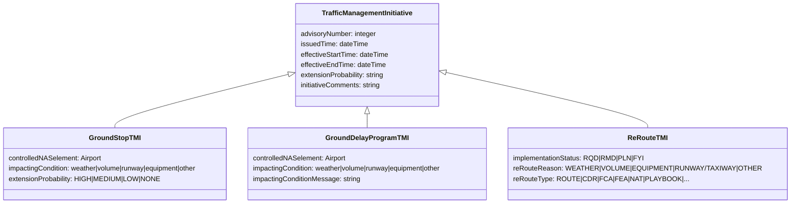

# ATCSCC Ontology Profile Overview

## Purpose

This note explains the ontology side of the NASA ATMONTO ATCSCC experiment. It
complements `reports/stages/atcscc_data_format_and_processing_flow.md`, which
documents the source data format.

The current experiment does not use the full NASA ATMONTO ontology as a broad
ground truth for all aviation concepts. It uses NASA ATMONTO as a schema
constraint and derives a narrow ATCSCC traffic-management profile for
retrospective FAA advisory extraction.

## Ontology Layers

The ontology stack has three practical layers:

| Layer | Artifact | Role |
| --- | --- | --- |
| External NASA ATMONTO OWL | `data/ontology/external/icarus_ontology/NASA/ATM.owl`, `data/ontology/external/icarus_ontology/NASA/NAS.owl` | Authoritative source ontology files used as the schema basis. |
| Parsed schema catalog | `data/ontology/curated/nasa_atmonto_schema_catalog.json` | Machine-readable catalog of classes, object properties, datatype properties, hierarchy, and constraints. |
| ATCSCC schema slice/profile | `data/ontology/curated/nasa_atmonto_atcscc_schema_slice.json` | Narrow subset used for ATCSCC advisory extraction and validation. |
| Extraction JSON schema | `data/ontology/curated/nasa_atmonto_atcscc_extraction_schema.json` | Runtime output contract for LLM/rule extraction payloads. |

The profile boundary is:

```text
NASA ATMONTO full ontology
  -> parsed schema catalog
  -> ATCSCC traffic-management schema slice
  -> extraction JSON schema
  -> candidate facts with evidence
  -> validator / reviewer decisions
```

## ATCSCC Schema Slice Size

The active ATCSCC schema slice is intentionally small:

| Component | Count |
| --- | ---: |
| Classes | 18 |
| Object properties | 11 |
| Datatype properties | 11 |
| Class hierarchy axioms | 33 |
| Class/property constraints | 17 |

This is a profile, not a new full ontology. It keeps only the terms needed to
model ATCSCC Traffic Management Initiative (TMI) advisories.

## Core Class Shape

The central class is `atm:TrafficManagementInitiative`. ATCSCC advisory types
are represented as subclasses or narrower profile classes:



In plain language:

- `TrafficManagementInitiative` is the general advisory event.
- `GroundStopTMI` models advisories requiring aircraft to remain on the ground.
- `GroundDelayProgramTMI` models arrival delay programs with rates, delay
  information, and impacted airport/control fields.
- `ReRouteTMI` models route closures, required reroutes, CDRs, FCA/FEA-style
  route-management advisories, and related reroute lifecycle notices.
- Generic `TrafficManagementInitiative` remains necessary for advisory types
  that are real ATCSCC messages but do not fit the narrower classes, such as
  volcanic activity bulletins, arrival/scheduling delay notices, hotline status
  notices, and diversion-recovery advisories.

## Object Properties

The object-property part of the profile connects an advisory to aviation
entities, airport specifications, flight specifications, and route structures:

| Property | Domain | Range | Use in ATCSCC extraction |
| --- | --- | --- | --- |
| `atm:controlledNASelement` | `atm:TrafficManagementInitiative` | `atm:TFMcontrolElement` | The controlled airport, route, ARTCC, or NAS element mentioned by the advisory. |
| `atm:departureScope` | `atm:GroundDelayProgramTMI`, `atm:GroundStopTMI` | `atm:AirportSpec` | Departure facilities included or excluded by a GDP/GS. |
| `atm:flightInclusionSpec` | `atm:GroundDelayProgramTMI`, `atm:GroundStopTMI` | `atm:FlightSpec` | Flight inclusion statements such as contiguous US departures. |
| `atm:flightExclusionSpec` | `atm:GroundDelayProgramTMI` | `atm:FlightSpec` | Flight exclusions from a GDP. |
| `atm:allowedRoute` | `atm:ReRouteTMI` | `atm:ReRouteSegment` | Allowed route alternatives for reroute advisories. |
| `atm:includesAirport` | `atm:AirportSpec` | `nas:Airport` | Airport-scope expansion. |
| `atm:excludesAirport` | `atm:AirportSpec` | `nas:Airport` | Airport-scope exclusion. |
| `atm:withinARTCC` | `atm:AirportSpec` | `nas:ARTCC` or `nas:ARTCCtier` | ARTCC-based airport scope. |
| `atm:excludesARTCC` | `atm:AirportSpec` | `nas:ARTCC` or `nas:ARTCCtier` | ARTCC-scope exclusion. |
| `nas:withinARTCC` | `nas:Airport` | `nas:ARTCC` | Airport-to-center reference relation. |
| `nas:includesARTCC` | `nas:ARTCCtier` | `nas:ARTCC` | ARTCC tier expansion. |

The current runtime profile is conservative. For example, some ATCSCC advisories
mention ARTCC centers such as `ZNY` as constrained facilities. These mentions
are source-supported, but they may be rejected or quarantined if the active
profile range expects a narrower `TFMcontrolElement` bridge that is not yet
implemented.

## Datatype Properties

The datatype-property part of the profile captures advisory identifiers, times,
status fields, causes, and comments:

| Property | Domain | Datatype | Typical source evidence |
| --- | --- | --- | --- |
| `atm:advisoryNumber` | `atm:TrafficManagementInitiative` | `xsd:integer` | `ATCSCC ADVZY 007 ...` |
| `atm:issuedTime` | `atm:TrafficManagementInitiative` | `xsd:dateTime` | `SIGNATURE: 26/05/14 00:31` |
| `atm:effectiveStartTime` | `atm:TrafficManagementInitiative` | `xsd:dateTime` | `EFFECTIVE TIME: 140030-140230` |
| `atm:effectiveEndTime` | `atm:TrafficManagementInitiative` | `xsd:dateTime` | `EFFECTIVE TIME: 140030-140230` |
| `atm:extensionProbability` | `atm:TrafficManagementInitiative` | `xsd:string` | `PROBABILITY OF EXTENSION: MEDIUM` |
| `atm:impactingCondition` | `atm:GroundDelayProgramTMI` | `xsd:string` | `IMPACTING CONDITION: WEATHER / THUNDERSTORMS` |
| `atm:impactingConditionMessage` | `atm:GroundDelayProgramTMI` | `xsd:string` | Detailed cause/comment text. |
| `atm:initiativeComments` | `atm:TrafficManagementInitiative` | `xsd:string` | `COMMENTS: ...` or message body. |
| `atm:implementationStatus` | `atm:ReRouteTMI` | `xsd:string` | `_RQD`, `_RMD`, `_PLN`, `_FYI`. |
| `atm:reRouteReason` | `atm:ReRouteTMI` | `xsd:string` | Route closure or reroute cause. |
| `atm:reRouteType` | `atm:ReRouteTMI` | `xsd:string` | Route category such as `ROUTE`, `CDR`, `FCA`, `NAT`. |

## Constraint Examples

The slice contains class/property constraints that function as validation rules.
Important examples:

| Class | Constraint |
| --- | --- |
| `GroundDelayProgramTMI` | exactly one `controlledNASelement`; controlled element should be an airport under the current profile. |
| `GroundDelayProgramTMI` | `impactingCondition` is restricted to `weather`, `volume`, `runway`, `equipment`, or `other`. |
| `GroundStopTMI` | exactly one `controlledNASelement`; controlled element should be an airport under the current profile. |
| `GroundStopTMI` | exactly one `extensionProbability`, restricted to `HIGH`, `MEDIUM`, `LOW`, or `NONE`. |
| `GroundStopTMI` | `impactingCondition` is restricted to `weather`, `volume`, `runway`, `equipment`, or `other`. |
| `ReRouteTMI` | exactly one `implementationStatus`, restricted to `RQD`, `RMD`, `PLN`, or `FYI`. |
| `ReRouteTMI` | exactly one `reRouteReason`, restricted to `WEATHER`, `VOLUME`, `EQUIPMENT`, `RUNWAY/TAXIWAY`, or `OTHER`. |
| `ReRouteTMI` | exactly one `reRouteType`, restricted to reviewed route categories such as `ROUTE`, `CDR`, `FCA`, `NAT`, `PLAYBOOK`, and related values. |

These constraints are deliberately narrower than all possible ATCSCC meanings.
That narrowness is useful because it exposes three distinct error types:

1. **Extraction error:** the model/parser produced a fact not supported by the
   advisory text.
2. **Canonicalization error:** the fact is meaningful but encoded in the wrong
   class, property, value, or datatype.
3. **Profile gap:** the source evidence is real, but the current ontology
   profile lacks the correct bridge or range policy to accept it.

## Mapping from ATCSCC Data to Ontology

The following table shows how raw advisory fields map to ontology facts:

| ATCSCC source pattern | Ontology target |
| --- | --- |
| `ATCSCC ADVZY 007 ... CDM GROUND STOP` | subject class `atm:GroundStopTMI`; `atm:advisoryNumber = 7`. |
| `ATCSCC ADVZY 089 ... CDM GROUND DELAY PROGRAM` | subject class `atm:GroundDelayProgramTMI`; `atm:advisoryNumber = 89`. |
| `CTL ELEMENT: DCA` | `atm:controlledNASelement -> nas:Airport/DCA`, when the token is valid under the active profile. |
| `EFFECTIVE TIME: 140030-140230` | `atm:effectiveStartTime`, `atm:effectiveEndTime`. |
| `SIGNATURE: 26/05/14 00:31` | `atm:issuedTime`. |
| `PROBABILITY OF EXTENSION: MEDIUM` | `atm:extensionProbability = MEDIUM`. |
| `IMPACTING CONDITION: WEATHER / THUNDERSTORMS` | `atm:impactingCondition = weather`; optional message text for more detailed explanation. |
| `_RQD`, `_RMD`, `_FYI`, `_PLN` in reroute titles | `atm:implementationStatus`. |
| `OCEANIC ROUTE CLOSURES`, `CDRS`, `PLAYBOOK`, `FCA` patterns | `atm:reRouteType`, when the route category is clear and reviewed. |

## Why the Ontology Matters

Without the ontology profile, the extraction task would reduce to free-form
event summarization. The ATMONTO-derived profile changes the task into
structured KG construction:

```text
Raw advisory:
  "CTL ELEMENT: DCA ... PROBABILITY OF EXTENSION: MEDIUM"

Ontology-constrained output:
  subject: advisory:2026-05-14:007
  class: atm:GroundStopTMI
  predicate: atm:controlledNASelement
  object: nas:Airport/DCA
  evidence_text: "CTL ELEMENT: DCA"

  subject: advisory:2026-05-14:007
  class: atm:GroundStopTMI
  predicate: atm:extensionProbability
  value: "MEDIUM"
  evidence_text: "PROBABILITY OF EXTENSION: MEDIUM"
```

The ontology profile therefore controls:

- which classes the system is allowed to emit;
- which predicates are valid for each class;
- which object ranges and datatypes are valid;
- which enum values are acceptable;
- whether a source-supported fact should be accepted, repaired, rejected, or
  marked as a profile gap.

## Thesis Wording

A concise thesis/defense description:

> The ontology used in the ATCSCC experiment is a narrow NASA ATMONTO-derived
> traffic-management profile, not a newly invented full aviation ontology. The
> profile centers on `TrafficManagementInitiative` and its operational
> subclasses such as `GroundStopTMI`, `GroundDelayProgramTMI`, and `ReRouteTMI`.
> It defines the admissible properties for advisory number, issue time,
> effective interval, controlled NAS element, impacting condition, extension
> probability, reroute type, and implementation status. During extraction, each
> candidate triple must conform to this profile and carry source evidence;
> otherwise it is repaired, rejected, or recorded as a profile gap.
