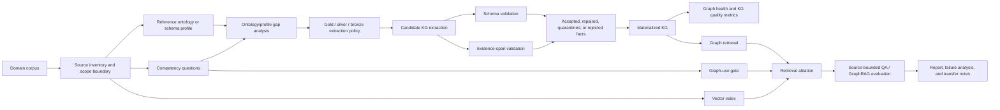

# Domain-Agnostic Ontology/KG/GraphRAG Methodology Roadmap

Date: 2026-06-02

Status: mid-term research direction. This roadmap reframes the current NASA
ATMONTO / FAA ATCSCC work as the first validation domain for a reusable
methodology, not as the final long-term domain.

## Strategic Reframing

The current ATM project is useful because it is narrow, evidence-rich, and
constrained enough to finish. Its long-term value is not that ATM ontology is a
large field. Its value is that it can serve as a controlled testbed for a
domain-independent pipeline:

> Given a domain corpus, one or more reference ontologies, and task-specific
> competency questions, build an evidence-grounded knowledge graph, validate it
> against schema and source evidence, and evaluate when graph-aware retrieval
> improves source-bounded question answering over vector-only retrieval.

The medium-term goal should therefore be:

> Create a transferable ontology-guided KG extraction and GraphRAG evaluation
> methodology that can be applied to aviation, digital twins, engineering
> documents, biomedical literature, legal/contracts, energy systems, or other
> specialized domains.

ATM remains the first project domain because it already has local artifacts,
reviewed gold records, ATMONTO constraints, and measurable CQs.

## Methodology Name

Working name:

**CQ-OGK-GraphRAG**: Competency-Question-driven, Ontology-Guided Knowledge Graph
construction and GraphRAG evaluation.

This is intentionally descriptive rather than branded. The thesis can later
rename it if a shorter name becomes useful.

## Domain-Independent Pipeline



## Agentic Orchestration Layer

The multi-agent ontology-generation paper should be used as an orchestration
pattern across the whole methodology, not only as an ontology-builder. In this
project, "agentic" means structured role separation plus artifact contracts,
not unconstrained autonomous chat.

Each stage should be allowed to run manually, by script, by LLM agent, or by a
mixed workflow. The invariant is the handoff artifact:

```text
Source brief -> CQ contract -> Semantic Requirements Document -> Technical
Implementation Plan -> Extraction Plan -> Candidate KG facts -> Validation
Findings -> Evidence Critique -> Repair Plan -> Graph-Use Plan -> Evaluation
Report -> Claim-Safe Synthesis
```

This layer is domain-independent. In ATM, the artifacts instantiate ATCSCC
advisory scope, ATMONTO profile slices, reviewed gold records, and CQ query
manifests. In a future UAV battery, contract, biomedical, or energy-system
domain, the same roles remain, while the source corpus, ontology/profile, and
CQ contract change.

Important constraints:

- the Manager/TIP step should happen before extraction, because the inspected
  paper suggests front-loaded planning is the main quality driver;
- repair loops must be bounded and logged rather than treated as open-ended
  self-healing;
- deterministic validators and evidence-span checks remain mandatory;
- LLM judges may assist scoring, but cannot replace reviewed gold labels or
  source-bound evidence checks;
- final report synthesis must preserve negative results and scope boundaries.

## Core Components

| Component | Domain-independent purpose | Current ATM instantiation | Future-domain analogue |
| --- | --- | --- | --- |
| Source inventory | Define what evidence exists and what is out of scope. | FAA ATCSCC advisories, NASR/reference docs, NASA ATMONTO materials. | Battery logs, maintenance manuals, biomedical abstracts, contracts, patents, energy system reports. |
| Reference ontology/profile | Provide a controlled vocabulary and relation space. | NASA ATMONTO / ATCSCC schema slice. | OEO/QUDT/ChEBI, engineering ontologies, domain taxonomies, legal clause schemas, biomedical ontologies. |
| Competency questions | Turn domain needs into measurable extraction/query requirements. | 12 ATCSCC advisory CQs. | Digital twin KPIs, degradation questions, claim requirements, treatment/relation questions. |
| Gold/silver/bronze policy | Separate reviewed truth from deterministic mappings and provisional LLM output. | Reviewed ATCSCC gold, deterministic parser facts, LLM candidates. | Expert labels, official structured logs, weak labels, model-generated candidates. |
| Extraction systems | Compare unconstrained, schema-constrained, repaired, and hybrid systems. | S0-S4 ATMONTO extraction suite. | Same suite adapted to new schema/corpus. |
| Validation | Distinguish schema conformance, evidence containment, and semantic support. | SHACL/profile checks plus source evidence review. | Domain constraints, provenance checks, expert support labels. |
| GraphRAG evaluation | Test when graph retrieval helps versus vector retrieval. | CQ query manifest and planned answer-set gold. | Domain query manifest and source-bounded QA benchmark. |
| Transfer report | Explain what transferred, failed, or required domain-specific change. | ATMONTO stage reports. | Per-domain adaptation report. |

## End-To-End Artifact Contract

Each new domain should produce the same artifact family:

| Stage | Required artifact | Purpose |
| --- | --- | --- |
| Domain setup | `source_inventory.{json,md}` | Source scope, licensing, temporal boundary, excluded use cases. |
| Agentic handoff | `templates/agentic_artifact_contract.md` copied into a run-specific artifact | Role definitions, required inputs/outputs, stop conditions, and ownership boundaries. |
| Ontology/profile | `ontology_profile.{ttl,yaml,json}` | Classes, predicates, domain/range, aliases, profile gaps. |
| CQ design | `competency_questions.md` | 8-15 primary CQs with metrics and failure modes. |
| Gold policy | `extraction_method_matrix.{json,md}` | Gold/silver/bronze acceptance policy. |
| Gold set | `gold.reviewed.jsonl` | Reviewed extraction/query labels. |
| Extraction outputs | `system_outputs/*.jsonl` | Candidate facts from each extraction system. |
| Validation report | `kg_validation.{json,md}` | Parse/schema/evidence/conformance metrics. |
| Scoring report | `formal_experiment_scoring.{json,md}` | Precision, recall, F1, repair success, confidence intervals. |
| Query manifest | `cq_query_manifest.json` | CQ-to-query mappings and graph-use routing labels. |
| Answer sets | `cq_answer_sets.json` | Source-bounded expected answers for retrieval/QA. |
| Retrieval ablation | `retrieval_ablation.{json,md}` | Vector, graph, hybrid, routed, token-matched results. |
| Transfer report | `domain_transfer_report.md` | What generalized and what was domain-specific. |

The important design principle is that a domain switch should mostly replace
data, ontology/profile, and CQ files. The extraction, validation, scoring, and
reporting skeleton should remain stable.

## System Suite Template

The current S0-S4 suite can become the reusable baseline template:

| System | Generic meaning | ATM example |
| --- | --- | --- |
| `S0_rule_or_structured_baseline` | Deterministic extraction from official structure or obvious patterns. | Advisory number, issued/effective times, header fields. |
| `S1_open_llm` | Diagnostic unconstrained LLM extraction. | Raw open advisory facts, not directly scored as ATMONTO truth. |
| `S1b_canonicalized_llm` | Open extraction mapped to target schema. | LLM facts canonicalized to ATMONTO predicates. |
| `S2_schema_slice_llm` | LLM prompted with a schema slice/profile. | ATCSCC schema-slice extraction. |
| `S3_validator_repair` | Schema validation and constrained repair. | Validator/repair of ATMONTO facts. |
| `S4_hybrid_backbone_enrichment` | Deterministic backbone plus semantic enrichment. | Current strongest ATCSCC system. |
| `S5_agentic_cq_module_routed_extraction` | Planned extension: use SRD/TIP and CQ/module routing before extraction. | Planned ATMONTO advisory-type and CQ-routed extraction. |
| `S6_agentic_evidence_verifier_repair` | Planned extension: separate schema validation from evidence critique and bounded repair. | Planned CQ-specific evidence verifier over ATCSCC spans. |
| `S7_agentic_graph_use_gate` | Planned extension: route retrieval by query type, graph need, and cost boundary. | Planned CQ route: vector, graph, hybrid, abstain. |

Current ATCSCC starter contract:
`reports/stages/atcscc_agentic_artifact_contract.md`.

## Research Contributions That Generalize

The long-term thesis/project contribution can be framed as a methodology with
four separable contributions:

1. **CQ-driven ontology scoping:** convert domain needs into measurable
   extraction, validation, and query requirements.
2. **Ontology-guided KG extraction:** compare open LLM, canonicalized LLM,
   schema-slice LLM, validator/repair, and hybrid systems under the same gold
   set.
3. **Evidence-grounded KG quality evaluation:** report schema validity,
   semantic support, evidence containment, profile gaps, and abstention
   separately.
4. **Graph-use-gated GraphRAG:** evaluate when graph retrieval is useful and
   when vector retrieval is sufficient, using token/cost controls.

This is stronger than a domain-only claim because it produces a reusable method
for narrow expert domains where ontologies exist but are incomplete, and where
LLM output must remain source-grounded.

## Current ATM Project Role

ATM should be treated as the first controlled case study:

- **Why it works now:** enough local data, a real reference ontology, a reviewed
  100-record gold set, and strong evidence-boundary requirements.
- **Why it should not be the whole future:** ATM ontology literature is narrow,
  domain data is specialized, and long-term publication/reuse is better served
  by a domain-independent method.
- **What it proves if successful:** the pipeline can be made concrete,
  auditable, and measurable in one difficult domain.
- **What it does not prove:** universal GraphRAG superiority, live operational
  utility, or broad aviation KG completeness.

## Future Domain Migration Candidates

| Candidate domain | Why it is attractive | Needed before migration |
| --- | --- | --- |
| UAV battery digital twin | Strong fit for digital twin thesis topics, sensor/state variables, degradation relations, and KPI monitoring. | Battery ontology/profile, data logs or benchmark datasets, SoC/SoH CQs. |
| Engineering claims / contracts | Already has a cross-domain reference paper and clear ontology/KG/QA path. | Corpus access, claim ontology, reviewed legal/contract CQs. |
| Energy systems / Power-to-X / SAF | Better long-term growth area than narrow ATM; strong ontology candidates such as OEO/QUDT/ChEBI. | Authoritative corpus and clear scope; should remain a later expansion. |
| Biomedical scientific extraction | Strong literature and ontology ecosystem, but high review burden. | Safe source scope and expert-reviewed labels. |
| Maintenance/fault diagnosis | Good fit for KG-RAG and evidence-grounded troubleshooting. | Maintenance manuals/logs and failure ontology. |

## Medium-Term Milestones

| Milestone | Output | Success condition |
| --- | --- | --- |
| M1 | Finish ATM case-study extraction and CQ retrieval benchmark. | S0-S4 plus CQ query manifest and answer sets are scored. |
| M2 | Define the agentic artifact contract. | Source brief, CQ contract, SRD, TIP, extraction plan, validation finding, evidence critique, repair plan, and graph-use plan have reusable schemas. |
| M3 | Implement S5 module/CQ-routed extraction. | Demonstrates whether modular ontology prompting improves evidence support or schema validity. |
| M4 | Implement S6 evidence verifier and bounded repair. | Shows whether evidence critique catches unsupported triples beyond schema/profile validation. |
| M5 | Implement S7 graph-use gate. | Shows per-CQ routing beats or explains always-vector/always-graph baselines. |
| M6 | Run a second small domain pilot. | Same pipeline works on a non-ATM corpus with limited changes to domain artifacts. |
| M7 | Write methodology chapter. | Thesis/report presents the method first and ATM as case study. |

## Immediate Changes To Project Direction

1. Keep the current ATMONTO experiment as the first case study and report
   generator.
2. Avoid writing the thesis as "an ATM ontology project" only.
3. Reframe report language toward "domain ontology-guided KG extraction and
   GraphRAG evaluation, validated on FAA ATCSCC advisories."
4. Keep future-domain migration visible but not required for the current
   submission.
5. Prefer reusable schemas, manifests, and report generators over one-off
   aviation-only scripts where the cost is reasonable.

## Safe Thesis Wording

Suggested medium-term wording:

> This project develops and evaluates a competency-question-driven,
> ontology-guided methodology for evidence-grounded KG construction and
> graph-aware retrieval in specialized domains. The current case study applies
> the methodology to retrospective FAA ATCSCC advisories using a NASA
> ATMONTO-derived profile. The aviation case is used to validate the pipeline,
> metrics, and failure analysis; the methodology is designed to transfer to
> other domains with different corpora and ontologies.

Unsafe wording to avoid:

- "This thesis solves ATM ontology construction."
- "GraphRAG is generally better than RAG."
- "ATMONTO is complete aviation ground truth."
- "The current system supports live air traffic decisions."
- "The method is domain-independent because it already works everywhere."

## Next Action

The next concrete step is to keep building the ATMONTO case study, but name
artifacts and scripts in a way that preserves the generic pattern:

1. derive `atcscc_cq_answer_sets.json`;
2. use `reports/stages/atcscc_agentic_artifact_contract.md` as the run-level
   handoff contract;
3. draft the first ATCSCC SRD/TIP artifact aligned to the 12 CQs;
4. run retrieval-only ablations from `atcscc_cq_query_manifest.json`;
5. document which parts are domain-specific adapters and which parts are
   reusable pipeline logic;
6. only after the ATM case is stable, choose one second-domain pilot.
