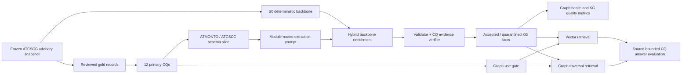

# Method Paper Migration Experiment Plan for ATMONTO-Constrained Advisory KG and GraphRAG

Date: 2026-06-02

Status: design bridge from inspected method papers to the next local
experiment. This report is a planning artifact, not a scored result.

## Purpose

This report turns the recently inspected cross-domain method papers into an
actionable experiment plan for the NASA ATMONTO / FAA ATCSCC advisory KG
project. It follows `docs/research_paper_analysis_protocol.md`: downloaded PDFs
stay local, evidence packs live under `tmp/pdfs/`, and only curated stage
reports can change the experiment design.

The migration target is narrow:

> Can a NASA ATMONTO-derived ATCSCC schema slice, combined with competency
> questions, evidence-span validation, and graph-aware retrieval, produce a
> more semantically valid, source-grounded, and queryable retrospective advisory
> KG than unconstrained or weakly constrained extraction?

This is not a claim about live aviation decision support, operational
readiness, or general air traffic management completeness.

## Evidence Inputs

| Paper | Local evidence | Project role | Transferable point | Boundary |
| --- | --- | --- | --- | --- |
| [When to use Graphs in RAG](https://arxiv.org/abs/2506.05690) | `tmp/pdfs/when_to_use_graphs_in_rag/` | `evaluation_reference`, `negative_reference` | Use a query/task gate: reserve GraphRAG for connected, multi-hop, relation-heavy questions; keep vector RAG for direct factual lookup. | Not aviation evidence; does not prove GraphRAG helps ATCSCC advisories. |
| [RAG vs. GraphRAG](https://arxiv.org/abs/2502.11371) | `tmp/pdfs/rag_vs_graphrag/` | `evaluation_reference`, `negative_reference` | Fair RAG-vs-GraphRAG comparison requires token-matched baselines, query routing, graph construction quality checks, and cost reporting. | Do not claim GraphRAG universally beats RAG; the paper emphasizes task dependence. |
| [GraphRAG-Bench](https://arxiv.org/abs/2506.02404) | `tmp/pdfs/graphrag_bench/` | `evaluation_reference`, `figure_design_reference` | Evaluate GraphRAG as a pipeline: graph construction, retrieval, generation, rationale quality, and per-topic/per-task breakdowns. | Computer-science textbook QA does not transfer as aviation performance evidence. |
| [Towards Automated Ontology Generation from Unstructured Text](https://arxiv.org/abs/2604.23090) | `tmp/pdfs/automated_ontology_generation_multi_agent/` plus `reports/stages/multi_agent_pipeline_method_adaptation.md` | `primary_method_reference`, `negative_reference` | Use role-separated artifact handoffs: Domain Expert/SRD, Manager/TIP, Coder, QA, bounded repair, and CQ-driven evaluation. | Insurance-contract ontology results do not transfer to ATCSCC; use the orchestration pattern, not the domain scores. |
| [Accelerating KG and Ontology Engineering with LLMs](https://arxiv.org/abs/2411.09601) | `tmp/pdfs/accelerating_kg_ontology_engineering_llms/` | `primary_method_reference` | Use LLMs as modular ontology/KG support components: route to relevant ontology modules, generate candidates, then validate with constraints and human review. | Do not copy reported cross-domain percentages as expected ATMONTO outcomes. |
| [Ontology-grounded Automatic KG Construction by LLM under Wikidata schema](https://arxiv.org/abs/2412.20942) | `tmp/pdfs/ontology_grounded_kg_construction_wikidata/` | `primary_method_reference`, `evaluation_reference` | CQ generation, relation discovery, ontology matching, schema-constrained RDF generation, and parse-valid triple evaluation form a close analogue to ATMONTO-constrained extraction. | Wikidata scale and model memorization do not transfer to NASA ATMONTO. |
| [Claim KG Construction and GraphRAG QA](https://doi.org/10.3390/buildings16040845) | `tmp/pdfs/claim_kg_graphrag_default_check/` plus curated reports | `figure_design_reference`, `background_method_reference` | Useful thesis structure: domain ontology, reviewed KG population, Base LLM / Vector RAG / GraphRAG comparison. | Its four-question QA evaluation is too small to copy as thesis-grade evidence. |

## Local Baseline To Preserve

The next experiment must preserve the existing reviewed ATCSCC extraction
baseline instead of replacing it with a broad GraphRAG story.

Current local anchors:

- 100 reviewed gold ATCSCC records:
  `data/evaluation/nasa_atmonto/atcscc_gold_v1.reviewed.jsonl`.
- 12 primary competency questions:
  `reports/stages/nasa_atmonto_competency_questions.md`.
- Current scored extraction systems:
  `S0_rule_only`, `S1_llm_only`, `S1b_llm_canonicalized`,
  `S2_llm_schema_slice`, `S3_llm_schema_slice_validator_repair`, and
  `S4_hybrid_backbone_enrichment`.
- Current strongest extraction baseline:
  `S4_hybrid_backbone_enrichment`, with semantic P=0.7168, R=0.7636,
  F1=0.7395 in the existing scored run.

The method papers should shape the next layer:

1. require explicit source brief, CQ contract, SRD, TIP, extraction plan,
   validation finding, evidence critique, repair plan, and graph-use plan
   artifacts before any new autonomous pipeline is claimed;
2. improve how ATMONTO/CQs constrain extraction;
3. evaluate graph construction and retrieval separately;
4. introduce a routing decision for when graph retrieval is justified;
5. avoid presenting GraphRAG answer generation as already proven.

## Migration Hypotheses

These hypotheses are design targets for the next run. They should be registered
before implementation and treated as falsifiable.

| ID | Hypothesis | Inspired by | How to falsify |
| --- | --- | --- | --- |
| M-H1 | CQ- and ontology-module-routed extraction improves schema validity and evidence support over flat schema-slice extraction. | Shimizu/Hitzler LLM ontology engineering; ontology-grounded KG construction | Module routing fails to reduce schema violations or evidence unsupported facts relative to S2/S3 while preserving recall. |
| M-H2 | A CQ-guided repair/verifier catches unsupported triples better than SHACL/profile validation alone. | Ontology-grounded KG construction; KG quality evaluation logic | Unsupported-triple rate does not drop, or repair creates semantic drift. |
| M-H3 | Graph retrieval helps only on relation-heavy, temporal, or multi-hop CQs; vector retrieval remains competitive for direct factual fields. | When to use Graphs in RAG; RAG vs. GraphRAG | Graph retrieval does not improve answer-set recall/evidence recall on routed graph-worthy CQs, or harms simple CQs. |
| M-H4 | A graph-use gate outperforms always-vector and always-graph retrieval when evaluated by source-bounded CQ answerability, citation support, and cost. | RAG vs. GraphRAG selection/integration strategies | The gate is worse than the stronger single strategy or only improves by using substantially more tokens/context. |

## Experiment Architecture



The architecture separates five layers:

1. **Source and gold layer:** reviewed ATCSCC records remain the semantic
   evidence for ABox facts.
2. **Ontology and CQ layer:** ATMONTO constrains classes, predicates, ranges,
   datatypes, and profile gaps; CQs define what must be measurable.
3. **KG extraction layer:** systems produce candidate facts with evidence text
   and source IDs.
4. **Retrieval layer:** vector, graph, hybrid, and routed retrieval are scored
   separately from extraction.
5. **Answer/rationale layer:** optional source-bounded answer generation uses
   retrieved evidence; it cannot rescue unsupported triples.

## Planned System Suite

Do not rename or discard the already scored S0-S4 systems. Add planned systems
only after registering the new experiment.

| System | Status | Role | Key difference |
| --- | --- | --- | --- |
| `S0_rule_only` | existing | deterministic backbone baseline | Owns stable fields such as advisory number and times. |
| `S1b_llm_canonicalized` | existing | open LLM plus target-schema canonicalization baseline | Keeps raw open extraction comparable without scoring free-form schema drift as ATMONTO truth. |
| `S2_llm_schema_slice` | existing | schema-constrained extraction baseline | Flat schema-slice prompting. |
| `S3_llm_schema_slice_validator_repair` | existing | validator/repair baseline | Uses structural validation and repair. |
| `S4_hybrid_backbone_enrichment` | existing | strongest current KG construction baseline | Combines deterministic backbone with semantic enrichment. |
| `A1_artifact_pipeline` | planned | agentic orchestration wrapper | Requires SRD, TIP, extraction plan, validation findings, evidence critique, and bounded repair logs around an extraction run. |
| `A2_no_manager_ablation` | planned | agentic ablation | Removes the TIP/Manager step to test whether front-loaded planning is the quality driver. |
| `M1_module_routed_extraction` | planned | ontology-module ablation | Route each record/chunk to a small ATMONTO/CQ module before extraction. |
| `M2_cq_evidence_verifier` | planned | support-checking ablation | Judge candidate facts against CQ-specific evidence expectations, not only SHACL/profile validity. |
| `M3_graph_use_gate` | planned | retrieval-routing ablation | Choose vector, graph, or hybrid retrieval based on CQ type, expected evidence breadth, and required hop count. |
| `M4_token_matched_rag_control` | planned | fairness baseline | Give vector RAG a token budget comparable to graph-context methods. |

The ATCSCC run-level contract for this suite is
`reports/stages/atcscc_agentic_artifact_contract.md`.

## CQ Routing Design

The 12 primary CQs should be typed before retrieval experiments begin.

| CQ group | Examples | Default route | Graph route condition |
| --- | --- | --- | --- |
| Direct identity/type | `CQ-D01`, advisory type, advisory number | deterministic / vector | Only if type conflicts require relation context. |
| Entity role and route semantics | `CQ-D02`, `CQ-E03` | hybrid | Use graph when controlled element, route, facility, or predicate-family context is needed. |
| Temporal fields | `CQ-D03` | deterministic / vector | Use graph only for cross-fact temporal consistency checks. |
| Cause/status semantics | `CQ-E01`, `CQ-E02` | vector + constrained KG | Use graph when cause/status must be tied to TMI type and evidence span. |
| Ontology conformance | `CQ-O01`, `CQ-O02` | KG validator | Graph traversal can expose type-specific predicate leakage. |
| Provenance and evidence | `CQ-P01`, `CQ-P02` | evidence checker | Graph helps only if provenance edges connect fact, source, and span. |
| Queryability | `CQ-Q01` | graph / hybrid | Primary graph-use case: answer-set retrieval over accepted KG facts. |
| Abstention | `CQ-A01` | sufficiency/verifier | Graph helps identify missing required support, but should not invent facts. |

## Metric Matrix

| Layer | Metric | Unit | Why it is needed |
| --- | --- | --- | --- |
| Ontology/CQ | CQ coverage status | CQ / field / predicate | Shows which CQs are measurable, partial, or deferred. |
| Ontology/CQ | ATMONTO profile-gap count | rejected fact group | Separates extractor bugs from profile limitations. |
| Ontology/CQ | Module-routing accuracy | record or fact candidate | Tests whether modular prompting is doing real work. |
| Extraction | Triple precision / recall / F1 | accepted fact | Existing core semantic metric. |
| Extraction | Schema violation rate | candidate fact | Measures structural conformance, not semantic truth. |
| Extraction | Evidence containment | fact evidence text | Checks whether cited text appears in the source. |
| Extraction | Evidence support | fact value + span | Checks whether the span actually supports the fact. |
| Extraction | Unsupported-triple rate | candidate fact | Main hallucination/overreach metric. |
| Extraction | Abstention correctness | missing or out-of-profile field | Prevents common-sense completion. |
| Graph health | Non-isolated node ratio | graph snapshot | Detects graph fragmentation, but not correctness. |
| Graph health | Component size / average degree | graph snapshot | Helps diagnose overconnected or sparse KGs. |
| Graph health | Ontology class and predicate coverage | graph snapshot | Links GraphRAG readiness to ATMONTO profile coverage. |
| Retrieval | Evidence recall | CQ query | Measures whether retrieval found required source facts. |
| Retrieval | Context relevance | retrieved chunk/fact | Detects noisy graph expansion. |
| Retrieval | Path support rate | CQ query | Measures whether graph paths connect answer-critical facts. |
| Retrieval | Token and latency cost | query | Required for fair RAG-vs-GraphRAG comparison. |
| Answer | Answer-set precision / recall | CQ query result | Source-bounded correctness for template questions. |
| Answer | Citation support | answer claim | Keeps answer scoring tied to source evidence. |
| Answer | Rationale correctness | answer rationale | Optional; should be separated from answer correctness. |

## Next Minimal Executable Experiment

The smallest useful migration experiment is not free-form GraphRAG answering.
It is a source-bounded CQ retrieval and queryability benchmark over the frozen
ATCSCC gold set.

### Step 1: Build A CQ Query Manifest

Create a manifest that maps each primary CQ to:

- query template;
- required gold fields;
- accepted system outputs;
- expected evidence source;
- route label: `deterministic`, `vector`, `graph`, `hybrid`, or `abstain`;
- difficulty label: `direct_fact`, `field_relation`, `temporal_consistency`,
  `multi_fact`, or `unsupported/no_answer`.

Recommended artifact:

```text
data/evaluation/nasa_atmonto/atcscc_cq_query_manifest.json
```

### Step 2: Derive Answer-Set Gold From Reviewed Facts

For each CQ template, derive expected advisory IDs and fields from
`atcscc_gold_v1.reviewed.jsonl`. This keeps the benchmark source-bounded and
avoids asking the model questions that the gold set cannot answer.

Recommended artifact:

```text
data/evaluation/nasa_atmonto/atcscc_cq_answer_sets.json
```

### Step 3: Run Retrieval-Only Ablations First

Before generating natural-language answers, score retrieval outputs:

- vector-only text retrieval;
- KG-only graph traversal;
- hybrid vector + KG;
- token-matched vector control;
- graph-use gate.

Candidate existing commands to adapt:

```bash
uv run aviation-ai report retrieval-ablation \
  --boundary-cqs <cq_manifest> \
  --gold-labels <answer_sets> \
  --chunks <chunks> \
  --kg-file <kg_file> \
  --index-dir <index_dir> \
  --out reports/stages/nasa_atmonto_cq_retrieval_ablation.md

uv run aviation-ai report graph-traversal-ablation \
  --boundary-cqs <cq_manifest> \
  --gold-labels <answer_sets> \
  --chunks <chunks> \
  --kg-file <kg_file> \
  --index-dir <index_dir> \
  --out reports/stages/nasa_atmonto_graph_use_gate_ablation.md
```

The exact input paths should be filled from the current run artifacts rather
than invented in this report.

### Step 4: Add Answer Generation Only After Retrieval Is Measured

If retrieval evidence is strong enough, add a small answer-generation layer:

- Base LLM;
- vector RAG;
- KG-only GraphRAG;
- hybrid GraphRAG;
- graph-use-gated retrieval.

Primary answer metrics should be answer-set precision/recall, citation support,
unsupported answer rate, and abstention correctness. ROUGE, BLEU, BERTScore, or
LLM-as-judge ratings can be supplementary diagnostics only.

## Figure And Table Plan For Thesis

| Figure / table | Borrowed pattern | Local version |
| --- | --- | --- |
| Method workflow | Ontology-grounded KG construction Figure 1; Claim KG pipeline | ATCSCC source -> CQs -> ATMONTO profile -> extraction -> validation -> KG -> retrieval. |
| RAG vs GraphRAG contrast | When to use Graphs in RAG Figure 1 | Direct advisory fields vs relation-heavy source-bounded CQ queries. |
| Benchmark taxonomy | GraphRAG-Bench Table 1; RAG vs GraphRAG query typing | 12 CQs grouped by direct fact, relation, temporal, provenance, queryability, abstention. |
| Pipeline metric table | GraphRAG-Bench construction/retrieval/generation tables | Separate KG construction, graph health, retrieval, and answer metrics. |
| Case study path | GraphRAG-Bench Figure 3 | One ATCSCC advisory question with source span, accepted triples, graph path, and answer rationale. |
| Failure analysis | RAG vs GraphRAG confusion matrices | Vector-only success, graph-only success, both success, both fail by CQ type. |

## Follow-Up Papers From References

Inspect these only when the corresponding implementation need becomes active:

| Follow-up | Trigger | Expected use |
| --- | --- | --- |
| Microsoft GraphRAG / From Local to Global | If implementing community summaries or local/global graph search | GraphRAG architecture and summarization baseline. |
| RAPTOR | If source hierarchy retrieval becomes a serious baseline | Tree/hierarchical retrieval control. |
| HippoRAG / HippoRAG2 | If explicit multi-hop graph-guided text retrieval is needed | Graph-guided retrieval baseline. |
| LightRAG | If incremental and lightweight graph retrieval becomes a cost constraint | Practical graph indexing baseline. |
| IRCoT | If iterative retrieval is added | Iterative retrieval control and error analysis. |
| Text2KGBench | If ontology-driven text-to-KG benchmark claims are written | Closest benchmark analogue for ontology-constrained KG generation. |
| KG quality management survey | If the thesis metrics chapter needs a stronger quality taxonomy | Quality dimensions: completeness, correctness, consistency, provenance. |

## Claim-Safety Boundaries

What can be cited:

- These papers justify a layered evaluation design for ontology-constrained KG
  construction and graph-aware retrieval.
- They support testing when GraphRAG helps, not assuming that it helps.
- They motivate module routing, CQ-driven validation, evidence support checks,
  token-matched baselines, and pipeline-level metrics.

What cannot be claimed:

- That GraphRAG improves ATCSCC advisory QA before local retrieval and answer
  experiments are run.
- That ATMONTO/profile conformance is semantic truth.
- That cross-domain benchmark numbers transfer to aviation advisories.
- That the system supports live operations, dispatch, ATC decision-making, or
  safety certification.

Domain-transfer warning:

- ATCSCC advisories are terse, semi-structured, source-bounded, and time
  sensitive. Most downloaded GraphRAG papers evaluate textbooks, novels,
  medical text, general QA, or Wikidata-style schemas. Their method patterns
  are transferable; their empirical performance claims are not.

## Immediate Action List

| Priority | Action | Output | Status |
| --- | --- | --- | --- |
| P0 | Register this migration plan as the bridge from method papers to experiment work. | `reports/stages/method_paper_migration_experiment_plan.md` | done in this report |
| P0 | Build CQ query manifest from the 12 primary CQs. | `data/evaluation/nasa_atmonto/atcscc_cq_query_manifest.json` | draft created |
| P0 | Derive source-bounded answer-set gold from reviewed records. | `data/evaluation/nasa_atmonto/atcscc_cq_answer_sets.json` | next |
| P1 | Add retrieval-only ablation report for vector, graph, hybrid, token-matched vector, and graph-use gate. | `reports/stages/nasa_atmonto_cq_retrieval_ablation.md` | planned |
| P1 | Add graph health metrics aligned with ATMONTO/CQ coverage. | graph-health section in retrieval ablation | planned |
| P2 | Implement answer generation benchmark after retrieval-only evaluation. | `reports/stages/nasa_atmonto_source_bounded_graphrag_qa.md` | deferred |
| P2 | Download and inspect follow-up papers only where they map to an implementation need. | additional curated paper reports | deferred |

## Bottom Line

The strongest migration path is a conservative one:

1. keep the existing S0-S4 ATMONTO extraction experiment as the primary scored
   contribution;
2. add a CQ query manifest and answer-set gold derived from the reviewed facts;
3. evaluate vector, graph, hybrid, and graph-use-gated retrieval before
   generating answers;
4. treat GraphRAG as a conditional routing problem, not as a guaranteed
   improvement claim.

This gives the thesis a concrete method-paper backbone while preserving the
project's evidence-first aviation boundary.
