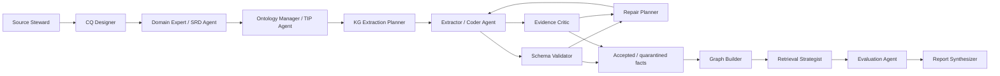

# Multi-Agent Method Adaptation for Domain-Agnostic Ontology/KG/GraphRAG Pipeline

Date: 2026-06-02

Source paper: Abid Talukder, Maruf Ahmed Mridul, and Oshani Seneviratne,
"Towards Automated Ontology Generation from Unstructured Text: A Multi-Agent
LLM Approach", arXiv: https://arxiv.org/abs/2604.23090.

Local PDF:
`data/papers/towards-automated-ontology-generation-multi-agent-llm.pdf`

Inspection artifacts:
`tmp/pdfs/automated_ontology_generation_multi_agent/`

Status: method-transfer note. The paper is used as a pipeline architecture
reference, not as aviation-domain evidence.

## Executive Takeaway

This paper is highly relevant, but its strongest transferable idea is not
"use many agents for ontology generation." The stronger idea is:

> Every agent should own one cognitive role and emit a structured artifact that
> becomes the next agent's contract.

For this project, that principle should be generalized beyond ontology
construction. The same artifact-driven multi-agent pattern can govern source
inventory, CQ design, ontology/profile construction, KG extraction, evidence
validation, graph retrieval, GraphRAG evaluation, and final reporting.

## What The Paper Actually Contributes

The paper compares a direct LLM ontology-generation baseline with a multi-agent
architecture. Its multi-agent pipeline is a directed acyclic graph of
artifact-producing roles:

1. **Domain Expert** produces a Semantic Requirements Document (SRD).
2. **Manager** converts the SRD into a Technical Implementation Plan (TIP).
3. **Coder** implements concrete Turtle/TTL ontology edits from the TIP.
4. **Quality Assurer** checks architecture, syntax, and semantic consistency,
   then loops bounded repairs through a QA-Coder.

The evaluation is also agentic:

- a SPARQL Query Generation Agent proposes a query for each CQ;
- syntax and execution nodes provide feedback;
- a Judge Agent scores the result against the expected CQ answer;
- a complementary graph/RAG evaluation probes whether ontology knowledge is
  navigable even when strict SPARQL querying is brittle.

The paper's key design principles are:

- separation of concerns;
- artifact-driven handoffs;
- ontology design pattern governance;
- CQ alignment through all stages;
- bounded iteration rather than unconstrained self-repair.

## Visual Evidence Checked

The evidence pack rendered 20 pages and extracted six embedded images. The most
important visual pages are:

- page 5: baseline workflow, where a single Coder generates ontology code and a
  bug fixer reacts after syntax/reasoner failures;
- page 7: multi-agent workflow with Domain Expert, Manager, Coder, QA Agent,
  syntax check, reasoner, bug fixer, and file tools;
- page 11: evaluation workflow with SPARQL query generator, syntax validation,
  execution, Judge, feedback loop, and failure handler.

The page 7 workflow is the main transfer pattern for this project because it
shows planning before implementation and artifact handoffs between roles.

## Evidence From Results

The paper's results support the value of front-loaded planning:

- Multi-agent quality scores exceeded direct generation on both evaluated
  contracts: overall 3.33 vs 1.33 for Equivita and 3.00 vs 2.33 for Sentinel.
- The largest gains were ODP usage and extensibility, which the authors
  attribute to the Manager's TIP.
- Redundancy remained difficult, showing that global reuse/state tracking is
  still hard for LLMs.
- SPARQL CQ coverage was mixed, while RAG CQ coverage favored the multi-agent
  pipeline: 0.7112 vs 0.5994 on Equivita and 0.5510 vs 0.4450 on Sentinel.

These numbers should not be copied as expected ATMONTO results. They support a
design choice: externalize reasoning into structured plans before generation.

## Important Caution From The Paper

The paper is unusually useful because it documents failure modes:

- bug-fixing loops are expensive;
- agents may fixate on narrow line ranges around parser errors;
- context resets can cause state amnesia;
- meta-reflection did not reliably break failure loops;
- syntax hallucinations can bloat files with repetitive garbage;
- the primary quality driver was the Manager's TIP, not autonomous repair.

For our pipeline, this means:

1. prefer strong front-loaded plans over heroic repair loops;
2. use small, bounded repair cycles with explicit failure escalation;
3. require structured artifacts and line/source references;
4. record failed attempts as evidence, not just final outputs;
5. keep human review for gold facts, profile gaps, and thesis claims.

## Generalized Agentic Pipeline



This is a methodology-level orchestration pattern. It can be implemented by
humans, scripts, LLM agents, or mixed workflows. The important point is that
each role has an artifact contract.

## Role And Artifact Contract

| Role | Owns | Consumes | Emits | Reusable outside ontology build? |
| --- | --- | --- | --- | --- |
| Source Steward | Source scope and evidence boundary | Raw corpus, metadata, licensing, temporal scope | Source Inventory Brief | Yes |
| CQ Designer | Functional requirements | Source brief, stakeholder questions, ontology/profile | CQ Contract / Query Manifest | Yes |
| Domain Expert / SRD Agent | Domain semantics | Source text, CQs | Semantic Requirements Document | Yes |
| Ontology Manager / TIP Agent | Modeling and reuse plan | SRD, reference ontologies, existing profile | Technical Implementation Plan | Yes |
| KG Extraction Planner | Extraction schema and field plan | TIP, CQs, gold policy | Extraction Implementation Plan | Yes |
| Extractor / Coder Agent | Candidate facts or code edits | Plan, source slice, current KG/profile | Candidate Facts / TTL / JSONL / code patch | Yes |
| Schema Validator | Formal conformance | Candidate facts, ontology/profile | Validation Findings | Yes |
| Evidence Critic | Source support | Candidate facts, source spans, CQs | Evidence Support Findings | Yes |
| Repair Planner | Bounded remediation | Validation/evidence findings | Repair Plan with stop condition | Yes |
| Graph Builder | Materialized KG | Accepted facts, provenance, profile | KG snapshot and graph health report | Yes |
| Retrieval Strategist | Retrieval route | CQ manifest, KG, vector index | Vector/graph/hybrid/gate plan | Yes |
| Evaluation Agent | Scoring | Gold labels, retrieval outputs, answers | Layered Evaluation Report | Yes |
| Report Synthesizer | Thesis/report narrative | All artifacts and failure logs | Claim-safe stage report | Yes |

## Mapping To Current ATMONTO Work

| General role | Current or planned ATMONTO artifact |
| --- | --- |
| Source Steward | `nasa_atmonto_*_source_inventory.{json,md}` and FAA/NASA source inventories. |
| CQ Designer | `reports/stages/nasa_atmonto_competency_questions.md` and `data/evaluation/nasa_atmonto/atcscc_cq_query_manifest.json`. |
| Domain Expert / SRD Agent | Planned: ATCSCC semantic requirements by advisory type and CQ family. |
| Ontology Manager / TIP Agent | Planned: ATMONTO / ATCSCC profile implementation plan with reuse vs extension decisions. |
| KG Extraction Planner | Current S0-S4 suite plus planned S5 module/CQ-routed extraction plan. |
| Extractor / Coder Agent | `S0_rule_only`, `S1b`, `S2`, `S3`, `S4`, and future S5 outputs. |
| Schema Validator | Existing validator and `kg_validation` reports. |
| Evidence Critic | Existing evidence containment/support logic plus future CQ evidence verifier. |
| Repair Planner | Existing validator/repair and rejected-fact adjudication. |
| Graph Builder | Materialized KG outputs and graph traversal reports. |
| Retrieval Strategist | Planned graph-use gate and retrieval ablations. |
| Evaluation Agent | Formal scoring, CQ evaluation, retrieval ablation, graph traversal ablation. |
| Report Synthesizer | Stage reports and thesis dashboard. |

## How To Extend Beyond Ontology Construction

### Source Inventory

The Source Steward agent can create a source inventory brief before any
ontology work begins. This prevents later agents from using out-of-scope
evidence or live data.

Generic artifact:

```json
{
  "domain": "...",
  "source_families": [],
  "allowed_claims": [],
  "excluded_use_cases": [],
  "licensing_notes": [],
  "temporal_boundary": "...",
  "evidence_levels": ["gold", "silver", "bronze"]
}
```

### CQ Design

The CQ Designer converts vague research goals into measurable CQs with fields,
metrics, failure modes, and routing labels. This should precede both ontology
generation and GraphRAG experiments.

### KG Extraction

The multi-agent pattern becomes:

1. Domain Expert extracts source-grounded semantic requirements.
2. Manager decides schema reuse, ontology modules, predicate families, and
   evidence requirements.
3. Extractor emits candidate facts under that plan.
4. Evidence Critic and Schema Validator independently judge the candidates.
5. Repair Planner allows only bounded, specific fixes.

This maps naturally to future `S5_cq_or_module_routed`.

### GraphRAG Retrieval

The same decomposition applies to retrieval:

1. Retrieval Strategist classifies the query/CQ as vector, graph, hybrid, or
   abstain.
2. Graph Builder exposes graph health and path availability.
3. Evaluation Agent scores evidence recall, context relevance, path support,
   answer-set precision/recall, cost, and abstention.

This maps naturally to future `S6_graph_use_gate`.

### Reporting

The Report Synthesizer should not invent claims from the final score. It should
consume structured evaluation artifacts and produce claim-safe language:

- what improved;
- what failed;
- what remained domain-specific;
- what transfers to another domain;
- what cannot be claimed.

## Agentic System Suite Extension

The existing S0-S4 extraction systems should be preserved as baselines. The
multi-agent paper suggests adding orchestration systems, not just more
extractors.

| System | Purpose | Key artifact |
| --- | --- | --- |
| `A0_direct_generation_baseline` | Single-agent end-to-end baseline for any new domain. | Candidate ontology/KG/answers with minimal handoff. |
| `A1_artifact_pipeline` | Multi-agent pipeline with SRD, TIP, extraction plan, validation, and evidence critique. | Full handoff artifact chain. |
| `A2_no_manager_ablation` | Test whether the Manager/TIP is the actual quality driver. | Pipeline without TIP. |
| `A3_no_evidence_critic_ablation` | Test whether schema validation alone is insufficient. | Validator-only output. |
| `A4_bounded_repair_ablation` | Compare no repair, bounded repair, and excessive repair. | Repair logs and failure modes. |
| `A5_graph_route_agent` | Test query routing for GraphRAG. | Graph-use gate decisions and retrieval metrics. |

For the current ATM case, the first practical addition should be
`A1_artifact_pipeline` around the existing S4/S5 design, not a full autonomous
rewrite of the project.

## Metrics To Add

| Metric | Unit | Why it matters |
| --- | --- | --- |
| Handoff completeness | artifact | Every role produced the required structured output. |
| CQ alignment coverage | CQ / fact / artifact | Each stage maps back to CQs. |
| Plan adherence | candidate fact / code edit | Extractor followed TIP/extraction plan rather than improvising. |
| Reuse ratio | class/property/fact | Measures whether existing schema/profile elements were reused. |
| Redundancy rate | class/property/fact | Directly targets the paper's hardest failure mode. |
| Evidence support delta | system pair | Tests whether evidence critic adds value beyond schema validation. |
| Repair cycle count | fact/run | Keeps bounded iteration honest. |
| Repair success without drift | repaired fact | Separates syntactic repair from semantic damage. |
| Graph-use decision accuracy | CQ/query | Tests retrieval routing, not just final answer quality. |
| Cost/latency overhead | run/query | Multi-agent systems must justify overhead. |

## Risks Not To Copy

- Do not rely on a 1000-cycle repair loop. It is a circuit breaker, not a
  target.
- Do not let agents silently overwrite prior artifacts.
- Do not judge a pipeline only by LLM-as-judge scores; keep deterministic
  schema/evidence checks.
- Do not treat synthetic ABox tests as real domain gold.
- Do not assume multi-agent decomposition always improves results; add
  ablations such as no-manager and no-evidence-critic.
- Do not let the Report Synthesizer inflate method-transfer evidence into
  domain-performance claims.

## Immediate Integration Plan

1. Keep the PDF evidence pack under
   `tmp/pdfs/automated_ontology_generation_multi_agent/`.
2. Add this paper to the method backbone as a primary reference for
   artifact-driven agentic orchestration.
3. Update the domain-agnostic roadmap so the pipeline includes an agentic
   orchestration layer.
4. For the current ATMONTO experiment, implement the next artifact manually
   before automating: an ATCSCC Semantic Requirements / TIP draft aligned to the
   12 CQs.
5. Only after the manual artifact contract is clear, consider implementing an
   `A1_artifact_pipeline` command or report generator.

## Bottom Line

This paper should influence the whole pipeline, not only ontology generation.
Its durable contribution is the artifact-driven handoff pattern:

> Source brief -> CQ contract -> SRD -> TIP -> extraction plan -> candidate KG
> facts -> validation findings -> evidence critique -> repair plan -> graph
> retrieval plan -> evaluation report -> claim-safe synthesis.

That sequence is exactly what can make the project domain-independent. ATM is
then simply the first domain where the artifact chain is made concrete.
